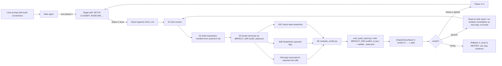

# Inspector Skill — README

Generic, phase-level execution auditor for any other Cursor skill. After a
phase of a target skill ends, the inspector reads that skill's action
markdown files at runtime, derives an expectation manifest of mandatory tool
calls / output files / state assertions, audits the agent transcript JSONL
plus on-disk artifacts, and **writes** a structured `audit_report.json` to
`$RESULT_DIR/.audit/<PHASE>_<utc-ts>.json` with a verdict in
`{PASS, WARN, BLOCK, FATAL}`. The chat shows only a single
`[Inspection] phase=<P> verdict=<V> ... -> <path>` line per audit; the
on-disk JSON is the canonical artifact. The user prompt that started the
run binds the main agent to read the on-disk report and remediate every
`block` / `fatal` violation as a natural next step before advancing.

The inspector is read-only and same-agent. It does not modify the audited
skill, does not spawn subagents, and does not run as a hook.

---

## When to use this skill

- Running a long, multi-phase skill (e.g. `inference-optimization`,
  `training-optimization`, `mlperf-optimization`,
  `marathon-inference-optimization`) where the agent might silently skip a
  mandatory step.
- Building confidence that a "PASS" outcome actually executed every step
  the action `.md` claims it does.
- Detecting compaction-induced omissions in long-running optimization runs.

## When NOT to use this skill

- Single-shot tasks (one Q&A, one file edit). Overhead is not justified.
- Skills whose action `.md` files are extremely loose / English-only (no
  fenced commands, no env-var paths). Inspector will degrade to mostly
  `unverified` entries.
- When you want enforcement that survives the agent forgetting to invoke
  it. For that you need a hook, not a same-agent skill (see "Upgrading"
  below).

---

## Quick start

1. Pick a target skill, e.g. `.cursor/skills/inference-optimization`.
2. Copy the appropriate filled example from
   [user-prompt-template.md](user-prompt-template.md). Replace the slot
   values (`MODEL_NAME`, `MODEL`, `TP`, etc.) with your run inputs.
3. Send the resulting prompt to the agent. The "INSPECTOR BINDING CONTRACT"
   block in the prompt makes the inspector enforceable.

That's it. The agent will read the target skill's `SKILL.md`, execute its
phases, and after each phase will read this skill's [SKILL.md](SKILL.md) and
run the 5-step audit.

---

## How it works (1-minute version)



---

## Files in this skill

| Path | Purpose |
|---|---|
| [SKILL.md](SKILL.md) | The 5-step audit procedure (S1-S5). What the inspector does on every invocation. |
| [extraction-protocol.md](extraction-protocol.md) | Deterministic 4-pass extraction of `{expected_tool_calls, expected_artifacts, expected_state_assertions}` from any action `.md`. |
| [audit-report-schema.md](audit-report-schema.md) | JSON schema for `audit_report.json`, the on-disk `$RESULT_DIR/.audit/` layout, the sentinel `_state.json` schema, and the one-line chat ack format. |
| [remediation-protocol.md](remediation-protocol.md) | Severity ladder, modality -> severity mapping, main-agent obligations per verdict. |
| [user-prompt-template.md](user-prompt-template.md) | The user prompt (blank template + filled examples + cheat sheet). |
| [scripts/find_transcript.py](scripts/find_transcript.py) | Locate the current conversation's transcript JSONL and compute the next audit window from `$RESULT_DIR/.audit/_state.json`. |
| [scripts/grep_transcript.py](scripts/grep_transcript.py) | Stream-grep a transcript for tool_use blocks matching `(tool_name_pattern, arg_regex)`. |
| [scripts/parse_action_outputs.py](scripts/parse_action_outputs.py) | Mechanical regex extraction from an action `.md`; produces the candidate proposal that the LLM classifies in S2 pass 3. |
| [scripts/parse_iron_rules.py](scripts/parse_iron_rules.py) | Pass-0 Iron Rules intake from the target SKILL.md. |
| [scripts/compute_verdict.py](scripts/compute_verdict.py) | Deterministic verdict computation from manifest + observations + semantic_rules.json. Output is frozen. |
| [scripts/emit_audit_report.py](scripts/emit_audit_report.py) | Writes `$RESULT_DIR/.audit/<PHASE>_<ts>.json`, updates `_state.json` sentinel, and prints the single `[Inspection] ...` chat line. |
| [tests/](tests/) | Hand-written fixtures and run-by-hand checklists. See [tests/RUN_TESTS.md](tests/RUN_TESTS.md) and [tests/INTEGRATION.md](tests/INTEGRATION.md). |

---

## Reading an `audit_report.json`

The inspector's chat output for an audit is exactly one line:

```
[Inspection] phase=BASELINE verdict=BLOCK passes=6 fatal=0 block=1 warn=0 info=0 unverified=2 top=missing_eval_summary_baseline -> /shared_nfs/.../qwen3-14b-2026-04-21/.audit/BASELINE_2026-04-21T10-34-00Z.json
```

The full `audit_report.json` is on disk at the path printed after `->`. To
inspect it:

```bash
RUN_DIR=/shared_nfs/inference-optimization/results/qwen3-14b-2026-04-21
ls "$RUN_DIR/.audit/"
# _state.json
# SETUP_2026-04-21T10-12-00Z.json
# BASELINE_2026-04-21T10-34-00Z.json

jq '.verdict, .verdict_summary, .violations[].id' \
  "$RUN_DIR/.audit/BASELINE_2026-04-21T10-34-00Z.json"
# "BLOCK"
# "passes=6 fatal=0 block=1 warn=0 info=0 unverified=2"
# "missing_eval_summary_baseline"

jq '.history' "$RUN_DIR/.audit/_state.json"
# [{"phase":"SETUP","verdict":"PASS",...},
#  {"phase":"BASELINE","verdict":"BLOCK",...}]
```

The on-disk JSON's top-level fields are documented in
[audit-report-schema.md](audit-report-schema.md). The sentinel
`_state.json` schema is in §4 of the same document.

### Interpreting `unverified` vs `miss`

- `unverified`: inspector could not evaluate the expectation. Most common
  cause is an unresolved env var in the path template (e.g. `$TARGET_DIR/...`
  when `TARGET_DIR` was not in `RUN_ENV`). `unverified` items by themselves
  do NOT trigger BLOCK; they are diagnostic.
- `violations[*].observed == "not_found"`: inspector evaluated the
  expectation and the artifact / tool call is genuinely missing. The
  `severity` field then determines whether this is `warn`, `block`, or
  `fatal`.

A high `unverified` count (>= 50% of expectations) auto-adds a synthetic
`extraction_low_confidence` `warn` violation. This makes silent extraction
failure visible without falsely blocking the run.

---

## Limitations & known failure modes

### 1. The agent might forget to invoke inspector (residual risk)

This is the **fundamental limit of the same-agent design**. After 50+ tool
calls in a long run, the agent can drift past the convention and just keep
going. The implicit-mode chat surface is intentionally minimal (good for
users, but offers fewer self-reminders to the agent). Mitigations:

- The single `[Inspection] phase=<X> verdict=<V> -> <path>` ack line is
  still in the chat for every audit, so the agent can grep it. It is
  concise but not invisible.
- The `_state.json` sentinel is the canonical "did we audit this phase?"
  signal. Before reading the next phase's action `.md`, the agent should
  `Read` `$RESULT_DIR/.audit/_state.json` and confirm `last_phase` equals
  the phase that just ended and `last_verdict ∈ {PASS, WARN}`.
- The on-disk per-phase report at `$RESULT_DIR/.audit/<PHASE>_*.json`
  carries `next_checkpoint.reminder_text` for cases where the agent does
  open the report.
- The README documents this risk explicitly so users do not over-trust the
  audit.

If your run is long enough that this risk is unacceptable, escalate to a
hook-based architecture (see "Upgrading" below). The contract files
([extraction-protocol.md](extraction-protocol.md),
[audit-report-schema.md](audit-report-schema.md),
[remediation-protocol.md](remediation-protocol.md)) and the on-disk
artifacts are reusable as-is by a hook; only the trigger mechanism
changes.

### 2. Tool returns are not in the transcript JSONL

Cursor's transcript JSONL records tool *invocations* (`type: tool_use`,
with `name` and `input`) but does NOT reliably record tool *return values*.
The inspector therefore audits outcomes via direct file existence checks
(Channel B), not by reading recorded tool outputs. This is a hard
assumption baked into [SKILL.md](SKILL.md). If your target skill's success
criteria are not visible on disk, inspector cannot audit them; consider
adding small `touch $WORK_DIR/.phase_<X>_done` markers in your scripts.

### 3. Multiple parallel conversations in the same project

`find_transcript.py` defaults to mtime-based selection; if you have two
chats running concurrently it can pick the wrong one. The fix is to pass
`MARKER_SENTENCE` (the first sentence of your user prompt) to the
inspector via `RUN_ENV`; `find_transcript.py` will then prefer the JSONL
whose content contains that sentence. The user-prompt template's filled
example shows exactly how to do this.

### 4. Action `.md` files written in unusual styles

The extraction protocol depends on patterns like backticked commands,
env-var-prefixed paths, and "Outputs"/"Procedure" section headings. If a
target action `.md` is mostly free-form English, the manifest will be
heavy on `unverified` and the audit's signal will be weaker. Inspect the
`extraction_diagnostics` block in `audit_report.json` to see the
candidate-from-regex vs kept-after-classification ratio. Fix by adding
"Outputs:" or "Procedure:" sections to the target action.

### 5. False positives are possible if the action `.md` is wrong

If the target action `.md` says "MUST run X" but the actual correct
behavior is to skip X under some condition, inspector will block the run.
The fix is to update the target action `.md` (e.g. add an "unless"
clause), not to argue with the inspector. Inspector is mechanical by
design.

### 6. Extraction is a probabilistic step

The extraction protocol's pass 3 (LLM classification) is per-candidate and
narrowly scoped, but it is still LLM. Pass 2 (regex) provides a non-LLM
anchor; the diff between them is recorded in `regex_anchors_diff_summary`.
If the diff is large, take the audit verdict less seriously and consider
adding more structure to the action `.md`.

---

## Debugging tips

### "Inspector returned BLOCK and I think it's wrong"

1. Open the relevant `audit_report.json` at
   `$RESULT_DIR/.audit/<PHASE>_*.json` (the inspector's one-line ack
   prints the exact path).
2. Find the violation. Read the `source_lines` and `source_quote` fields:
   they cite the exact location in the target `actions/<X>.md` that drove
   the expectation.
3. If the source quote is genuinely strict but you believe it should be
   conditional, edit the target action `.md` to add the condition (e.g.
   "MUST do Y unless TARGET_DIR is unset"). Then re-run.
4. If the source quote is ambiguous, the inspector defaulted conservatively
   (extraction-protocol §3 non-goal: "if uncertain, classify as `unverified`,
   never `miss`" — a `MUST` from the inspector means the source had
   explicit "MUST"/"MANDATORY"/Iron-Rule keywords).

### "Inspector returned PASS but I know a step was skipped"

1. The action `.md` probably did not declare the step as MUST. Inspector
   only blocks on items the source explicitly marked mandatory.
2. Check `unverified[]`: the step might be there because of an
   unresolvable env var or unrecoverable state.
3. Promote the step to MUST in the target action `.md` by adding "MUST" /
   "MANDATORY" near it, or move it under a section heading containing
   "Iron Rule" / "Mandatory".

### "Inspector says transcript_unreadable"

1. Run `python3 .cursor/skills/inspector/scripts/find_transcript.py`
   manually from the same cwd. Inspect the output.
2. Check `~/.cursor/projects/` exists and contains a directory matching
   your slug (cwd with `/` -> `-`).
3. If the slug computation is wrong for your environment, pass
   `--slug <slug>` explicitly when invoking.

### "Inspector flagged extraction_low_confidence"

This is informational. It means more than half of your expectations are
`unverified`. Either the action `.md` is loose (add structure) or many env
vars in the action `.md` were not in `RUN_ENV` (add them).

---

## Upgrading: when same-agent invocation is not enough

If your runs are long enough that the agent drift risk dominates (see
limitation #1 above), upgrade to a hook-based enforcement. The migration
path is:

1. Keep all four protocol documents
   ([extraction-protocol.md](extraction-protocol.md),
   [audit-report-schema.md](audit-report-schema.md),
   [remediation-protocol.md](remediation-protocol.md), this README) and
   the three helper scripts unchanged. They are not coupled to the
   trigger mechanism.
2. Add a Cursor hook (e.g. `PostToolUse` or a custom event) at
   `.cursor/hooks/phase-audit-hook.py`. The hook detects phase boundaries
   (e.g. by greping for the most recent action `.md` `Read` call in the
   transcript), runs the same audit logic in Python (no LLM
   classification), and returns a `followup_message` that injects the
   verdict into the agent's context.
3. Replace the LLM classification in extraction-protocol pass 3 with a
   pre-built lookup table mapping anchor-types to default modalities.
   This loses some flexibility but gains determinism, which matters in a
   hook.

The user prompt template is unchanged in the hook architecture; the
difference is that the hook *also* enforces invocation, so even if the
agent forgets, the audit still happens.
