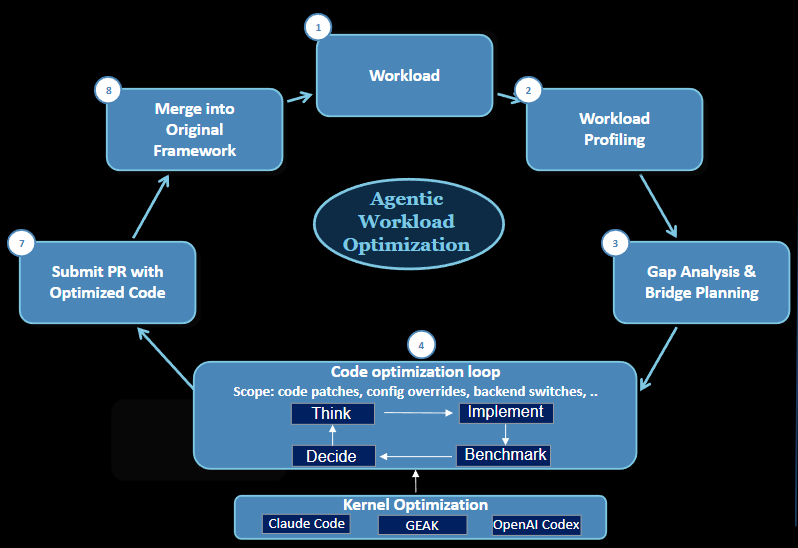
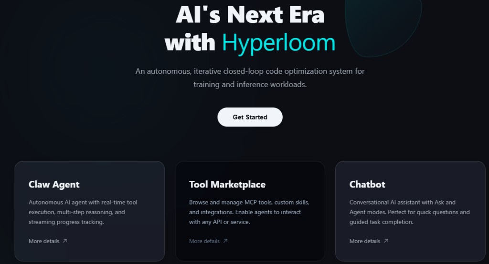
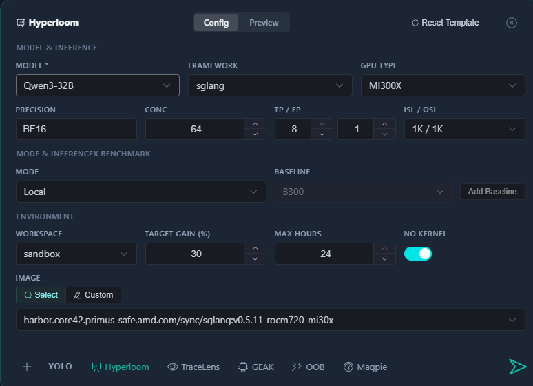
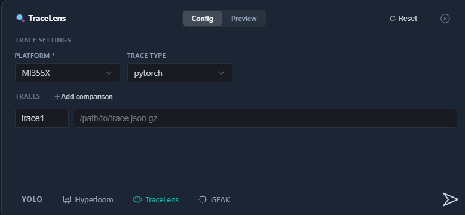
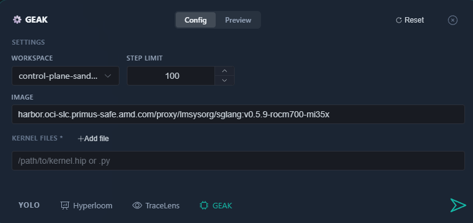

# ROCm Hyperloom

An agentic system that autonomously optimizes LLM inference on AMD GPUs. Hyperloom treats optimization as a **search problem**: given a workload, it builds a tree of candidate optimizations — backend swaps, server parameters, GEMM tuning, kernel rewrites, parallelism configs — scores each by expected gain and cost, then explores depth-first, always measuring against the real workload. Simply provide your workload and the agent delivers a fully optimized codebase — profiling against peak hardware potential, identifying bottlenecks, and iteratively rewriting code to maximize throughput on AMD GPUs, so the team gets production-ready optimized code.

<p align="center"></p>

Block 1-3 - Workload understanding and profiling: Submit your workload as the starting point for the agent to understand your codebase, profile using [TraceLens Agentic Analysis](https://github.com/AMD-AGI/TraceLens/) (relies on [Magpie](https://github.com/AMD-AGI/Magpie) for trace collection), capture bottlenecks and roofline targets. Hyperloom uses the public TraceLens package (`TRACELENS_ROOT`) by default (open-source-only report). An optional internal TraceLens extension — roofline numbers, gains estimates, and MI355/MI455 MAF data — can be enabled by internal users who set `TRACELENS_INTERNAL_ROOT` to point at their own internal checkout (path self-provided); leave it unset to stay on the open-source-only report. There is no separate on/off toggle.

Block 4 - Code Optimization Loop: The core of Hyperloom. The agent builds a scored tree of candidates — config overrides, code patches, backend switches, kernel rewrites — and explores depth-first, one change at a time: **Think → Implement → Benchmark → Decide**. Each result re-scores the remaining tree. 

In parallel, hot kernels are asynchronously optimized via external backends ([GEAK](https://github.com/AMD-AGI/GEAK/tree/main), and OOB kernel optimization via Claude Code and OpenAI Codex relying on kernel optimization flow of [Apex](https://github.com/AMD-AGI/Apex)). Kernel profiling and validation is powered by [Magpie](https://github.com/AMD-AGI/Magpie), which relies on [IntelliKit](https://github.com/AMDResearch/intellikit) for some of low-level GPU profiling tools.

Block 5-6 - Validated Delivery: The agent optimizes for throughput while maintaining accuracy — every change is correctness-gated before acceptance. Once the loop exits, the agent packages the optimized code, submits a PR to your repo, and merges into your codebase, completing the full loop.

### Learn More

| | |
|---|---|
| **[How the Optimization Loop Works](docs/HOW_THE_OPTIMIZATION_LOOP_WORKS.md)** | Scoring heuristics, stack mechanics, dynamic branching, and the self-evolving knowledge base |
| **[GLM-5 — Discovering Optimizations Hard to Spot Manually](docs/CASE_STUDY_GLM5.md)** | Hidden GEMM configs, cross-repo kernel patches, +193% throughput |
| **[DeepSeek-R1 — Fast Scale-Up on a New Workload](docs/CASE_STUDY_DEEPSEEK_R1.md)** | 7 configs to optimal in one session, MTP scheduling fix, +97% over B200 |
| **[Auth & Environment Guide](docs/ENV_AND_AUTH.md)** | Single authoritative auth/env reference; the inline tables in this README are a convenience excerpt |
| **[Configuration Reference](docs/CONFIGURATION_REFERENCE.md)** | Every environment variable read by the runtime |
| **[Knowledge-Base Guide](docs/KB_GUIDE.md)** | How to obtain or skip `INFERENCE_OPTIMIZER_KB_ROOT` and the marathon KB |
| **[`session_breakdown.json` Integration](docs/INTEGRATION_SESSION_BREAKDOWN.md)** | Stable contract for downstream consumers (`claw-stats-service`, dashboards) |
| **[Operations & Self-Host Runbook](docs/OPERATIONS.md)** | k8s sizing, `USER_DATA_PATH` backup, disaster recovery |
| **[Troubleshooting](docs/TROUBLESHOOTING.md)** | Auth-proxy 401, Ray `--num-gpus`, VRAM IR-1, and other recurring failures |
| **[Upgrading](docs/UPGRADING.md)** | Per-version migration steps (companion to [`CHANGELOG.md`](CHANGELOG.md)) |

---

## Prerequisites

Bind your **[LLM Gateway](https://llm.amd.com/)** key to **[Hyperloom](https://core42.primus-safe.amd.com/hyperloom/)** to obtain your `AK_YOUR_API_KEY`. This key is required for both the Hyperloom UI and the local optimization workflow — it provides access to TraceLens, GEAK, and OOB services.

---

## Quickstart — Hyperloom UI (PrimusClaw)

The fastest way to start is through the hosted **AMD Hyperloom** web interface — powered by **[PrimusClaw](https://github.com/AMD-AGI/Primus-Claw)**, the hosted online mode designed for **large-scale reachability**. Any team member can launch an optimization through the browser without local GPU setup or environment configuration.

- **Easy to scale** — each job runs in isolated sandboxed containers (GPU or CPU). Single-node optimizations run in-sandbox; multi-node workloads fan out via RayJob for distributed benchmarking.
- **Data flywheel** — every optimization run feeds results back through Minio storage and Langfuse observability, creating a closed feedback loop that continuously improves the agent's knowledge base and scoring heuristics.
- **Full Skills support** — sandboxes load optimization Skills on demand, giving the agent the same profiling, kernel-rewrite, and domain-specific capabilities at cloud scale.

1. Go to **[core42.primus-safe.amd.com/hyperloom](https://core42.primus-safe.amd.com/hyperloom/)**
2. Select **Claw Agent** or **Get Started** from the landing page to enter PrimusClaw
   <p align="center"></p>
3. Hyperloom (tab): End-to-end Model Performance Optimization
   <p align="center"></p>
4. TraceLens-only (tab): Model Performance/gap analysis and bridge planning
   <p align="center"></p>
5. GEAK-only: Kernel optimization
   <p align="center"></p>

---

## Quickstart — Local Mode (Cursor)

### Environment Setup

Local Mode runs Hyperloom in a remote AMD GPU environment, then uses Cursor to connect to that environment and launch optimization. Complete these three steps in order:

1. Prepare the GPU environment.
2. Connect Cursor to that environment.
3. Clone Hyperloom in the remote environment and run the bootstrap script.

#### 1. Prepare the GPU Environment

You need an AMD GPU machine that supports MI300X or MI355X, using an SGLang or vLLM ROCm inference image. Example images:

- SGLang MI300X: `harbor.core42.primus-safe.amd.com/proxy/primussafe/sglang:v0.5.11-rocm720-mi30x-profilerfix`
- SGLang MI355X: `harbor.core42.primus-safe.amd.com/proxy/primussafe/sglang:v0.5.11-rocm720-mi35x-profilerfix`
- vLLM MI300X: `vllm/vllm-openai-rocm:v0.19.0`
- vLLM MI355X: `vllm/vllm-openai-rocm:v0.19.0`

> The SGLang `-profilerfix` images patch `libamdhip64`/`libroctracer` so rocprofiler captures kernels launched under HipGraphLaunch (issue #352). Use the stock `lmsysorg/sglang:v0.5.11-rocm720-*` images once that fix lands upstream in ROCm.

Choose one environment:

- **Recommended — SaFE Authoring Pod**: create an Authoring Pod on [Primus-SaFE Authoring](https://core42.primus-safe.amd.com/authoring), select one of the SGLang or vLLM images above, and wait for the Pod to become ready.
- **Your own GPU machine**: start a long-running ROCm inference container that can access the GPU. The container name, workspace path, model path, and image version in the example below can all be changed for your environment.

Minimal Docker example for your own GPU machine:

```bash
docker run -d \
  --name hyperloom-local \
  --shm-size 64g \
  --device /dev/kfd \
  --device /dev/dri \
  --group-add video \
  -v /path/to/workspace:/workspace \
  -v /path/to/models:/models \
  harbor.core42.primus-safe.amd.com/proxy/primussafe/sglang:v0.5.11-rocm720-mi30x-profilerfix \
  tail -f /dev/null
```

If Hyperloom is already cloned on the host, you can mount that checkout directly into the container, for example by replacing `-v /path/to/workspace:/workspace` with `-v /path/on/host/Hyperloom:/workspace/Hyperloom`. Then open `/workspace/Hyperloom` after attaching Cursor to the container; you do not need to clone Hyperloom again inside the container.

**Install TraceLens inside the container** (required once per container):

```bash
# On the host
ssh <node>
docker exec -it <container> bash

# Inside the container — public repo (required)
git clone https://github.com/AMD-AGI/TraceLens.git
cd TraceLens && pip install -e .
```

Recommended container path (matches the default below):

```bash
git clone https://github.com/AMD-AGI/TraceLens.git /workspace/TraceLens
cd /workspace/TraceLens && pip install -e .
```

If the checkout already exists on the host, mount it instead of cloning:

```bash
-v /path/on/host/TraceLens:/workspace/TraceLens:rw
```

> **Optional internal extension (internal users only).** If you have access to the internal TraceLens extension, install your checkout (`pip install -e .`) and set `TRACELENS_INTERNAL_ROOT` to its path. Hyperloom does not clone it and ships no internal URL/path; leave `TRACELENS_INTERNAL_ROOT` unset for the open-source-only report.

#### 2. Connect Cursor to the Runtime Environment

- **SaFE Authoring Pod**: when the Pod is ready, check the connection instructions in the SaFE Authoring page and follow them to connect with Cursor Remote SSH.
- **Your own GPU machine + Docker**: first connect Cursor Remote SSH to the server running Docker, then use Dev Containers / Attach to Running Container to select `hyperloom-local` and open `/workspace` inside the container.

> Tip: to attach Cursor to a Docker container on a remote server:
>
> 1. Open the command palette in Cursor: `Ctrl+Shift+P`.
> 2. Search for `Remote-SSH: Connect to Host...` and connect to the server running Docker.
> 3. In that SSH remote window, open Extensions: `Ctrl+Shift+X`.
> 4. Search for and install `Dev Containers`, making sure it is installed in the current remote environment.
> 5. Open the command palette again: `Ctrl+Shift+P`.
> 6. Search for `Dev Containers: Attach to Running Container...`.
> 7. Select `hyperloom-local` (or your container name) and open `/workspace` inside the container.

#### 3. Clone Hyperloom and Bootstrap Local Mode

In the remote environment, first make sure GitHub authentication and AMD-AGI repository access are available. `local_setup.sh` will use the same access to clone dependency repositories.

If the remote environment does not already have a Hyperloom checkout, clone this repository:

```bash
git clone https://github.com/AMD-AGI/Hyperloom.git
cd Hyperloom
```

If Hyperloom was mounted through a Docker volume or a SaFE Authoring Pod, enter the mounted checkout directly:

```bash
cd /workspace/Hyperloom
```

Prepare Hyperloom credentials:

```bash
cp .env.template .env
```

Edit `.env`:

```env
SAFE_API_KEY=ak-your-safe-apikey
OPENAI_BASE_URL=https://core42.primus-safe.amd.com/api/v1/llm-proxy/v1
TRACELENS_ROOT=/workspace/TraceLens
# Optional: set only if you installed the internal extension (enables roofline
# gap / MI355+ MAF). Leave unset for the open-source-only report.
# TRACELENS_INTERNAL_ROOT=/workspace/TraceLens-internal

# Optional, only set if you want the Cursor kernel-opt backend:
# CURSOR_API_KEY=crsr_xxxxxxxxxxxx
# CURSOR_DEFAULT_MODEL=claude-opus-4-7
```

| Variable | Description | Example |
|----------|-------------|---------|
| `SAFE_API_KEY` | LLM gateway auth key | `ak-your-safe-apikey` |
| `OPENAI_BASE_URL` | LLM gateway endpoint | `https://core42.primus-safe.amd.com/api/v1/llm-proxy/v1` |
| `TRACELENS_ROOT` | TraceLens public repo checkout (`pip install -e .`; skills, patches, CLI, analysis orchestrator) | `/workspace/TraceLens` |
| `TRACELENS_INTERNAL_ROOT` (optional, internal users) | Path to your own internal TraceLens extension checkout (`pip install -e .`; rehydration module). Hyperloom never clones it. Set only to enable the internal extension; unset => open-source-only. | (self-provided) |
| `CURSOR_API_KEY` (optional) | Cursor SDK key for the OOB cursor kernel-opt backend (independent issuer, prefix `crsr_...`). Leave blank to skip cursor and only use claude/codex/geak. | `crsr_xxxxxxxxxxxx` |
| `CURSOR_DEFAULT_MODEL` (optional) | Override the default Cursor model id | `claude-opus-4-7` |

> `SAFE_API_KEY` is obtained from [LLM Gateway](https://core42.primus-safe.amd.com/litellm-gateway). GEAK and OOB (claude/codex) inherit their API key and base URL from `SAFE_API_KEY` / `OPENAI_BASE_URL` automatically — no separate GEAK or OOB configuration is needed. The public TraceLens repo must be installed in the container (see step 1); the internal extension is optional and is enabled only when `TRACELENS_INTERNAL_ROOT` is set.

> If HTTPS requests to `core42.primus-safe.amd.com` or the AMD LLM Gateway fail with a certificate verification error inside the container, install the AMD certificate bundle manually. This is most common when running on your own GPU server or a custom container image:
>
> ```bash
> curl -fsSL https://raw.githubusercontent.com/AMD-AGI/Primus-SaFE/main/Scripts/setup-certs/setup.sh | bash
> ```

Then run the Local Mode bootstrap:

```bash
export USER_DATA_PATH=/path/to/hyperloom-run
bash inference_optimizer/scripts/local_setup.sh
```

`USER_DATA_PATH` is Hyperloom's runtime directory for dependency code, logs, state, and optimization results. It is not the Hyperloom source directory, and you can point it at any location with enough space. `local_setup.sh` clones and wires OOB and InferenceX into this directory, resolves TraceLens paths from your container install (or clones both repos as a fallback), and writes a local env file. When it finishes, it prints:

- the Hyperloom workspace path to open in Cursor;
- the prompt template to paste into Cursor Chat;
- the env file that the agent should source before launch.

Example output snippet:

````text
Open this folder in Cursor as the workspace:
  /path/to/Hyperloom

Paste this into Cursor Chat and fill in your workload:

@inference_optimizer/SKILL.md

Optimize inference for this workload:
- Model: /path/to/your/model
- Framework: sglang
- GPU: MI300X
- TP: 8
- CONC: 64
- ISL: 1024
- OSL: 1024
- Precision: bf16
- Goal: improve throughput by at least 10%
- Budget: 24 hours

Before launch, run exactly:
```bash
source '/path/to/hyperloom-run/runtime/local-setup.env.sh'
export USER_DATA_PATH='/path/to/hyperloom-run'
```

Requirements:
1. Report the session ID, log path, PID, and initial health check result.
2. Monitor the process every 300s until the optimization is complete or failed.
````

Follow the script output. In the default flow, users do not need to manually configure GEAK or OOB. Both TraceLens repos must be installed in the container before bootstrap (step 1).

### Quantization (optional): AMD Quark dependency

The optional quantization prelude (`inference_optimizer optimize --quantize ...`, backed by the `quantization_agent` sub-agent) drives [AMD Quark](https://quark.docs.amd.com/) to produce a quantized model before the optimization loop runs. You only need Quark if you use this path; the rest of Hyperloom works without it.

- **Dependency.** `quantization_agent` requires an AMD Quark checkout **at runtime**. It does not bundle Quark or implement quantization itself — it invokes Quark's published skills (`quark-torch-ptq` → `quark-torch-result-validator` → `quark-torch-llm-eval`) end-to-end.
- **Obtaining Quark.** Quark is published on PyPI (`pip install amd-quark`). However, the current external release does **not** ship the `.claude/skills/quark-torch-*` skill-invocation entry points that the agent drives, so **today you must use the internal Quark repository** checkout. Switch to the public package once it bundles those skills.
- **Pointing at a local checkout.** The agent resolves the Quark root in this order:
  1. the explicit `quark_root=` argument (Python API / `--quark-root` CLI flag),
  2. the `QUARK_ROOT` environment variable,
  3. the built-in default `/wekafs/hyperloom/Quark`.

  The resolved path must contain `.claude/skills/quark-torch-ptq/SKILL.md` (plus the validator / eval skills under the same tree). If none of the above resolves to an existing directory, the run fails fast with `quark_root_missing` rather than silently optimizing the un-quantized model. Set it in your `.env` when your checkout lives elsewhere:

  ```env
  # Only needed for the --quantize prelude; path to your internal amd-quark checkout.
  QUARK_ROOT=/workspace/Quark
  ```

### Launch Inference Optimization

After setup, open the Hyperloom workspace printed by `local_setup.sh` in Cursor, then paste the generated prompt template into Cursor Chat. Replace the model path, framework, GPU type, budget, and any other workload parameters before sending.

**Resume an existing session:**

Example prompt:

```text
@inference_optimizer/SKILL.md

Resume the existing Hyperloom optimization session.

Requirements:
1. Launch `inference_optimizer optimize --resume`; do not start a new session.
2. Do not pass `--model`; read the model and workload from the saved manifest/state.
3. Before launching, verify `manifest.json` and `state.json` exist.
4. Report the log path, PID, initial health check result, current phase, cumulative gain, and best config.
5. Monitor the process every 300s until the optimization is complete or failed.
```

Prompt field reference:

| Field | Maps to | Description | Default |
|---|---|---|---|
| `Model` | `--model`, `MODEL_PATH` | Model path. Required for a new run; ignored when resuming. | required |
| `Framework` | `--framework`, `FRAMEWORK` | Inference framework: `sglang` or `vllm`. Do not mix frameworks within one session. | `sglang` |
| `GPU` | `--gpu-type`, `GPU_TYPE` | Target GPU type, such as `MI300X`, `MI325X`, or `MI355X`; can also be auto-detected. | auto-detect |
| `Model class` | `--model-class` | Model architecture type used for action selection and scoring. | unset |
| `Compare against GPU` | `--compare-against-gpu` | Optional external reference GPU, such as `B200`. When unset, optimization continues without fetching an external baseline. | unset |
| `TP` | `TP` | Tensor parallel size. | `1` |
| `CONC` | `CONC` | Benchmark concurrency. | YAML default, commonly `8` |
| `ISL` | `--isl`, `ISL` | Input sequence length. | `256` |
| `OSL` | `--osl`, `OSL` | Output sequence length. | `256` |
| `Precision` | `--precision`, `PRECISION` | Model precision, for example `bf16`. | `bf16` |
| `Goal` | `--target-gain`, `--target-tput`, `--target-baseline-dir` | Optional stop condition, such as target throughput gain. | unset |
| `Budget` | `--max-hours` | Maximum optimization time. | `2.0` hours |
| `Kernel optimization` | `--no-kernel` | Kernel optimization is enabled by default; ask to skip it if you only want parameter/backend search. | enabled |
| `Resume` | `--resume` | Resume an existing session; requires `manifest.json` and `state.json`. | disabled |

For first-launch errors, see `inference_optimizer/SKILL.md` §"Failure Handling".

> Training and MLPerf-training skills have been retired from this repo. Only inference optimization is supported here.

#### Migration Notes (upgrading from earlier Hyperloom releases)

1. **Session directory env renamed.** Set `USER_DATA_PATH` instead of `INFERENCE_OPTIMIZER_SESSION_DIR`. The legacy variable is no longer read.
2. **`setup` and `classify` actions removed.** If your launcher relied on them being in the action graph, supply the equivalents on the CLI:
   - `--model-class <…>` for what `classify` used to derive.
   - `--compare-against-gpu <…>` to opt into InferenceX reference fetching (otherwise `target_analysis` writes a `no_target_gpu_configured` marker and the run proceeds).
3. **Magpie benchmark script is now generic-pinned by default.** When `--gpu-type` is set, the YAML renderer pins `benchmark_script=<framework>_<gpu_type>.sh` to stop InferenceX-native scripts from silently leaking `result.json` outside the session dir. If you intentionally use a model-specific script (e.g. `dsr1_fp8_mi300x.sh`), keep passing `benchmark_script=` explicitly — operator overrides still win against the generic-script pin. You may additionally want to set `$INFERENCE_OPTIMIZER_RESCUE_PATHS` so the harvest step can recover leaked `result.json` files written to hardcoded `--result-dir` locations.

---

## Key Results

### Inference Optimization — InferenceX Challenge

Hyperloom optimized 4 flagship models for the [InferenceX](https://github.com/SemiAnalysisAI/InferenceX) benchmark on AMD Instinct MI355X, matching or beating NVIDIA B200 on 3 out of 4 models.

| Model | Best tok/s/GPU | vs MI355X Baseline | vs NVIDIA B200 |
|-------|---------------:|:------------------:|:--------------:|
| DeepSeek-R1-0528 (671B MoE) | **1,476** | — | **+97% ahead** |
| GLM-5-FP8 (756B MoE+NSA) | **509** | **+193%** | **+27% ahead** |
| Qwen3.5-397B (397B MoE) | **350** | **+40%** | **+2.5% ahead** |
| MiniMax-M2.5 (MoE 256E) | **2,276** | **+6.5%** | **+5.7% ahead** |
| gpt-oss-120b (120B MoE, mxfp4) | **11,643** | — | **+34% ahead** |

All benchmarks: ISL=1024, OSL=1024 on MI355X (gfx950). "vs B200" shows best concurrency point. Full concurrency/ISL/OSL sweeps, patches, configs, and reproduction scripts: **[Agentic-InferenceX](https://github.com/AMD-AGI/Agentic-InferenceX)**.

## Hosted Tier — Limits & Pricing

The hosted [Hyperloom UI / PrimusClaw](https://core42.primus-safe.amd.com/hyperloom/)
is operated by AMD on shared infrastructure. Defaults for the public
PrimusClaw tier:

| Resource                          | Hosted default                                                                 |
|-----------------------------------|---------------------------------------------------------------------------------|
| Per-session GPU budget            | 1 ├ù MI300X / MI325X / MI355X for single-node runs; 2–8 GPUs via RayJob for multi-node |
| Concurrent sessions per account   | 2                                                                               |
| Session wall-clock                | 24 hours (extensible on request)                                                |
| `USER_DATA_PATH` quota            | 200 GB per session, with daily snapshots                                        |
| LLM-gateway request rate          | Bound to your `SAFE_API_KEY` quota (see [LLM Gateway](https://llm.amd.com/))     |
| Outbound network                  | Allowlisted (model registries, HuggingFace, GitHub)                             |

Pricing for the hosted tier is currently **free for AMD-internal users
and approved AMD partners** via Primus-SaFE. Public / enterprise
pricing is under active definition by the BRAIN team; reach out via
the [Hyperloom support form](https://core42.primus-safe.amd.com/hyperloom/)
or open an issue if your organization needs a quote.

For higher limits, dedicated capacity, or air-gapped deployment, self-host
Hyperloom in your own cluster following [`docs/OPERATIONS.md`](docs/OPERATIONS.md).
Self-hosted Hyperloom is Apache-2.0 licensed (see
[Licensing](#licensing)); there is no per-seat or per-session fee.

---

## Detailed Skill Documentation

The repo ships a single skill — `inference_optimizer/` — with the full optimization protocol, examples, and a knowledge base of lessons learned from prior runs:

| Domain | Skill | Description |
|--------|-------|-------------|
| **Inference** | [SKILL.md](inference_optimizer/SKILL.md) | Multi-agent system, CLI-driven, fully automated |

The skill file is the agent's instructions. It encodes the full optimization methodology — setup, profiling protocol, what to try, how to measure, when to stop, and how to report. The knowledge base sections are updated live during runs with new pitfalls and validated results.

---

## Repo Structure

```
Hyperloom/
├── inference_optimizer/                  # Inference optimization skill (sole entry point)
│   ├── SKILL.md                          # Skill spec (Cursor/Claw entry point)
│   ├── cli.py                            # CLI entry: inference_optimizer optimize
│   ├── actions/_meta/                    # Action metadata and scheduling policy
│   ├── baseline_comparison/              # InferenceX baseline comparison and target analysis
│   ├── orchestrator/                     # Coordinator + agent roles + action executors
│   │   ├── action_executors/             # Executors for baseline/profile/params/sweep, etc.
│   │   ├── backends/                     # Claude/Codex/Critic backend adapters
│   │   └── system_prompts/               # Orchestration prompt construction
│   ├── scripts/                          # Install scripts, baseline/profile configs
│   └── tests/                            # Inference optimizer unit and regression tests
├── kernel-agent/                         # Kernel Agent toolkit (TraceLens/GEAK/OOB tools)
│   ├── SKILL.md                          # Kernel Agent operation spec
│   ├── tools/                            # TraceLens analysis, kernel optimization, patch apply
│   │   └── backends/                     # GEAK/OOB submission (Ray-scheduled)
│   ├── scripts/                          # Runtime setup scripts: install.sh, etc.
│   └── tests/                            # Kernel Agent tool tests
├── critic-agent/                         # Critic-agent subprocess runtime (proposal review)
├── robustness-agent/                     # Robustness-agent subprocess runtime (health/RCA)
├── ci/                                   # CI orchestration (PR submitter, AB test)
├── docs/                                 # Architecture docs, case studies, and Mermaid diagrams
├── scripts/                              # Repo-level helper scripts
├── .env.template                         # Environment variables
├── CHANGELOG.md                          # Per-release notes
├── CONTRIBUTING.md                       # Contribution guidelines
├── LICENSE                               # Apache-2.0
├── SECURITY.md                           # Vulnerability disclosure policy
└── README.md
```

---

## Licensing

Hyperloom is released under the **Apache License 2.0**. The full
license text is in [`LICENSE`](LICENSE); the same license is asserted
in [`pyproject.toml`](pyproject.toml) for PyPI / sdist consumers.

You may use Hyperloom commercially, modify it, and distribute it under
the terms of Apache-2.0. Patent grants and NOTICE handling follow the
standard Apache-2.0 rules.

For security-relevant issues, see [`SECURITY.md`](SECURITY.md). For
contribution conventions, see [`CONTRIBUTING.md`](CONTRIBUTING.md).

