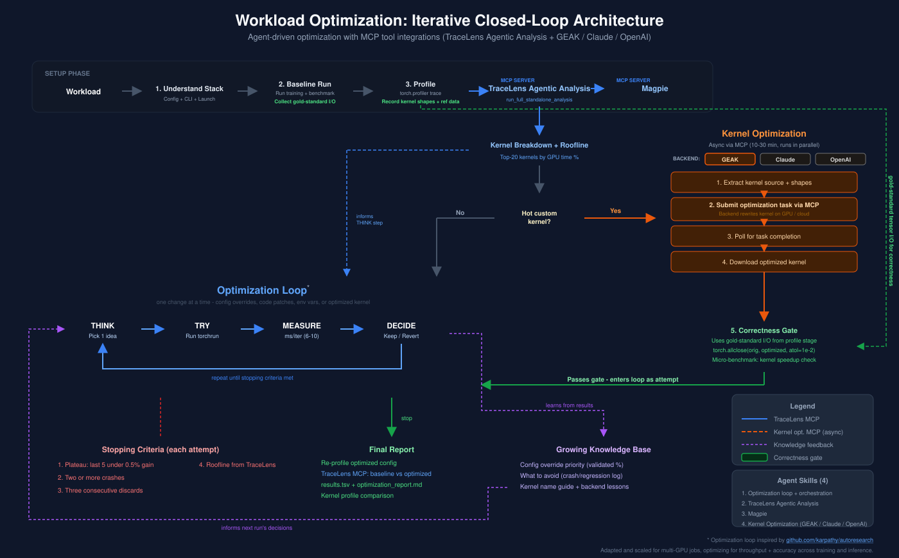

# PRISM — Profile, Rewrite, Iterate, Speedup, Measure

An autonomous, iterative closed-loop code optimization system for training and inference workloads. Given a real training or inference workload, PRISM's agent establishes a baseline, profiles it, then enters a **think → apply one change → measure → keep or revert → repeat** loop until it has squeezed the most performance out of the hardware. Every optimization is validated against the actual workload — no synthetic microbenchmarks, no guesswork.

This is the core novelty: **a general-purpose optimization loop that works across both training and inference**, generating and testing ideas autonomously — config overrides, code patches, framework-level changes, parallelism strategies — one at a time, always measuring real end-to-end impact.



The agent is the loop controller. It decides what to try next based on the profile, what's already been tried, the framework source code, and a knowledge base of lessons from prior runs. It runs **actual training or serving** as the benchmark — the real workload is both the test and the measurement.

### What the Agent Changes

The agent generates and tests ideas across multiple levels of the stack:

| Level | Training examples | Inference examples |
|-------|------------------|-------------------|
| **Config overrides** | `moe_permute_fusion=true`, `gradient_accumulation_fusion=true`, RoPE fusion | `--num-continuous-decode-steps`, `--mem-fraction-static`, CUDA graph coverage |
| **Code patches** | Cache hot per-forward lookups, fuse MoE dispatch, swap attention backends | Patch Inductor cache, swap attention backends, enable torch.compile |
| **Parallelism / data** | Micro batch size tuning (preserving GBS), packed sequences | DP/TP/EP configuration, concurrency tuning |
| **Kernel-level** | Triton kernel rewrites via GEAK (when hot kernels are identified) | Inductor-generated Triton kernels via GEAK |
| **Environment** | NCCL tuning, `CUDA_DEVICE_MAX_CONNECTIONS` | Server parameters, memory allocation |

### Stopping Criteria

The loop is not open-ended. It stops when:
- Last 5 attempts yield < 0.5% total improvement (plateau)
- 3 consecutive discards (local minimum)
- Time budget exceeded
- Total speedup exceeds target threshold
- 2+ crashes (unstable environment)

---

## Key Results

### Training Optimization

| Workload | GPUs | Baseline | Optimized | Speedup | Attempts |
|----------|------|----------|-----------|---------|----------|
| GPT-OSS 20B (MoE, BF16) | 8x MI355X | 13,708 ms/iter | 13,060 ms/iter | **+4.7%** | 57 (4hr) |
| GPT-OSS 20B (MoE, BF16) | 8x MI355X | 13,265 ms/iter | 13,042 ms/iter | **+1.7%** | 9 (1hr) |
| Qwen3 8B (full finetune) | 8x MI355X | 863 tok/s/gpu | 18,860 tok/s/gpu | **21.9x** | 19 |
| Qwen3 32B (LoRA) | 8x MI355X | 467 tok/s/gpu | 4,984 tok/s/gpu | **10.7x** | 19 |
| Llama 4 Scout 17B-16E (MoE) | 8x MI355X | 20 tok/s/gpu | 170 tok/s/gpu | **8.6x** | 18 |

### Inference Optimization

| Workload | GPUs | Baseline | Optimized | Speedup | Method |
|----------|------|----------|-----------|---------|--------|
| GLM-5 FP8 (756B MoE) | 8x MI355X | 1,379 tok/s | 2,794 tok/s | **+102.6%** | DP/TP config + server tuning |
| Qwen3-30B-A3B | 1x MI355X | 571 tok/s | 653 tok/s | **+14.4%** | torch.compile + kernel optimization |

Each result directory in `training_optimization/results/` and `inference_optimization/results/` contains the full optimization report, `results.tsv` with every attempt, and the final configuration.

---

## Quick Start

### 1. Configure MCP Servers

PRISM uses two external tools as MCP servers, configured in `.cursor/mcp.json`:

- **TraceLens (Jarvis)** — for profiling analysis (kernel breakdown, roofline modeling). Used during the profile phase.
- **GEAK** — for kernel-level optimization (rewrites Triton/HIP source). Used when the agent identifies hot custom kernels worth optimizing.

Update the GEAK authorization key in `.cursor/mcp.json`:

```json
{
  "geak-agent": {
    "headers": {
      "Authorization": "$YOUR_KEY"
    }
  }
}
```

TraceLens requires Node.js (uses `npx mcp-remote` transport).

### 2. Environment

```bash
cp .env.template .env
# Edit .env — set GEAK auth key and LiteLLM API key
```

### 3. Run an Optimization

Reference a skill file in your Cursor chat with `@` and describe the workload:

**Training:**
```
@.cursor/skills/training-optimization/SKILL.md
Optimize GPT-OSS 20B training on 8x MI355X.
Config: examples/megatron/configs/MI355X/gpt_oss_20B-BF16-pretrain.yaml
Results: /shared_nfs/nehaprakriya/results/gpt_oss/
```

**Inference:**
```
@.cursor/skills/inference-optimization/SKILL.md
Optimize Qwen3-30B-A3B inference on MI355X.
Model: /path/to/Qwen3-30B-A3B
InferenceX: /path/to/InferenceX
```

The agent takes it from there — baseline, profile, loop, report.

---

## Detailed Skill Documentation

Each domain has a comprehensive skill file with the full optimization protocol, examples, and a knowledge base of lessons learned from prior runs:

| Domain | Skill | Detailed README |
|--------|-------|-----------------|
| **Training** | [SKILL.md](.cursor/skills/training-optimization/SKILL.md) | [README](.cursor/skills/training-optimization/README.md) |
| **Inference** | [SKILL.md](.cursor/skills/inference-optimization/SKILL.md) | [README](.cursor/skills/inference-optimization/README.md) |

The skill files are the agent's instructions. They encode the full optimization methodology — setup, profiling protocol, what to try, how to measure, when to stop, and how to report. The knowledge base sections are updated live during runs with new pitfalls and validated results.

---

## Repo Structure

```
PRISM/
├── .cursor/
│   ├── mcp.json                          # MCP server config (TraceLens + GEAK)
│   └── skills/
│       ├── training-optimization/        # Training optimization skill + knowledge base
│       └── inference-optimization/       # Inference optimization skill + scripts
├── training_optimization/
│   ├── results/                                    # Full results from optimization runs
│   │   ├── gpt_oss_4hr_20260322/                   # GPT-OSS 20B, 57 attempts, +4.7%
│   │   ├── gpt_oss_primus/                         # GPT-OSS 20B, 9 attempts, +1.7%
│   │   ├── gpt_oss_primus_geak_9_hrs/              # GPT-OSS 20B with GEAK kernels
│   │   ├── qwen3_8b_optimization_20260323/         # Qwen3 8B full finetune, 21.9x
│   │   ├── qwen3_32b_lora_optimization_20260323/   # Qwen3 32B LoRA, 10.7x
│   │   ├── llama4_scout_17b_optimization_20260323/ # Llama 4 Scout MoE, 8.6x
│   │   ├── llama3.1_8b_optimization_20260322/      # Llama 3.1 8B
│   │   └── torchtune/                              # TorchTune cross-model summary
│   └── turboquant/                       # Quantization evaluation library
├── inference_optimization/
│   ├── InferenceX/                       # Inference benchmarking framework
│   └── results/glm5_optimization/        # GLM-5 FP8, +102.6%
├── slides/                               # Architecture diagrams
├── .env.template                         # Environment variables
└── README.md
```

---

## Prerequisites

- **Hardware**: AMD Instinct MI300X / MI325X / MI355X with ROCm 7.0+
- **Training stack**: Primus/Megatron-LM or TorchTune
- **Inference stack**: SGLang v0.5.6+ or vLLM
- **Cursor IDE** with MCP support
- **Node.js** for TraceLens MCP transport
