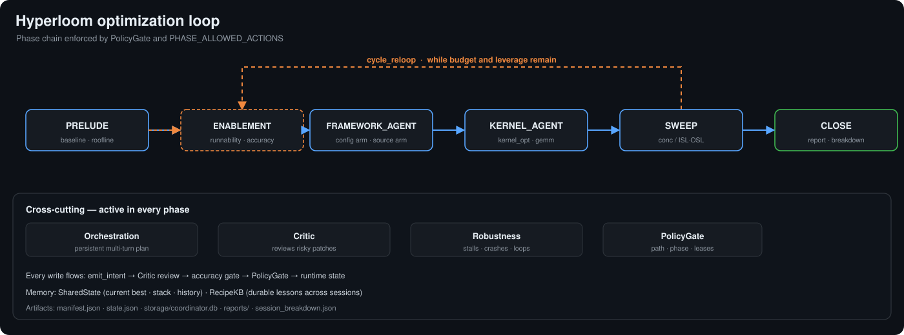

# ROCm Hyperloom

ROCm™ Hyperloom is an autonomous agentic system designed to optimize end-to-end inference workloads
(targeting both host code and GPU kernels) on AMD GPUs. Using advanced AI agents and profiling tools,
Hyperloom analyzes your workload, identifies performance bottlenecks, implements targeted optimizations,
and validates the performance and correctness of the optimizations without requiring manual intervention.
 
The system operates through a sophisticated multi-stage pipeline. First, an agent profiles your workload,
leveraging tools like IntelliKit for low-level GPU profiling, Magpie for trace collection, and TraceLens
for trace analysis to identify top bottlenecked kernels and create a bridge plan.

Next, Hyperloom employs a self-evolving code optimization engine following an iterative agentic loop (Think
→ Decide → Implement → Benchmark), alongside a Dynamic Specialist Agent and Knowledge Base to intelligently
search the optimization space. GEAK, a multi-agent GPU performance optimizer, optimizes hot kernels in
parallel. Once optimizations are identified and validated, Hyperloom prepares the optimized code and
generates a report with all proposed changes and expected performance improvements. This end-to-end
automation enables developers to achieve significant performance improvements while maintaining code
quality and reducing the manual effort traditionally required for GPU optimization.

Hyperloom combines:

- Trace analysis through [TraceLens](https://github.com/AMD-AGI/TraceLens) and
  [Magpie](https://github.com/AMD-AGI/Magpie).
- Kernel optimization through KernelForge, [GEAK](https://github.com/AMD-AGI/GEAK), Claude, Codex, and Cursor
  backends.
- A validated optimization loop that writes reproducible artifacts and
  `session_breakdown.json` for downstream consumers.

## Get Started

| Goal | Guide |
|------|-------|
| Set up Hyperloom and run a demo | [Setup and examples](examples/README.md) |
| Launch and monitor an optimization | [Run an optimization](docs/how-to/optimize.md) |
| Understand the algorithm | [Optimization loop](docs/conceptual/optimization-loop.md) |

## Documentation

| Topic | Link |
|-------|------|
| Authentication and credentials | [Authentication & credentials](docs/reference/authentication.md) |
| Environment variables | [Environment variables](docs/reference/environment-variables.md) |
| Components | [Components](docs/components/index.md) |
| Compatibility | [Compatibility matrix](docs/compatibility.md) |
| Troubleshooting | [Troubleshooting](docs/reference/troubleshooting.md) |
| Operations | [Operations & self-hosting](docs/reference/operations.md) |
| Session output schema | [`session_breakdown.json`](docs/reference/session-breakdown.md) |

---

## Developer Entry Points

- Runtime package: `src/hyperloom/`
- Main agent instructions: [`src/hyperloom/inference_optimizer/SKILL.md`](src/hyperloom/inference_optimizer/SKILL.md)
- CLI entry point: `python -m hyperloom.inference_optimizer.cli optimize`
- Operator tools: `python -m hyperloom.inference_optimizer.tools.*`
- Documentation source: `docs/`

For contribution workflow, testing, and linting, see
[`CONTRIBUTING.md`](CONTRIBUTING.md).

---

## Licensing

Hyperloom is released under the **MIT License**. The full license text
is in [`LICENSE`](LICENSE).

You may use Hyperloom commercially, modify it, and distribute it under
the terms of the MIT license, provided the copyright notice and the
permission notice are retained in all copies or substantial portions of
the software.

Third-party tools and agents (Cursor, Visual Studio, and Claude Code)
that Hyperloom invokes are governed by their own separate license terms
and are NOT covered by the MIT license above — see the "Third-Party
Tools and Agents" section in [`LICENSE`](LICENSE). You are responsible
for reviewing and complying with each tool's individual license.

For security-relevant issues, see [`SECURITY.md`](SECURITY.md). For
contribution conventions, see [`CONTRIBUTING.md`](CONTRIBUTING.md).

