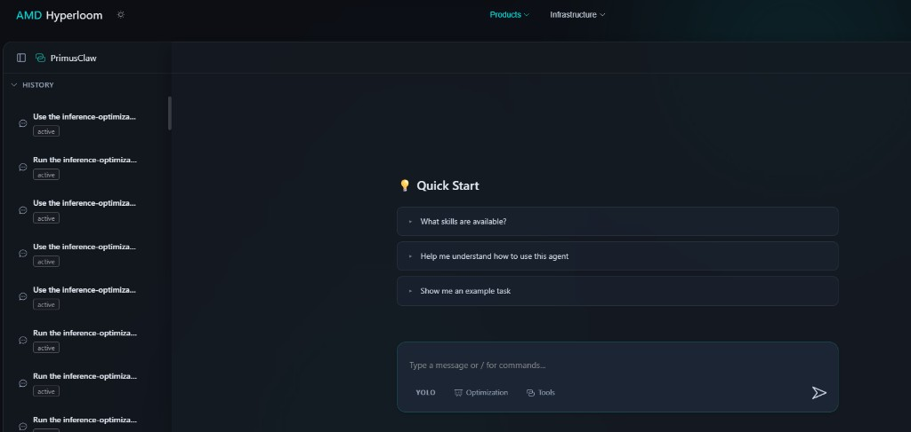

# ROCm Hyperloom

An agentic system that autonomously optimizes LLM inference and training on AMD GPUs. Hyperloom treats optimization as a **search problem**: given a workload, it builds a tree of candidate optimizations — backend swaps, server parameters, GEMM tuning, kernel rewrites, parallelism configs — scores each by expected gain and cost, then explores depth-first, always measuring against the real workload. Simply provide your workload and the agent delivers a fully optimized codebase — profiling against peak hardware potential, identifying bottlenecks, and iteratively rewriting code to maximize throughput on AMD GPUs, so the team gets production-ready optimized code.


Block 1-3 - Workload understanding and profiling: Submit your workload as the starting point for the agent to understand your codebase, profile using [TraceLens Agentic Analysis](https://github.com/AMD-AGI/TraceLens-internal/), capture bottlenecks and roofline targets.


Block 4 - Code Optimization Loop: The core of Hyperloom. The agent builds a scored tree of candidates — config overrides, code patches, backend switches, kernel rewrites — and explores depth-first, one change at a time: **Think → Implement → Benchmark → Decide**. Each result re-scores the remaining tree. In parallel, hot kernels are asynchronously optimized via external backends ([GEAK](https://github.com/AMD-AGI/GEAK/tree/main), Claude Code, OpenAI Codex) and patched back in.

Block 7-8 - Validated Delivery: The agent optimizes for throughput while maintaining accuracy — every change is correctness-gated before acceptance. Once the loop exits, the agent packages the optimized code, submits a PR to your repo, and merges into your codebase, completing the full loop.

### Learn More

| | |
|---|---|
| **[How the Optimization Loop Works](docs/HOW_THE_OPTIMIZATION_LOOP_WORKS.md)** | Scoring heuristics, stack mechanics, dynamic branching, and the self-evolving knowledge base |
| **[GLM-5 — Discovering Optimizations Hard to Spot Manually](docs/CASE_STUDY_GLM5.md)** | Hidden GEMM configs, cross-repo kernel patches, +193% throughput |
| **[DeepSeek-R1 — Fast Scale-Up on a New Workload](docs/CASE_STUDY_DEEPSEEK_R1.md)** | 7 configs to optimal in one session, MTP scheduling fix, +97% over B200 |

---

## Quickstart — Hyperloom UI

The fastest way to start is through the hosted **AMD Hyperloom** web interface:

1. Go to **[oci-slc.example-internal-host.invalid/hyperloom](https://oci-slc.example-internal-host.invalid/hyperloom/)**
2. Select **[PrimusClaw](https://oci-slc.example-internal-host.invalid/hyperloom/claw)** from the sidebar
3. Start chatting — the Quick Start panel offers guided options and example tasks



---

## Quickstart — Local Optimization (Cursor / Claude / VS Code)

### 1. Configure MCP Servers

PRISM uses two external tools as MCP servers, configured in `.cursor/mcp.json`:

- **TraceLens Agentic Analysis** — for profiling analysis (kernel breakdown, roofline modeling). Used during the profile phase.
- **GEAK** — for kernel-level optimization (rewrites Triton/HIP source). Used when the agent identifies hot custom kernels worth optimizing.

Update the GEAK authorization key in `.cursor/mcp.json`:

```json
{
  "geak-agent": {
    "headers": {
      "Authorization": "$YOUR_KEY"
    }
  }
}
```

TraceLens requires Node.js (uses `npx mcp-remote` transport).

### 2. Environment

```bash
cp .env.template .env
# Edit .env — set GEAK auth key and LiteLLM API key
```

### 3. Run an Optimization

Reference a skill file in your Cursor chat with `@` and describe the workload:

**Inference:**
```
@.cursor/skills/inference-optimization/SKILL.md
Optimize Qwen3-30B-A3B inference on MI355X.
Target: (Specify throughput targets)
Model: /path/to/Qwen3-30B-A3B
InferenceX: /path/to/InferenceX
```

**Training:**
```
@.cursor/skills/training-optimization/SKILL.md
Optimize GPT-OSS 20B training on 8x MI355X.
Config: examples/megatron/configs/MI355X/gpt_oss_20B-BF16-pretrain.yaml
```

The agent takes it from there — baseline, profile, loop, report.

---

## Key Results

### Inference Optimization — InferenceX Challenge

PRISM optimized 4 flagship models for the [InferenceX](https://github.com/SemiAnalysisAI/InferenceX) benchmark on AMD Instinct MI355X, matching or comparing with reference GPU on 3 out of 4 models.

| Model | Best tok/s/GPU | vs MI355X Baseline | vs NVIDIA B200 |
|-------|---------------:|:------------------:|:--------------:|
| DeepSeek-R1-0528 (671B MoE) | **1,476** | — | **+97% ahead** |
| GLM-5-FP8 (756B MoE+NSA) | **509** | **+193%** | **+27% ahead** |
| Qwen3.5-397B (397B MoE) | **350** | **+40%** | **+2.5% ahead** |
| MiniMax-M2.5 (MoE 256E) | **2,276** | **+6.5%** | **+5.7% ahead** |
| gpt-oss-120b (120B MoE, mxfp4) | **11,643** | — | **+34% ahead** |

All benchmarks: ISL=1024, OSL=1024 on MI355X (gfx950). "vs B200" shows best concurrency point. Full concurrency/ISL/OSL sweeps, patches, configs, and reproduction scripts: **[Agentic-InferenceX](https://github.com/AMD-AGI/Agentic-InferenceX)**.

### Training Optimization

| Workload | GPUs | Baseline | Optimized | Speedup | Attempts |
|----------|------|----------|-----------|---------|----------|
| GPT-OSS 20B (MoE, BF16) | 8x MI355X | 13,708 ms/iter | 13,060 ms/iter | **+4.7%** | 57 (4hr) |
| GPT-OSS 20B (MoE, BF16) | 8x MI355X | 13,265 ms/iter | 13,042 ms/iter | **+1.7%** | 9 (1hr) |
| Qwen3 8B (full finetune) | 8x MI355X | 863 tok/s/gpu | 18,860 tok/s/gpu | **+2,085%** | 19 |
| Qwen3 32B (LoRA) | 8x MI355X | 467 tok/s/gpu | 4,984 tok/s/gpu | **+967%** | 19 |
| Llama 4 Scout 17B-16E (MoE) | 8x MI355X | 20 tok/s/gpu | 170 tok/s/gpu | **+750%** | 18 |


## Detailed Skill Documentation

Each domain has a comprehensive skill file with the full optimization protocol, examples, and a knowledge base of lessons learned from prior runs:

| Domain | Skill | Detailed README |
|--------|-------|-----------------|
| **Training** | [SKILL.md](.cursor/skills/training-optimization/SKILL.md) | [README](.cursor/skills/training-optimization/README.md) |
| **Inference** | [SKILL.md](.cursor/skills/inference-optimization/SKILL.md) | [README](.cursor/skills/inference-optimization/README.md) |

The skill files are the agent's instructions. They encode the full optimization methodology — setup, profiling protocol, what to try, how to measure, when to stop, and how to report. The knowledge base sections are updated live during runs with new pitfalls and validated results.

---

## Repo Structure

```
PRISM/
├── .cursor/
│   ├── mcp.json                          # MCP server config (TraceLens + GEAK)
│   └── skills/
│       ├── training-optimization/        # Training optimization skill + knowledge base
│       └── inference-optimization/       # Inference optimization skill + scripts
├── inference_optimization/
│   └── InferenceX/                       # Inference benchmarking framework
├── training_optimization/
│   └── turboquant/                       # Quantization evaluation library
├── dashboards/                            # Interactive optimization dashboard (HTML)
├── slides/                               # Architecture diagrams
├── .env.template                         # Environment variables
└── README.md
```

