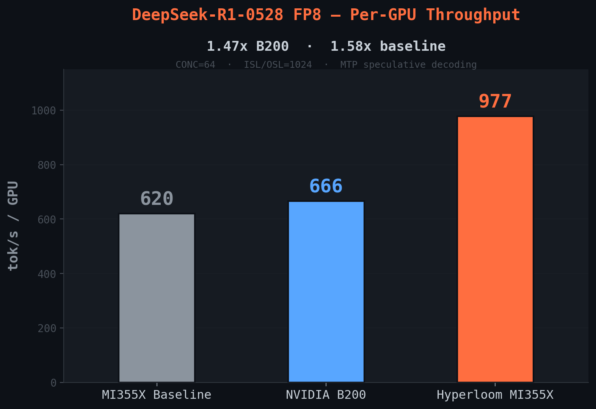

# Case Study: DeepSeek-R1 — Fast Scale-Up on a New Workload

When a new model lands on new hardware, the first question is: how quickly can we get it running well? DeepSeek-R1-0528 (671B, MoE+MLA, FP8) on 8x MI355X went from baseline to **+97% over NVIDIA B200** in a single optimization session. The agent explored 7 configurations, identified MTP speculative decoding as the key lever, diagnosed and fixed a scheduling bottleneck that was masking MTP's gains, and verified accuracy — arriving at production-ready performance without patches or kernel modifications.

The config changes themselves are straightforward — server flags any engineer could set. The value is in how quickly the agent navigated the search space: testing the right combinations, diagnosing why an initially promising config underperformed, and converging on the optimal setup. Manually, each configuration requires launching a server (~12 min CUDA graph capture), running benchmarks at multiple concurrency levels, and analyzing the results. The agent compressed this into a systematic loop.

**Model**: DeepSeek-R1-0528 (671B, 256-expert MoE, MLA, FP8, built-in MTP head)
**Hardware**: 8x MI355X (gfx950) | **Framework**: SGLang v0.5.8 + aiter

---

## Starting Point

The InferenceX baseline config on MI355X was slightly behind B200 at every concurrency level — 8% behind at CONC=4, 7% at CONC=64. The agent classified the model as `moe_mla`, noting that torch.compile is incompatible with MLA+FP8, which immediately pruned an entire optimization branch.

---

## The Search: 7 Configs to the Winner

The agent tested 7 configurations in sequence, each informed by the results of the previous:

| # | Config | CONC=64 tok/s/GPU | vs B200 | Verdict |
|---|---|---:|---:|---|
| 1 | Baseline (InferenceX default) | 620 | −7% | Starting point — behind B200 |
| 2 | +decode-steps=8, mem=0.85 | 617 | -7% | Neutral — baseline already tuned |
| 3 | +DP attention (dp=8) | 408 | -39% | Hurts at CONC≤64 |
| 4 | +MTP (EAGLE, 3 steps, draft=4) | 782 | +18% | Promising, but TTFT=5010ms bottleneck |
| 5 | +mixed-chunk scheduling | 764 | +15% | No help on this model |
| 6 | +MTP + decode-steps=8 + draft=6 | 800 | +20% | Marginal gain from more draft tokens |
| 7 | **+MTP + scheduling tuning** | **977** | **+47%** | Fixed TTFT bottleneck, winner |

The interesting part is the path from config 4 to config 7. MTP immediately showed ~2x improvement at low concurrency (CONC=4), but at CONC=64 the gain collapsed to just +18%. The agent diagnosed the bottleneck: TTFT (time to first token) had spiked to 5010ms — the scheduler was overwhelmed by the higher effective batch size from speculative decoding.

The fix was two scheduler flags borrowed from the B200 reference config: `--scheduler-recv-interval 10` and `--stream-interval 30`. These reduce scheduling overhead at high concurrency. Combined with `--cuda-graph-max-bs 128` (to cover the larger speculative batches) and `--num-continuous-decode-steps 8`, TTFT dropped from 5010ms to 425ms and throughput jumped 22% over pure MTP.

This diagnostic — noticing that MTP's gains degraded at high concurrency, identifying TTFT as the cause, and tracing it to scheduler overhead — is where the systematic loop pays off. Each config was benchmarked at CONC={4, 8, 16, 32, 64}, giving the agent visibility into the concurrency-dependent behavior that a single-point test would miss.

---

## Results



| CONC | MI355X Baseline | B200 | **Hyperloom MI355X** | vs B200 |
|---:|---:|---:|---:|---:|
| 4 | 100 | 109 | **214** | +96% |
| 8 | 176 | 177 | **312** | +77% |
| 16 | 276 | 289 | **492** | +70% |
| 32 | 392 | 447 | **774** | +73% |
| 64 | 620 | 666 | **977** | +47% |
| 128 | — | — | **1,476** | — |

All values in total tok/s/GPU. ISL=1024, OSL=1024, TP=8, FP8.


---

## Getting Faster Over Time

Part of the agent's speed on DeepSeek-R1 came from prior runs. The recipe knowledge base (KB) already contained entries like "torch.compile is incompatible with MLA+FP8" and "GEAK yields 0% E2E on vendor aiter kernels despite +44% micro-benchmark gains" — both learned from earlier models. These eliminated two entire optimization branches upfront, letting the agent focus immediately on config-space exploration and speculative decoding.

DeepSeek-R1's findings fed back: the MTP scheduling interaction (TTFT spike under speculative decoding at high concurrency, resolved by scheduler tuning) and the observation that `--num-continuous-decode-steps` is model-dependent (+13.9% on R1, 0% on gpt-oss) are now in the KB. The next MoE+MLA model will start with these priors baked in.

---

## Reproduce

```bash
git clone https://github.com/AMD-AGI/Agentic-InferenceX.git
cd Agentic-InferenceX/DeepSeek-R1-0528-optimized
bash scripts/launch_server.sh --background mtp    # MTP-optimized config
bash scripts/run_sweep.sh                          # Full concurrency sweep
```

## Further Reading

- [DeepSeek-R1 README](https://github.com/AMD-AGI/Agentic-InferenceX/tree/main/DeepSeek-R1-0528-optimized) — full reproduction guide with ISL/OSL sweeps
- [Optimization Report](https://github.com/AMD-AGI/Agentic-InferenceX/blob/main/DeepSeek-R1-0528-optimized/docs/OPTIMIZATION_REPORT_MTP.md) — complete action stack with every config tested
- [B200 Comparison](https://github.com/AMD-AGI/Agentic-InferenceX/blob/main/DeepSeek-R1-0528-optimized/docs/NVIDIA_B200_COMPARISON.md) — detailed side-by-side analysis
