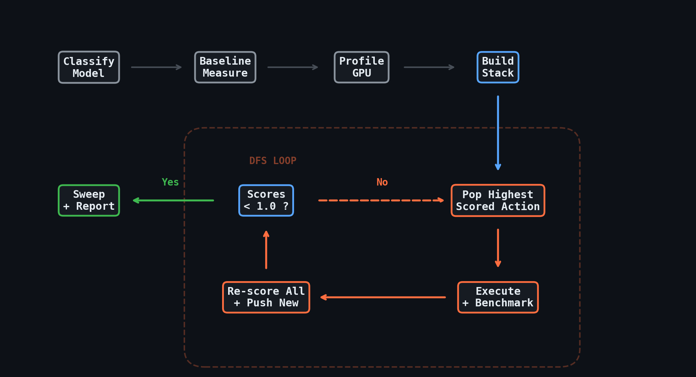

# How the Optimization Loop Works

> ⚠️ **Stale content notice (May 2026).** This walkthrough still
> describes a "Step 1: Classify the Model" automated action that has
> been **removed** from the Hyperloom action graph. The Coordinator no
> longer derives `model_class` from a `classify` step; it must be
> supplied explicitly via the `--model-class` CLI flag (see the
> "Migration Notes" section of the root [README](../README.md) and
> [UPGRADING.md](UPGRADING.md)). The rest of the loop mechanics — DFS
> scoring, dynamic branching, KB-driven priors — are still accurate, but
> read "Step 1: Classify the Model" below as **"The user supplies
> `model_class` on the CLI, which sets the same score-table priors
> shown here."** A full rewrite is tracked in the documentation
> backlog.

A walkthrough of Hyperloom's DFS-guided inference optimization, showing how the agent builds a search tree, scores actions, explores branches, and improves over time. Each optimization run feeds a self-evolving knowledge base that makes the next run faster and more targeted. Uses the GLM-5-FP8 optimization (174 → 509 tok/s/GPU) as a running example.

---

## The Loop at a Glance

The agent runs a single sequential loop. Each iteration: pop the highest-scored action from the stack, execute it, measure the result, re-score everything, repeat.



The tree is **not fixed upfront**. The initial stack is a starting template based on model classification. As the agent explores, new branches emerge from discoveries, scores shift based on results, and dead branches get pruned by crashes or regressions.

---

## The Self-Evolving Knowledge Base

The optimization loop does not start from scratch each time. The agent maintains a structured knowledge base (KB) — a JSONL store of lessons, validated results, architecture constraints, and pitfalls accumulated across every optimization run. The KB is what turns a single-model optimizer into a system that gets faster and better with each model it touches.

**Before each run**, the agent queries the KB for the target model and architecture class:

```
kb_query.py --model "GLM-5-FP8" --top-k 20
```

Relevant entries surface immediately: "torch.compile is incompatible with MLA+FP8" (learned from DeepSeek-R1), "backend switches outperform parameter sweeps on MoE models" (learned from Kimi-K2.5 and GLM-5), "vendor aiter kernels resist GEAK optimization — 0% E2E gain despite +44% micro" (learned from DeepSeek-R1). These adjust the initial score priors before the first benchmark even runs — actions known to fail get `crash_risk=1.0`, and actions known to succeed on similar architectures get boosted expected gains. This is how the classification table and risk estimates in the steps below are calibrated.

**After each action**, new findings are ingested back:

```
kb_ingest.py --category lesson --model "GLM-5-FP8" \
  --action "combined backend switches" \
  --lesson "Super-linear synergy: 3 switches at +3%/+3%/+0.3% individually gave +41% combined"
```

The KB currently holds **39 validated entries** spanning 7 models, covering architecture constraints, server parameter effects, kernel optimization outcomes, benchmark methodology pitfalls, and cross-model takeaways. Each entry carries a confidence score and can be superseded by newer findings.

The practical effect is compound. The first model the agent optimized required broad exploration with many dead ends. By the time GLM-5 was optimized (the 6th model), the agent already knew to skip torch.compile, prioritize backend switches, and expect vendor kernel mods to crash — pruning entire branches before they were attempted. Each run makes the next one faster and more targeted. The steps below show the loop mechanics; the KB is the reason those mechanics improve over time.

---

## Step 1: Classify the Model

The agent reads `config.json` and classifies the architecture. This determines which optimization actions are relevant and sets their initial score priors.

For GLM-5-FP8:
```
Architecture: GlmMoeDsaForCausalLM
MoE: True (256 experts, topk=8)
MLA: True (multi-latent attention)
NSA: True (native sparse attention)
torch.compile: INCOMPATIBLE (NSA uses custom CuteDSL kernels)
→ Classification: moe_mla_nsa
```

Each model class has a different score table — the agent knows upfront that MoE+MLA+NSA models benefit most from backend switches, while dense models benefit most from torch.compile and GEAK kernel optimization:

| Action | Dense | MoE+MLA | MoE+MLA+NSA |
|---|---|---|---|
| backends | 3 | 9 | **10** |
| params | 5 | 6 | **5** |
| kernel-opt | 8 | 2 | **2** |
| torch.compile | 7 | 0 | **0** |

For GLM-5, `backends=10` and `torch.compile=0` — the agent will explore backend switches first and never attempt torch.compile. The `torch.compile=0` prior was set by a KB entry learned from DeepSeek-R1: "torch.compile is incompatible with MLA+FP8." Without that entry, the agent would have wasted a cycle discovering the incompatibility from scratch.

---

## Step 2: Baseline + Profile

The agent measures the starting point and profiles the GPU to understand where time is spent.

**Baseline**: 1,379 tok/s (344.8 tok/s/GPU) at TP=4, CONC=64

**Profile** (TraceLens):

| Component | % GPU time |
|---|---|
| AllReduce communication | 44.9% |
| GPU idle (scheduling gaps) | 49.0% |
| MoE Router GEMM | 8.2% |
| MoE Expert GEMM | 4.7% |

**Target** (NVIDIA B200): 660 tok/s/GPU → gap = 47.8%

The profile feeds the scoring heuristic. The 8.2% MoE Router GEMM becomes a potential GEMM tuning target. The 44.9% AllReduce confirms that communication-reducing backends should be prioritized. The 47.8% target gap sets an urgency multiplier of 1.478 on all scores.

---

## Step 3: Build the Initial Stack

Each candidate action gets a full score computed from the formula:

```
score = (expected_gain / cost_minutes) × (1 - accuracy_risk) × (1 - crash_risk) × target_gap_multiplier
```

**Backends** (base=10):
```
(10 / 5) × (1 - 0.1) × (1 - 0.1) × 1.478 = 2.39
```

**Params** (base=5):
```
(5 / 5) × (1 - 0.0) × (1 - 0.05) × 1.478 = 1.40
```

**Kernel-opt** (base=2):
```
(2 / 15) × (1 - 0.15) × (1 - 0.2) × 1.478 = 0.13
```

The initial stack, sorted highest to lowest:

```
STACK  ┃ Score
━━━━━━━╋━━━━━━
  1    ┃ backends     2.39  ← popped first
  2    ┃ params       1.40
  3    ┃ kernel-opt   0.13
  4    ┃ sweep        0.07
```

---

## Step 4: The DFS Loop in Action

Here's how the stack evolves through the full GLM-5 optimization. Each row is a moment in time — an action is popped, executed, and the stack is re-scored.

### T=0 → Pop `backends` (score 2.39)

The agent tests 5 backend switches individually:

| Switch | Gain |
|---|---|
| `--nsa-decode-backend aiter` | +3.1% |
| `--enable-mixed-chunk` | +2.9% |
| `--enable-aiter-allreduce-fusion` | +0.3% |
| Fused MoE runner | +0.4% |
| Fused MLA decode | 0.0% |

Two winners found (>1%). Score update rule fires: **"After 2+ backend wins, push `combined_test` with score = sum of individual gains × 1.5."**

```
STACK  ┃ Score  ┃ Note
━━━━━━━╋━━━━━━━━╋━━━━━━━━━━━━━━━━━━━━━━━━━
  1    ┃ combined_test  9.45  ← NEW (auto-pushed)
  2    ┃ params         1.40
  3    ┃ kernel-opt     0.13
```

### T=1 → Pop `combined_test` (score 9.45)

All three winners tested together: **+41.2%** (1,403 → 1,981 tok/s). Multiplicative synergy — 6.5x the additive prediction. Stack re-scored against the new baseline:

```
STACK  ┃ Score  ┃ Note
━━━━━━━╋━━━━━━━━╋━━━━━━━━━━━━━━━━━━━━━━━━━
  1    ┃ params         1.40  ← next
  2    ┃ kernel-opt     0.16  (slight boost — backends done, compute is next frontier)
  3    ┃ sweep          0.08
```

### T=2 → Pop `params` (score 1.40)

Tests 8 server parameters. All neutral (<1%) except `QR INT4 quantization` (+1-2%). Discovers `--num-continuous-decode-steps` is a complete no-op. Score update: **"All params <1%: reduce param scores, slight boost to remaining actions."**

```
STACK  ┃ Score  ┃ Note
━━━━━━━╋━━━━━━━━╋━━━━━━━━━━━━━━━━━━━━━━━━━
  1    ┃ kernel-opt     0.19
  2    ┃ sweep          0.10
```

### T=3 → New branch discovered: GEMM tuning

**This is the key moment.** While investigating performance variance, the agent traces from the profile (8.2% in router GEMM) → through SGLang's model runner → into aiter's Triton GEMM library → to the config directory. It finds: **no tuning config exists for shape (N=256, K=6144).**

The agent creates a new action and scores it:
```
GEMM tuning: (5% expected / 2 min cost) × 0.95 × 0.9 × 1.478 = 3.16
```

Score 3.16 is higher than everything on the stack. It's pushed and immediately popped.

```
STACK  ┃ Score  ┃ Note
━━━━━━━╋━━━━━━━━╋━━━━━━━━━━━━━━━━━━━━━━━━━
  1    ┃ GEMM tuning    3.16  ← NEW (runtime discovery), popped immediately
  2    ┃ kernel-opt     0.19
  3    ┃ sweep          0.10
```

### T=4 → Pop `GEMM tuning` (score 3.16)

Creates `gfx950-GEMM-A16W16-ATOMIC-N=256-K=6144.json` with `ksplit=24`. Result: **+21.4%** (1,704 → 2,070 tok/s). Massively exceeds the 5% estimate.

Score update: **"Kept kernel: boost similar kernel type scores."** Sub-branches pushed for dense GEMM tuning (55 shapes) and A8W8 Triton experiments.

```
STACK  ┃ Score  ┃ Note
━━━━━━━╋━━━━━━━━╋━━━━━━━━━━━━━━━━━━━━━━━━━
  1    ┃ dense-GEMM     0.50  ← sub-branch from GEMM success
  2    ┃ A8W8-Triton    0.30
  3    ┃ kernel-opt     0.19
  4    ┃ sweep          0.10
```

Dense GEMM tuning: 55 shapes tuned, zero decode impact (bandwidth-bound). A8W8 Triton: -5.1% regression, reverted.

### T=5 → Pop `kernel-opt` (score 0.19)

LLM proxy generates optimized FP8 quantization kernel. Result: **+0.5%**. Small but validated — patch kept.

```
STACK  ┃ Score  ┃ Note
━━━━━━━╋━━━━━━━━╋━━━━━━━━━━━━━━━━━━━━━━━━━
  1    ┃ fMoE-mods      0.30  ← aggressive exploration
  2    ┃ RCCL-tuning    0.20
  3    ┃ sweep          0.10
```

### T=6 → Aggressive phase: crashes

| Action | Result | Score after |
|---|---|---|
| fMoE 2-stage CK path | -76% regression | → 0 |
| fMoE block_m=64 | GPU crash | → 0 |
| fMoE block_m=128 | GPU crash | → 0 |
| NCCL_PROTO=LL128 | RCCL crash | → 0 |
| RCCL_MSCCL_ENABLE=1 | Server crash | → 0 |

Score update: **"After 2+ crashes on vendor-type kernels: reduce all vendor kernel scores to near-zero."** Crashed actions get `crash_risk=1.0`, making their score permanently 0.

```
STACK  ┃ Score  ┃ Note
━━━━━━━╋━━━━━━━━╋━━━━━━━━━━━━━━━━━━━━━━━━━
  1    ┃ sweep          0.10  ← only action left above 0
```

**All scores < 1.0 → stopping criterion met.** Proceed to sweep and report.

### Final: 2,039 tok/s (509 tok/s/GPU) — +47.8% cumulative

Every finding from this run — the super-linear backend synergy, the missing GEMM config pattern, the crash-prone vendor kernel mods — was ingested back into the KB. The next MoE+MLA+NSA model starts with these priors baked in.

---

## How Branches Get Added Dynamically

The initial stack is just a starting point. Three mechanisms add new branches at runtime:

**1. Rule-based:** After 2+ backend wins, a `combined_test` is automatically pushed with boosted score. After any kept optimization, a `re-profile` is pushed to discover new bottlenecks.

**2. Discovery-based:** The GEMM tuning branch didn't exist at T=0. The agent found the missing config while investigating aiter source code. It created an ad-hoc action, scored it with the same formula, and it immediately became the highest priority.

**3. Sub-branching:** A successful GEMM tuning pushed sub-branches for dense GEMM tuning and Triton-for-CK experiments. These inherit a boosted score from the parent's success.

---

## How Scores Evolve

| Phase | backends | params | kernel-opt | GEMM tuning | Note |
|---|---|---|---|---|---|
| Classification | 10 | 5 | 2 | — | Base priors from model class |
| After profiling + target gap (×1.478) | 14.8 | 7.4 | 3.0 | — | B200 gap boosts everything |
| Stack built (cost/risk applied) | **2.39** | 1.40 | 0.13 | — | Full formula. Backends popped first. |
| After backend wins | done | 1.40 | 0.13 | — | `combined_test` pushed at 9.45 |
| After +41.2% combo | done | **1.40** | 0.16 | — | Re-scored against new baseline |
| After params (all <1%) | done | done | 0.19 | — | Params exhausted |
| GEMM config discovered | done | done | 0.19 | **3.16** | New branch — immediately popped |
| After +21.4% GEMM win | done | done | 0.19 | done (9) | Sub-branches pushed |
| After FP8 kernel (+0.5%) | done | done | done | done | |
| After 5 crashes | done | done | 0 | done | All remaining < 1.0 → **STOP** |

---

## Backtracking

Backtracking is implicit. The agent doesn't undo and walk back up a tree — it re-scores the flat stack and pops whatever is highest. If backends are exhausted and params now scores highest, the agent naturally moves there.

Explicit revert happens in two cases:
- **Regression**: throughput decreased → changes reverted from `.bak` files, action scored down by 0.5×
- **Accuracy failure**: output doesn't match reference → changes reverted, action scored to 0

Example: A8W8 Triton for MLA GEMMs caused -5.1% regression. The agent reverted immediately, reduced the score for similar Triton-for-CK substitutions by 0.7×, and moved on.

---

## Why the Tree Looks Different for Different Models

Classification routes models through fundamentally different paths. GLM-5 (MoE+MLA+NSA) went deep into backends. DeepSeek-R1 (MoE+MLA) found its baseline was already near-optimal and the big win came from MTP speculative decoding. Qwen3.5 (MoE+hybrid attention) had its backends branch crash immediately, collapsing to a params-only optimization.

| | GLM-5 | DeepSeek-R1 | Qwen3.5 |
|---|---|---|---|
| Deepest branch | Backends (4 levels) | MTP + scheduling (3 levels) | Params (2 levels) |
| Branches added at runtime | 2 (GEMM tuning, combined test) | 1 (MTP scheduling combo) | 0 |
| Crashed branches | 2 (fMoE, RCCL) | 1 (DP attention) | 3 (aiter, alter, backends) |
| Primary lever | Backend combo (+41%) | MTP spec decoding (+97%) | Scheduling params (+4.7%) |
| Total improvement | +47.8% | +47% over B200 | +39.7% |

The same loop, same formula, same rules — different trees emerge from different models.

---

## Further Reading

- [PRISM DFS Scoring Walkthrough](../dashboards/PRISM_DFS_SCORING_WALKTHROUGH.md) — formula-level trace of every scoring decision in the GLM-5 run
- [Interactive Search Tree](../dashboards/optimization-search-tree.html) — visual DFS tree with scores at each node
- [GLM-5 Case Study](CASE_STUDY_GLM5.md) — what the agent discovered (cross-repo GEMM config, kernel patches)
- [DeepSeek-R1 Case Study](CASE_STUDY_DEEPSEEK_R1.md) — fast config-space exploration on a new workload
