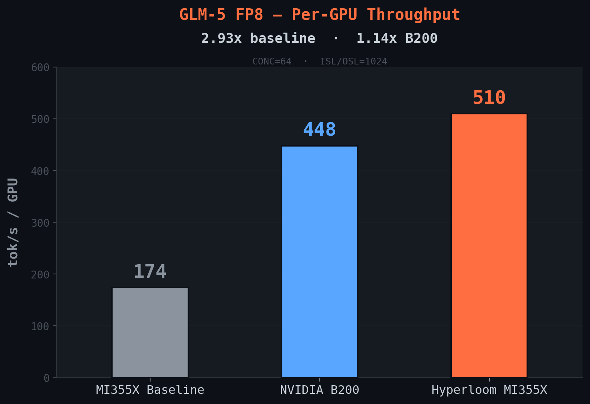

---
myst:
    html_meta:
        "description": "Case study: Hyperloom optimized GLM-5-FP8 on AMD Instinct MI355X GPUs, achieving 2.93x throughput and exceeding NVIDIA B200 by 14% through agentic GEMM tuning."
        "keywords": "Hyperloom, GLM-5, case study, AMD Instinct MI355X, GEMM tuning, MoE, SGLang, LLM inference, throughput, ROCm, optimization, FP8, aiter, Triton, kernel"
---
# Case Study: GLM-5 — Discovering Optimizations That Are Hard to Spot Manually

Autonomous optimization of GLM-5-FP8 on AMD Instinct™ MI355X GPUs — from 174 tok/s/GPU to 509 tok/s/GPU (2.93x), exceeding NVIDIA B200 by 14% on per-GPU throughput. The optimization explored 40+ configurations, produced code patches, and tuned 55 GEMM shapes. The most impactful findings required the agent to move fluidly across repository boundaries — from SGLang's serving layer, into aiter's Composable Kernel library, down to Triton GEMM config files and individual kernel source — building a cross-stack understanding that is time-consuming to develop manually.

**Model**: GLM-5-FP8 (756B, 256-expert MoE, native sparse attention (NSA) + multi-head latent attention (MLA), 78 layers; FP8 = 8-bit floating point)
**Hardware**: 4x AMD Instinct MI355X (gfx950) | **Framework**: SGLang v0.5.9-dev + aiter

---

## Starting point

The InferenceX default config ran GLM-5 on 8x AMD Instinct MI355X at tensor parallelism (TP)=8 and produced 174 tok/s/GPU at concurrency 64. The B200 reference was 448 tok/s/GPU — a 61% gap. The agent profiled the baseline with TraceLens and found: 44.9% of the decode step was AllReduce communication, 8.2% was the mixture of experts (MoE) router general matrix multiplication (GEMM), and 49% of GPU time was idle.

---

## Discovering the missing GEMM config (+21%)

This was the single largest optimization, and it illustrates the kind of finding that's hard to arrive at without systematic agentic exploration.

GLM-5's 256-expert MoE layer routes each token through a GEMM with shape (M, N=256, K=6144) — mapping the hidden state to expert routing scores. This GEMM runs once per layer across all 78 layers, for every token. The aiter Triton GEMM library looks up tuning configurations from JSON files keyed by (N, K). For (N=256, K=6144): no config file existed. The kernel was falling back to default tile parameters.

The agent found this gap by tracing across repositories: from the TraceLens profile (8.2% GPU time in the router GEMM) → into SGLang's model runner (which dispatches to aiter for MoE) → into aiter's Triton GEMM library (where it learned the file-based config lookup mechanism) → to the config directory on disk (where the file for this shape was missing). It then created a tuning config:

```json
{
    "BLOCK_SIZE_M": 16,
    "BLOCK_SIZE_N": 16,
    "BLOCK_SIZE_K": 256,
    "NUM_KSPLIT": 24,
    "num_warps": 4
}
```

The key parameter is `NUM_KSPLIT=24`. The MI355X has 256 Compute Units. With the default config, most CUs sat idle during the router GEMM. Setting ksplit=24 splits the K dimension (6144) into 24 parallel chunks, distributing the reduction across the full GPU.

**Result: +21.4%** (1,704 → 2,070 tok/s). One JSON file.

This branch didn't exist when the agent started — it emerged at runtime when source code inspection during the GEMM tuning phase revealed the gap. The agent went on to tune 55 additional dense GEMM shapes (all model-specific (M, N, K) combinations for GLM-5's linear layers) using aiter's auto-tuner.

Spotting this requires crossing three codebases — SGLang's model layer, aiter's GEMM dispatch, and the on-disk config directory — then connecting a profiling hotspot to a missing file to a hardware utilization problem. Each step is individually straightforward, but the chain from "8.2% in profile" to "create this specific JSON file" spans enough of the stack that it's unlikely to be attempted under typical time constraints.

---

## Finding the right backend combination (+41%)

An engineer would likely try backend switches individually, see +3% / +3% / +0.3%, and move on. The combinatorial test (up to 2^5 = 32 subsets) is tedious to do manually but natural for an automated search loop. In this case, it uncovered a superlinear interaction.

The agent tested five SGLang backend switches one at a time:

| Switch | Individual Gain |
|---|---|
| `--nsa-decode-backend aiter` — Composable Kernel (CK) attention kernels for NSA decode | +3.1% |
| `--enable-mixed-chunk` — Overlap prefill and decode in the same batch | +2.9% |
| `--enable-aiter-allreduce-fusion` — Fuse AllReduce with RMSNorm+quantization | +0.3% |
| Fused MoE runner | +0.4% |
| Fused MLA decode | 0.0% |

These are config-level changes — the kind an engineer would try. Individually, none looked significant. The agent's systematic search tests positive switches in combination rather than stopping at single-switch results. When the top three were enabled together:

**+41.2%** (1,403 → 1,981 tok/s)

The interaction is multiplicative. Faster attention (aiter CK kernels) shortens each decode step. Mixed-chunk scheduling fills the idle gaps between those shorter steps. Allreduce fusion hides communication latency during the now-faster compute. Each optimization unlocks headroom that the others exploit — an effect invisible when testing in isolation.

---

## Results

The following table and chart show per-GPU throughput across concurrency levels.



| CONC | MI355X Baseline (TP=8) | B200 (TP=8) | **Optimized MI355X (TP=4)** | vs B200 |
|---:|---:|---:|---:|---:|
| 4 | 17.5 | 56.4 | **65.9** | +17% |
| 8 | 33.3 | 97.3 | **120.2** | +24% |
| 16 | 59.8 | 172.4 | **206.4** | +20% |
| 32 | 106.3 | 268.4 | **341.4** | +27% |
| 64 | 173.7 | 447.8 | **508.7** | +14% |

All values in tok/s/GPU. Input sequence length (ISL)=1024, output sequence length (OSL)=1024, FP8 weights.


---

## Getting faster over time

The GLM-5 run was not the agent's first optimization. Prior runs on DeepSeek-R1, Kimi-K2.5, Qwen3, and others had already populated the recipe knowledge base (KB) with validated lessons — "torch.compile is incompatible with MLA+FP8," "vendor aiter kernels resist rewriting," "backend switches outperform parameter sweeps on MoE models." These priors pruned dead branches before the first benchmark: the agent never attempted torch.compile on GLM-5 and deprioritized vendor kernel modifications, saving hours of exploration.

In return, GLM-5's findings — the super-linear backend synergy, the missing GEMM config pattern, the FP8 kernel eviction trick — were ingested back into the KB. Future MoE+MLA+NSA models start with higher-confidence priors for these actions, converging faster than GLM-5 did.

---

## Reproduce

Use these commands to reproduce the optimized configuration:

```bash
git clone https://github.com/AMD-AGI/Agentic-InferenceX.git
cd Agentic-InferenceX/glm5-optimized
bash scripts/apply_patches.sh                  # GEMM config + kernel patch + stability fix
bash scripts/launch_server.sh --background     # TP=4, 4x MI355X
bash scripts/run_benchmark.sh                  # Expected: ~2,039 tok/s (509 tok/s/GPU)
```

## More info

These resources provide the full optimization history and comparison data:

- [glm5-optimized README](https://github.com/AMD-AGI/Agentic-InferenceX/tree/main/glm5-optimized) — Full reproduction guide with TurboQuant KV cache option.
- [Optimization History](https://github.com/AMD-AGI/Agentic-InferenceX/blob/main/glm5-optimized/docs/FULL_OPTIMIZATION_HISTORY.md) — Complete v1→v8 journey with every experiment.
- [B200 Gap Analysis](https://github.com/AMD-AGI/Agentic-InferenceX/blob/main/glm5-optimized/docs/NVIDIA_B200_COMPARISON.md) — Detailed comparison of software stacks.
