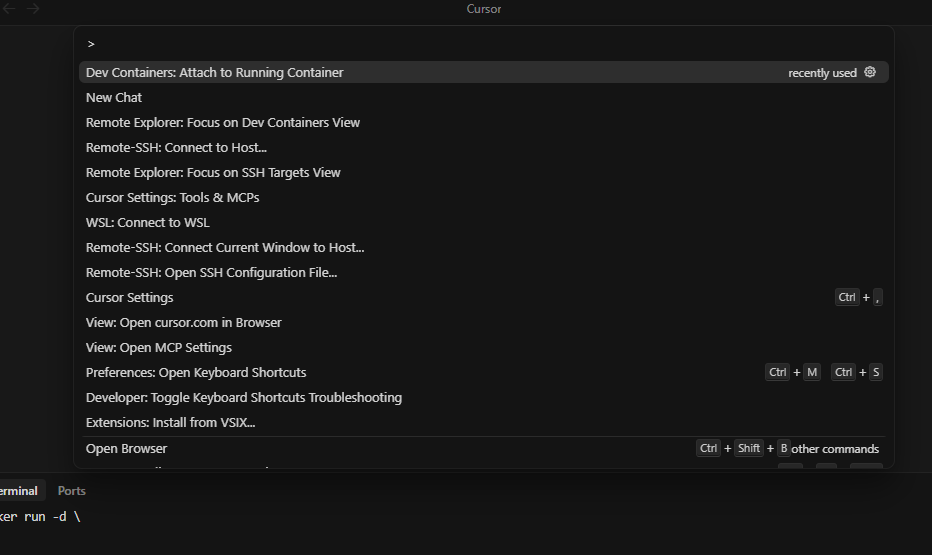
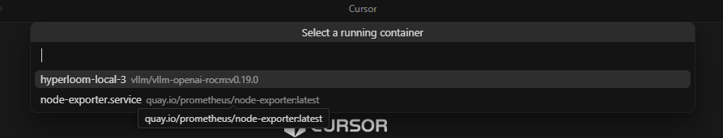

# Quickstart — Local Mode (Cursor)

Local Mode runs Hyperloom inside a Docker container on an AMD GPU machine. You attach Cursor to that container and launch the optimization loop from Cursor Chat.

There are two ways to get a GPU environment:

- **[Your own GPU machine](#quickstart--your-own-gpu-machine)** — the primary, fully self-serve path.
- **[Primus-SaFE platform](#optional-quickstart--primus-safe-platform)** — an optional path for AMD-internal users on the Primus-SaFE Authoring platform.

---

## Quickstart — Your own GPU machine

**Prerequisites:**

- An AMD GPU machine supporting **MI300X / MI308X / MI325X / MI355X** (MI308X and MI325X run with the MI300X runner scripts).
- Access to an OpenAI-compatible (LiteLLM-style) LLM gateway: set **both** `SAFE_API_KEY` (your gateway API key) and `OPENAI_BASE_URL` (your gateway’s `/v1` endpoint). The Primus-SaFE LiteLLM gateway is one option (get your key via the [LLM Gateway](https://global.primus-safe.amd.com/litellm-gateway)), but any compatible gateway works.

### 1. Start the container

Pick the ROCm image matching your GPU (browse all tags at **[hub.docker.com/r/primussafe/sglang/tags](https://hub.docker.com/r/primussafe/sglang/tags)**):

- SGLang MI300X: `docker.io/primussafe/sglang:v0.5.12-rocm720-mi30x-profilerfix`
- SGLang MI355X: `docker.io/primussafe/sglang:v0.5.12-rocm720-mi35x-profilerfix`
- vLLM MI300X: `docker.io/primussafe/vllm-openai-rocm:v0.21.0-rocm720-profilerfix`
- vLLM MI355X: `docker.io/primussafe/vllm-openai-rocm:v0.21.0-rocm720-profilerfix`

Start a long-running container that can access the GPU:

```bash
docker run -d \
  --name hyperloom-local \
  --shm-size 64g \
  --device /dev/kfd \
  --device /dev/dri \
  --group-add video \
  docker.io/primussafe/sglang:v0.5.12-rocm720-mi30x-profilerfix \
  tail -f /dev/null
```

> **Notes:** You need a model available inside the container — download one after attaching (e.g. `huggingface-cli download ...`), or reuse a host model by adding `-v /path/to/models:/models`. The `-profilerfix` images patch rocprofiler so it captures kernels launched under HipGraphLaunch ([SGLang issue #352](https://github.com/sgl-project/sglang/issues/352)).

### 2. Connect Cursor to the container

With Cursor already connected to your remote GPU host and the container running, attach to it using the **Dev Containers** extension. Open the command palette (`Ctrl+Shift+P`) and run **Dev Containers: Attach to Running Container...**:

> If you do not have the Dev Containers extension yet, install it from the [Dev Containers extension page](https://marketplace.visualstudio.com/items?itemName=ms-vscode-remote.remote-containers) (make sure it is installed in the remote environment).



Select the container you started (`hyperloom-local`):



Cursor opens a new window attached to the running container. Open a workspace folder inside the container to continue.

### 3. Clone Hyperloom and configure credentials

In the container, make sure GitHub authentication and AMD-AGI repository access
are available — `local_setup.sh` reuses that access to clone dependency
repositories. Then clone Hyperloom:

```bash
git clone https://github.com/AMD-AGI/Hyperloom.git && cd Hyperloom
cp .env.template .env
```

Configure one of the supported LLM gateway layouts:

**Single gateway (default).** One OpenAI-compatible endpoint serves both Claude
and GPT-style models. This is the usual AMD Primus-SaFE setup:

```bash
export SAFE_API_KEY=ak-your-safe-apikey
export OPENAI_BASE_URL=https://global.primus-safe.amd.com/api/v1/llm-proxy/v1
```

**Split Anthropic + OpenAI entrypoints.** Use this when Claude and GPT models
live on different upstream providers or gateways:

```bash
export ANTHROPIC_BASE_URL=https://api.anthropic.com
export ANTHROPIC_API_KEY=sk-ant-...
export OPENAI_BASE_URL=https://api.openai.com/v1
export OPENAI_API_KEY=sk-...
```

**Model IDs.** The AMD defaults work on the Primus-SaFE gateway. For split
entrypoints or a self-hosted gateway, pin model IDs that your gateway serves:

```bash
export CLAUDE_MODEL=your-orchestration-model
export CODEX_MODEL=your-kernel-model
```

For non-AMD/self-hosted gateways, also opt out of the AMD-only model gate so
preflight validates against your gateway's `/models` catalog:

```bash
export INFERENCE_OPTIMIZER_ALLOW_CUSTOM_ORCH_MODEL=1
```

Shell exports are enough for one session. To persist them, put the same values
in `.env`; shell exports still win over `.env`. For non-AMD gateways, model
overrides, Cursor keys, and endpoint overrides, see
[Authentication and credentials](../reference/authentication.md).

### 4. Bootstrap dependency checkouts

Run `local_setup.sh` after credentials are available:

```bash
export USER_DATA_PATH=/workspace/hyperloom && mkdir -p "$USER_DATA_PATH"
bash src/hyperloom/inference_optimizer/assets/local_setup.sh
```

- `SAFE_API_KEY` — your key from the [LLM Gateway](https://global.primus-safe.amd.com/litellm-gateway). Exporting it in the shell is enough; to persist it instead, use the `.env` appendix below.
- `USER_DATA_PATH` — Hyperloom's runtime directory for dependency code, logs, state, and results (not the source directory). Use an absolute path pointing at any location with enough space (relative paths are not rejected by `local_setup.sh`, but an absolute path avoids ambiguity across the runtime).

When it finishes, `local_setup.sh` prints the workspace path to open in Cursor, a prompt template to paste into Cursor Chat (it includes a `- Model: /path/to/your/model` line to fill in), and the env file to source before launch.

> **Before the first launch**, you must also run the runtime installer and source
> the kernel-agent env (per the SKILL IR-2 preflight): `local_setup.sh` only
> clones dependencies. The prompt in
> [Run a Hyperloom optimization](../how-to/optimize.md) already chains
> `install.sh` + `source .../runtime/kernel-agent.env.sh`; follow it rather than
> launching straight after Step 4.

---

## Optional Quickstart — Primus-SaFE platform

AMD-internal users can run Local Mode on the **Primus-SaFE Authoring** platform instead of their own machine:

1. Create an Authoring Pod on Primus-SaFE Authoring and select an SGLang or vLLM image. On this platform, use the Harbor mirror prefix `harbor.<datacenter_name>.primus-safe.amd.com/proxy/primussafe/<image>:<tag>` (the internal mirror of the Docker Hub images above) — for example `.../proxy/primussafe/sglang:<tag>` or `.../proxy/primussafe/vllm-openai-rocm:<tag>`.
2. When the Pod is ready, connect to it with Cursor Remote SSH (follow the connection instructions shown in the Primus-SaFE Authoring UI).
3. Inside the Pod, follow [Step 3](#3-clone-hyperloom-and-configure-credentials) and [Step 4](#4-bootstrap-dependency-checkouts) above to clone Hyperloom and run the bootstrap.

---

## Next Step

After setup, open the Hyperloom workspace printed by `local_setup.sh` in Cursor.
Then follow [Run a Hyperloom optimization](../how-to/optimize.md) to launch,
monitor, or resume a run.

For the optional AMD Quark quantization prelude, see [Quantization with AMD Quark](../how-to/quantization-quark.md).

## Appendix — Environment configuration (.env)

<details>
<summary><strong>Basic <code>.env</code> recipe and advanced options</strong></summary>

To persist gateway credentials between shells instead of exporting them each session:

```bash
cp .env.template .env
```

Edit `.env`:

```text
SAFE_API_KEY=ak-your-safe-apikey
OPENAI_BASE_URL=https://global.primus-safe.amd.com/api/v1/llm-proxy/v1
```

Shell `export` always wins over `.env` — see [Credential precedence](../reference/authentication.md#credential-precedence).

For setups beyond the single-gateway default above, see [Authentication and credentials](../reference/authentication.md):

- **Split Anthropic + OpenAI entrypoints** — [Split entrypoints](../reference/authentication.md#split-entrypoints-native-anthropic-openai)
- **Non-AMD / self-hosted gateway + custom models** — [Non-AMD / self-hosted gateway](../reference/authentication.md#non-amd-self-hosted-gateway)
- **Optional `CURSOR_API_KEY` / `CURSOR_DEFAULT_MODEL`** — [Cursor SDK kernel-opt backend](../reference/authentication.md#cursor-api-key-cursor-sdk-kernel-opt-backend)
- **Optional `TRACELENS_INTERNAL_ROOT`** — [Dependency checkout variables](../reference/authentication.md#dependency-checkout-variables)

</details>

## Troubleshooting

**TLS / certificate errors against the AMD LLM Gateway (AMD network only).** If you are using the Primus-SaFE gateway and HTTPS requests to it fail with a certificate verification error inside the container, install the AMD certificate bundle:

```bash
curl -fsSL https://raw.githubusercontent.com/AMD-AGI/Primus-SaFE/main/Scripts/setup-certs/setup.sh | bash
```

This is only needed for the AMD-hosted gateway; it does not apply when you point `OPENAI_BASE_URL` at your own gateway.
