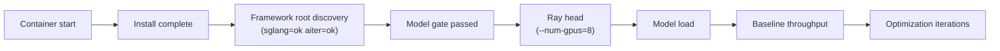
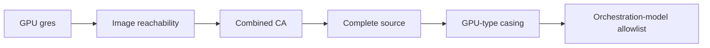

---
myst:
    html_meta:
        "description": "Submit Hyperloom optimization jobs to a Slurm cluster on AMD Instinct GPUs. Covers credentials, cluster setup, job submission, monitoring, and troubleshooting."
        "keywords": "Hyperloom, Slurm, cluster, AMD Instinct, MI300X, MI355X, sbatch, SGLang, vLLM, job submission, batch scheduler, ROCm"
---
# Install and configure Hyperloom on a Slurm cluster

Slurm mode submits Hyperloom optimization jobs to a Slurm cluster, where each
job launches a ROCm serving container (sglang or vllm) on one node and runs the
`inference_optimizer` CLI inside it. It is the batch-scheduler counterpart to the
Kubernetes layout in the [self-hosting and operations guide](../reference/operations.md),
and suits teams whose AMD GPU fleet is managed by Slurm rather than Kubernetes.

The submission scripts wrap the full flow:


They never start optimization on the login node; work only runs inside the scheduled job.

The ready-to-use scripts ship under
`src/hyperloom/inference_optimizer/assets/slurm/`:

| File | Purpose |
|---|---|
| `submit.sh` | Generic submitter: validates the model key, wires the config dir, applies cluster overrides, and submits one job per model. |
| `submit-vultr.sh` | Preset wrapper (MI355X / docker / `/mnt/vast`) around `submit.sh`. Copy and adapt for your own cluster. |
| `run_hyperloom.sbatch` | The job body: starts the container, sets the gateway host alias, mounts the CA bundle, installs the optimizer, and launches the backend. |
| `models.tsv` | Model table (key / repo / framework / image / TP / precision / ISL / OSL / concurrency / model-class / max-hours / target-gain). |
| `proxy.env.template` | Gateway connectivity profile. Copy to `proxy.env` and fill in before use. |

---

## Prerequisites

The following table lists the prerequisites and their implications for running Hyperloom on Slurm.

| Aspect | Assumption | Consequence |
|---|---|---|
| Scheduler | Slurm (`sbatch` / `srun` / `sinfo` / `squeue` available) | — |
| Container runtime | pyxis/enroot *or* docker | Auto-detected; override with `HL_CONTAINER_RUNTIME`. |
| GPU | AMD Instinct™ (for example MI355X `gfx950` or MI300X), 8 per node | Image and `--gpu-type` must match the hardware variant. |
| Slurm GPU gres | GPUs might or might not be registered as gres | If *not* registered you cannot use `--gpus`; see [Clusters without GPU gres](#clusters-without-gpu-gres). |
| Shared filesystem | A cross-node mount (WekaFS, VAST/NFS, ...) | Holds source, artifacts, and the CA bundle. |
| LLM gateway | Reachable directly or through a jump host | Might need a host alias plus an internal CA. |
| Container registry | Public or private | A private registry unreachable from compute nodes requires a locally cached image. |

---

## Step 1: Get the scripts

For a full source checkout, the scripts are already present under the assets
directory:

```bash
git clone https://github.com/AMD-AGI/Hyperloom.git && cd Hyperloom
cd src/hyperloom/inference_optimizer/assets/slurm
```

For a standalone setup on a login node, copy that `slurm/` directory to a shared
location the scheduler can read (for example `/mnt/vast/hyperloom-slurm`) and run
`submit.sh` from there.

## Step 2: Configure LLM credentials

Hyperloom is an LLM-driven agent: the Orchestration role calls the gateway
throughout the run, and GEAK (the kernel optimization backend, launched as a
subprocess) has its own gateway calls. A working key and a reachable endpoint
are hard requirements; the installer's preflight enforces them.

Copy the template and fill it in:

```bash
cp proxy.env.template proxy.env
```

In `proxy.env`, replace the three `ak-REPLACE_ME` placeholders with your SaFE API
key (issued from the Primus-SaFE LLM Gateway page), and set `HL_HOST_ALIAS_IP` to
your gateway jump-host IP if the domain does not resolve on compute nodes.
`run_hyperloom.sbatch` reads `proxy.env` (not the template) from the same
directory as `submit.sh`. Verify the key before submitting:

```bash
set -a; . ./proxy.env; set +a
# Map your gateway hostname (the one in $OPENAI_BASE_URL) to its jump-host IP.
curl -sS --resolve <your-gateway-host>:443:<GATEWAY_JUMP_HOST_IP> \
  "$OPENAI_BASE_URL/models" -H "Authorization: Bearer $OPENAI_API_KEY"
```

HTTP 200 plus a model list means the key works. **Note the model names in the
list** — they are needed in [LLM model-name constraints](#llm-model-name-constraints).

See [Authentication and credentials](../reference/authentication.md) for the full
credential model, including the split Anthropic-/OpenAI-compatible provider setup.

## Step 3: Prepare cluster access

### Build a combined CA bundle

If the gateway uses an internal CA, the job still needs to reach
`huggingface.co` and `github.com` over public TLS. A CA bundle containing
only the internal certificate makes public TLS fail with
`CERTIFICATE_VERIFY_FAILED`. Merge the system roots with the internal CA into a
single bundle and point `HL_CA_BUNDLE_HOST` at it:

```bash
cat /etc/ssl/certs/ca-certificates.crt internal-ca.pem > ca-combined.pem
```

Leave `HL_CA_BUNDLE_HOST` empty if the container image already trusts every CA
you need.

### Confirm the container image is reachable

If `models.tsv` references a private registry (a `<REGISTRY>/...` prefix) that
compute nodes cannot resolve, docker fails with `no such host`. Either
`docker login` the reachable registry, or replace the image with a node-local
cached image name (drop the registry prefix). List cached images and match the
variant to the hardware (for example a `mi35x` build for MI355X):

```bash
ssh <node> 'docker images | grep -iE "sglang|vllm"'
```

### Stage the Hyperloom source

Copy a *complete* source checkout (src-layout, `src/hyperloom/...`) to the
shared mount and point `submit.sh --source-dir` at it to skip the runtime
`git clone`. It must be a complete snapshot: an old flat layout or a snapshot
missing `src/hyperloom/inference_optimizer/cli/` causes `ModuleNotFoundError`
(see [Troubleshooting](#troubleshooting)). If `--source-dir` is omitted, the job
clones `main` from GitHub at runtime, which requires GitHub egress on the node.

## Step 4: Submit a job

```bash
# Generic (pyxis/enroot or docker auto-detected; requests TP GPUs by default)
./submit.sh deepseek_r1_sglang

# Preset for a docker / /mnt/vast cluster
./submit-vultr.sh deepseek_r1_sglang

# Print the sbatch command without submitting
./submit.sh --dry-run deepseek_r1_sglang

# claude-code backend (the image must ship the claude CLI)
./submit.sh -b claude deepseek_r1_sglang
```

Example model keys in `models.tsv`: `deepseek_r1_sglang`, `deepseek_r1_vllm`,
`gptoss_vllm` (edit the file to add your own).

Useful `submit.sh` options (run `./submit.sh --help` for the full list):

| Option | Meaning |
|---|---|
| `-b, --backend <python\|claude>` | Launch backend (default `python`). |
| `-p, --partition <name>` | Slurm partition. |
| `-g, --gpus <n>` | GPUs to request (default: the model's TP; use `0` on clusters without GPU gres). |
| `-c, --constraint <feat>` | Slurm `--constraint` (for example `gfx950`). |
| `--gpu-type <TYPE>` | Override the optimizer `--gpu-type` (lowercase, for example `mi355x`). |
| `--shared-mount <path>` | Shared FS bind-mounted into the container. |
| `--source-dir <path>` | Existing Hyperloom checkout to use instead of cloning. |
| `--data-root <path>` | Artifact root (default `<shared-mount>/hyperloom-slurm`). |
| `--dry-run` | Print the sbatch command, do not submit. |

### Clusters without GPU gres

If compute nodes do *not* register GPUs as Slurm gres (`scontrol show node`
reports `Gres=(null)`), any `--gpus N>0` request stays `PENDING (Resources)`
forever. The convention is then "one job takes a whole node; the container grabs
the GPUs directly":

- Pass `-g 0` so the job requests only a placeholder CPU and lands on the node;
- `submit.sh` emits `--gpus` only when `-g` is non-zero;
- `run_hyperloom.sbatch` carries no `#SBATCH --gpus` directive.

The container still receives every GPU through `--device=/dev/kfd
--device=/dev/dri`, so TP=8 works. If your GPUs *are* registered as gres
(`Gres=gpu:...:8`), use the standard `--gpus 8` and skip `-g 0`.

## Step 5: Monitor and read artifacts

```bash
squeue -p <partition>                                 # queue
tail -f hyperloom-hl-<key>-<backend>-<jobid>.out      # job output (submit dir)
SID=$(ls -t <data-root>/<key> | head -1)
cat <data-root>/<key>/$SID/state.json
```

The artifact directory `<data-root>/<model_key>/<CLAW_SESSION_ID>/` contains:

- `state.json`: Live status (`baseline_tput`, `current_best`, `cumulative_gain_validated`);
- `manifest.json`: Session manifest;
- `ci_metrics.json`: Baseline/optimized throughput plus `gain_pct`;
- `optimizer_runs/`: `launch_<sid>.json` and logs;
- `runtime/`: `kernel-agent.env.sh` and other files produced by the installer.

A healthy run logs in this order:



GPU memory and utilization ramp up only after the model-load step.

---

## LLM model-name constraints

The job calls the gateway for orchestration and (through the GEAK subprocess) for kernel
optimization. Model names must exist in your key's catalog:

| Use | Environment variable | Allowed values | Notes |
|---|---|---|---|
| Orchestration | `CLAUDE_MODEL` / `LLM_MODEL` | Any model in the gateway catalog; `claude-opus-5` preferred, with `claude-opus-4-8` / `claude-opus-4-7` / `claude-opus-4-6` as the AMD allowlist fallbacks | Validated against your gateway's `/models` catalog. |
| GEAK (kernel optimization subprocess) | `GEAK_CLAUDE_MODEL` | For example `claude-opus-5` | Defaults from `CLAUDE_MODEL`; set explicitly only when GEAK should use a different model. |
| Forge (fusion / rewrite / collective) | `FORGE_CLAUDE_MODEL` | For example `claude-opus-5` / `gpt-5.6-sol` | Defaults from `CLAUDE_MODEL` for the selected Forge backend; set explicitly only when Forge should use a different model. |

- Do *not* append effort/thinking suffixes (for example
  `claude-opus-4-7-thinking-xhigh`); the gateway returns `Invalid model name`
  (which can surface misleadingly as `401 missing subscription key`). Ids the
  catalog lists verbatim are fine even when they look suffixed — `gpt-5.6-sol`
  is a deployment name, not a variant of a bare `gpt-5.6`.
- To restore the stricter AMD Claude allowlist instead of catalog validation,
  set `INFERENCE_OPTIMIZER_ALLOW_CUSTOM_ORCH_MODEL=0`.
- These variables are set in `proxy.env` and are on the docker `-e` allowlist in
  `run_hyperloom.sbatch`. If you add a new model variable, add it to that
  allowlist too, or it will not reach the container.

---

## Tunable environment variables

| Variable | Default | Meaning |
|---|---|---|
| `HL_SHM_SIZE` | `64g` | docker `--shm-size`; raise it for high concurrency. |
| `HL_CONTAINER_RUNTIME` | `auto` | Force `docker` or `pyxis`. |
| `HL_GPU_TYPE_OVERRIDE` | — | Override `--gpu-type` (lowercase) when hardware differs from the table row. |
| `HL_SHARED_MOUNT` | `/path` | Shared FS bind-mounted into the container. |
| `HL_DATA_ROOT` | `<shared-mount>/hyperloom-slurm` | Artifact root. |
| `HL_CA_BUNDLE_HOST` | — | Combined CA bundle path (see [Build a combined CA bundle](#build-a-combined-ca-bundle)). |
| `INFERENCE_OPTIMIZER_ALLOW_CUSTOM_ORCH_MODEL` | unset (custom models allowed) | Set `0` to enforce the stricter AMD Claude orchestration allowlist. |

---

## Troubleshooting

The following items address common Slurm job and cluster configuration problems.

- Job stuck `PD (Resources)` while the node is `idle`: The node has no GPU gres, so `--gpus` can never be satisfied. Submit with `-g 0` and confirm there is no `#SBATCH --gpus` (see [Clusters without GPU gres](#clusters-without-gpu-gres)).
- `docker: ... no such host` when pulling the image: The private registry is unreachable from the node. Use a node-cached local image name, or `docker login` a reachable registry.
- `CERTIFICATE_VERIFY_FAILED: unable to get local issuer` (huggingface/github): The CA bundle has only the internal cert. Use a combined CA bundle.
- `ModuleNotFoundError: No module named '...cli'`: The source snapshot is incomplete or an old layout. Stage a complete src-layout checkout (`src/hyperloom/...`).
- `--gpu-type: invalid choice: 'MI355X'`: The CLI is case-sensitive. Use lowercase (for example `mi355x`; `submit-vultr.sh` already does).
- `--claude-model=... is not allowed`: The strict AMD allowlist is in force (`INFERENCE_OPTIMIZER_ALLOW_CUSTOM_ORCH_MODEL=0`). Use `claude-opus-5` for orchestration, or unset the variable to validate against the gateway catalog instead.
- `Invalid model name` / `401 missing subscription key`: The model name is not in the key catalog (often a suffixed variant). Use a name from `curl $OPENAI_BASE_URL/models`.
- Server fails to start / OOM in shm: `/dev/shm` is too small. Raise `HL_SHM_SIZE` (default `64g`).
- DNS failure / connection timeout to the gateway: The host alias was not applied. The docker path uses `--add-host`; confirm the node can reach the jump host on `:443`.

Suggested triage order:



---

## Known limitations

The following are known limitations of the Slurm integration.

- A source snapshot without `.git` (a plain rsync copy) leaves `code_revision`
  empty in `manifest.json`. Sync with `.git` if you need provenance.
- The docker path exposes all node GPUs to the container, so TP=8 occupies a
  whole node. Running multiple jobs per node requires isolating devices with
  `HIP_VISIBLE_DEVICES` / `ROCR_VISIBLE_DEVICES` (the scripts do not do this).
- The installer pip-installs Magpie and clones InferenceX / GEAK / TraceLens from GitHub, so
  nodes need GitHub egress. A fully offline setup must bake these into the image
  and pre-stage model weights on the shared mount.
- If the gateway's upstream lacks subscription credentials, real completions might
  return `missing subscription key` even though listing models and auth succeed;
  that is a gateway-side issue.
