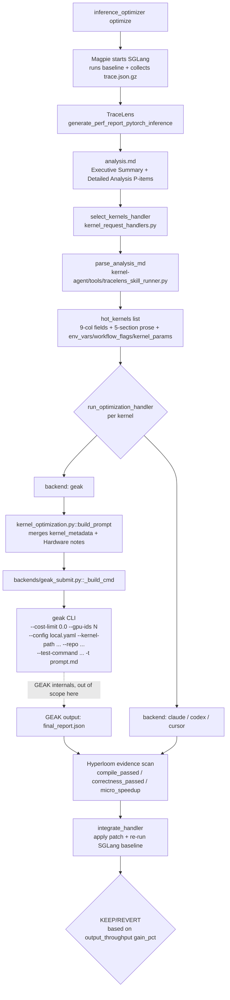

# TraceLens ↔ Hyperloom ↔ GEAK Interfacing — Contract & Current Implementation

> Status: Aligned to `design/TraceLens_Report_Interfacing.docx` and the `feature/xiaofei/tracelens-finishing-touches` branch (2026-05-15).
> Purpose: One-shot reconciliation of the docx contract, Hyperloom's current implementation, and how TraceLens / GEAK fit into the pipeline — **so that we stop spending review cycles on integration tickets that have already been resolved or that fall outside Hyperloom's scope**.
> Audience: TraceLens team, GEAK team, Hyperloom maintainers.
>
> **Parallel work note**: The "best-practice argument passing" between unitTestAgent and GEAK (the #175 family — full kernel-metadata injection, payload compression, test-harness propagation) is being handled in parallel by **@An, Zihao**; this document does not duplicate that workstream and only cross-references the shared contract in §3.4.

---

## 1. Summary: docx contract sync status

**One-line conclusion**: All 6 binding contracts in `TraceLens_Report_Interfacing.docx` that require **Hyperloom-side** consumption are **fully satisfied**. docx §3 (Kernel Fusion) is a **schema gap**: the docx schema is in place and TraceLens already emits the data, but GEAK has no fusion-input API and Hyperloom has no fusion parser; the blocker sits on the GEAK side, not the Hyperloom side (see §3.7). docx's System-Level Optimizations entry **does not define a binding schema** and is not a gap (see §3.8).

### 1.1 docx 8 requirements vs Hyperloom implementation

| # | docx requirement | Hyperloom implementation site | Status |
|---|---|---|---|
| 1 | `analysis.md` is the single source of truth; no fallback to `priority_data.json` / `category_data/*.json` / `kernel_summary.csv` / raw-trace | `kernel-agent/tools/tracelens_analysis.py:1882-1987` (explicit raise instead of fallback) + `tracelens_skill_runner.py:351-353` | ✅ |
| 2 | 9-column Compute Insights schema: `Operation / Args / Kernel Path / Time (ms) / %E2E / Count / FLOPS/Byte / Efficiency / Bound` | `tracelens_skill_runner.py:354-364` strict 9-token validation + `:742-755` exact header match | ✅ |
| 3 | Five labeled sections per P-item: `Identification / Data / Reasoning for Slowdown / Resolution / Impact estimate` | `tracelens_skill_runner.py:390-394` + `_extract_pitem_prose()` extracts all five | ✅ |
| 4 | GEAK prompt must inject `Workflow flags / Environment variables / Kernel-specific parameters (KV_DTYPE / BLOCK_SIZE / HEAD_SIZE)` | `kernel_optimization.py:755-827 build_kernel_metadata()` + prompt.md JSON block | ✅ |
| 5 | Budget filter for GEAK: **Higher P-item first, then Lower Efficiency within a block** | `tracelens_skill_runner.py:679-693 _efficiency_sort_key` (the docstring directly cites docx §2) + `:786` stable sort | ✅ |
| 6 | Idle %  sanity check (10–20% threshold); do not fall through when triggered | `tracelens_analysis.py:36-37 HIGH_IDLE_PCT_THRESHOLD_DEFAULT=20.0` + `:1896-1912` idle gate | ✅ |
| 7 | Fusion 4-column schema: `Kernel / Type / Duration / Perf model` (targeted at "kernel fusion modules") | Hyperloom does not consume it + GEAK has no fusion-input API | ⚠️ **schema gap** — docx schema and TraceLens data are both in place; the bottleneck is on GEAK's side, not Hyperloom's (see §3.7) |
| 8 | System-Level Optimizations (GPU idle / async launches / communication / graph capture) | GPU idle already consumed via #6 idle gate; the other three not consumed | ⚠️ **Not a binding contract** — docx provides no schema; only listed as "Exploratory ... if observed" in the §1 overview (see §3.8) |

### 1.2 Recent fix history (last 3 commits)

| Commit | Summary | Root cause it solved |
|---|---|---|
| `3dd1ab9` | `fix(tracelens)`: stop raw-trace fallback from silently undoing idle-gate suppression | The idle-gate suppression result was being overwritten by the raw-trace fallback path |
| `2044407` | `fix(install)`: pip-install all 5 GEAK v3.1.0 MCP tools, not just `rag-mcp` | Four MCP packages including `profiler_mcp` were missing → GEAK preprocess Step 5/7 died with `ModuleNotFoundError` |
| `aaadeb8` | `fix(geak)`: default `--geak-cost-limit` to `0.0` to match GEAK `geak.yaml` contract | GEAK's sub-agent path does not honour `geak.yaml`; it falls back to dataclass `cost_limit=3.0` and kills every sub-agent at ~50 steps |

### 1.3 Related historical issues (full table in §4)

**Already CLOSED, "integration / interface" category (grouped by role, more than the 8 in §1.1)**:

- TraceLens report aggregation / output consistency: **#125 · #144 · #194 · #203 · #204 · #205 · #209**
- TraceLens Agent early interface / deployment: **#43 · #61 · #74 · #75 · #76 · #77 · #78 · #79 · #80 · #126 · #127 · #148**
- GEAK invocation contract / prompt content: **#175 · #183 · #188 · #189**
- GEAK resources / budget / scheduling: **#34 · #56 · #131 · #181 · #182 · #184 · #186**
- End-to-end flow / Hyperloom-side integration: **#89 · #93 · #120 · #124 · #143**

**Still OPEN**:

| Issue | Type | Real bottleneck / Suggested handling |
|---|---|---|
| **#195** Fusion | **schema gap** (docx schema in place → TraceLens data in place → GEAK has no fusion-input API and Hyperloom has no fusion backend) | GEAK team needs to design the fusion-input API first; Hyperloom can then add a parser. See §3.7 |
| **#211** FlyDSL | **Integration extension request** (a new backend outside docx) | Requires TraceLens to add FlyDSL classification, Hyperloom to add FlyDSL metadata, and GEAK to use its existing `flydsl_optimization.md` skill. See §4.1 |

> Distinguishing principle: an **integration bug** is when, under the existing contract, the three-way information flow between TraceLens / GEAK / Hyperloom is broken or wrong. A **schema gap / integration extension request** is when a new backend / new schema / new capability needs to be added. This document only reconciles "integration bugs"; the other two categories belong on a separate roadmap.

> **Hyperloom's capability boundary on fusion** (for #195): Hyperloom can add a parser to extract the fusion section from docx §3, but **it cannot perform "fuse multiple kernels into one"** — that capability lives on the GEAK / compiler side. So the bottleneck for landing fusion is on the GEAK side, not on Hyperloom's. Please do not file follow-up fusion asks as Hyperloom bugs on this repo; once the GEAK team decides to add a fusion-input API, Hyperloom's parser work can land in parallel.

---

## 2. Hyperloom's current pipeline

This section traces the path "from TraceLens to GEAK input" and **stops at the GEAK invocation arguments**. What GEAK does internally (preprocess / sub-agent spawning / patch selection) is out of scope and owned by the GEAK team.

### 2.1 End-to-end flow (up to the GEAK invocation)



### 2.2 TraceLens is invoked exactly once in the pipeline

**At the `select_kernels` stage**: the baseline trace produces `analysis.md`, which is fed to `select_kernels_handler`.

- Trigger site: `inference_optimizer/orchestrator/kernel_request_handlers.py::select_kernels_handler`
- Underlying tool: `kernel-agent/tools/tracelens_analysis.py` (a thin wrapper around the `TraceLens_generate_perf_report_pytorch_inference` CLI)
- Output: `<workspace>/kernel-agent/runs/<session>/select_kernels/analysis_output/analysis.md`
- Consumer: `tracelens_skill_runner.parse_analysis_md(md_path, top_k=10)` parses `hot_kernels[]`, each row carrying the 9 raw fields + 5 P-item prose fields + `env_vars` / `workflow_flags` / `kernel_params`.

### 2.3 Where GEAK sits in the pipeline

GEAK is one of several backends that `run_optimization_handler` invokes. The current backend ladder (after commit `2044407`) is:

```
geak → claude → codex → cursor
```

GEAK is placed first because of the docx §2 contract "Filter for GEAK based on budget" — for an equally ranked candidate, the most specialised optimiser (GEAK) should consume the budget first. Claude / Codex / Cursor act as fallbacks when GEAK fails, declines, or times out.

**Inputs Hyperloom passes to GEAK** (the full Hyperloom-side boundary):

```
kernel-agent/tools/kernel_optimization.py
  └── build_prompt()                   # assembles prompt.md (content per §3.3 / §3.4)
  └── backends/geak_submit.py::submit()
       └── _build_cmd()                # assembles the geak CLI command
            geak -t prompt.md --yolo --output <patch_output_dir>
                 --gpu-ids N
                 --config /workspace/hyperloom/runtime/geak-config/local.yaml
                 --kernel-path <abs path to .cu/.triton>
                 --repo <abs path to repo root>
                 --test-command "<python harness>"
                 --cost-limit 0.0      # ← commit aaadeb8 forces 0 (= unlimited)
```

The arguments stop here. Everything GEAK does after receiving them (preprocess / sub-agent spawn / SelectPatchAgent / benchmark loop) is owned by the GEAK team and not detailed in this document.

---

## 3. docx requirements item-by-item, vs Hyperloom implementation

Each subsection follows the format: **docx quote → Hyperloom implementation → key code → (when present) test coverage / related issues**.

### 3.1 Requirement 1: `analysis.md` is the single source of truth; no fallback

**docx quote** (§2 Recommended Interfacing Approach):

> The TraceLens report (analysis.md) should be considered the single source of truth for all kernel details (no intermediates generated by the agent).
>
> Any fallback paths in Hyperloom using the agent intermediates such as sub-agent reports and TraceLens CSVs may be inadvertently triggered by situations involving incorrect profiling (report not populated since most of the trace involves idle time). Sanity checks must be present to verify trace post-collection to ensure typical idle time (<10-20% as a rough threshold).

**Hyperloom implementation**:

- All four fallback parsers removed: `priority_data.json` / `category_data/*.json` / `kernel_summary.csv` / raw-trace
- The TraceLens skill runner **raises explicitly** on failure rather than silently falling back to sidecars
- The idle gate (see §3.6) suppresses candidates directly and writes a `trace_health_warnings[]` record — it **no longer falls through to the raw-trace path** (commit `3dd1ab9` fixed this regression)

**Key code**:

```python
# kernel-agent/tools/tracelens_analysis.py:1982-1990
warnings.append(
    "TraceLens analysis.md was not produced; refusing to "
    "fall back to priority_data/category_data/CSV candidate "
    "parsers because analysis.md is the single source of truth."
)

# kernel-agent/tools/tracelens_analysis.py:2034-2037
warnings.append(
    "No hot-kernel candidates produced by any TraceLens "
    "analysis.md path. Refusing intermediate/CSV/raw-trace "
    "fallbacks because analysis.md is the single source of truth."
)
```

```python
# kernel-agent/tools/tracelens_skill_runner.py:351-353
# This parser is the only place in Hyperloom that reads TraceLens candidate
# data; intermediate files (``priority_data.json``, ``category_data/*.json``)
# are intentionally ignored.
```

**Test coverage**: `kernel-agent/tools/test_tracelens_csv.py` (verifies CSV fallback is closed) + `kernel-agent/tests/test_kernel_agent.py::KernelAgentToolTests::test_tracelens_high_idle_suppresses_candidates`

**Closed by this contract**: #125 · #183 · #203 · #204.

---

### 3.2 Requirement 2: 9-column Compute Insights table schema

**docx quote** (§2 H3 9-Column Operations Table Schema):

> The Data section contains a single Markdown table with nine mandatory columns (extra columns allowed only at the end):
>
> Operation / Args / Kernel Path / Time (ms) / %E2E / Count / FLOPS/Byte / Efficiency / Bound

**Hyperloom implementation**: strict 9-token validation; the header must match exactly. **Substring-based renames are the only tolerated form of drift**; reordering or missing columns is rejected.

```python
# kernel-agent/tools/tracelens_skill_runner.py:354-364
_DATA_TABLE_HEADER_TOKENS = (
    "operation",
    "args",
    "kernel path",
    "time (ms)",
    "%e2e",
    "count",
    "flops/byte",
    "efficiency",
    "bound",
)
```

Validation logic (`:742-755`):

1. Lower-case the header row and compare it position-by-position with `_DATA_TABLE_HEADER_TOKENS`.
2. If they do not match, try the "substring contains" relaxation (so `Time` → `Time (ms)` is tolerated).
3. If that still does not match, **skip the entire P-item block** — losing a candidate is preferable to silently mis-mapping a column.

**Why strict**: a silent mis-mapping would map `Efficiency` to `FLOPS/Byte`, which fully breaks the budget filter ordering (§3.5). The design principle is verbatim "silent wrong-mapping would be worse than a missed candidate".

---

### 3.3 Requirement 3: five labeled sections per P-item

**docx quote** (§2 H2 Detailed Analysis: Compute Kernel Insights):

> Each P-item under "### Compute Kernel Insights" provides a full deep-dive with exactly five labeled sections. This section is meant to be consumed by the interface to kernel optimization modules.
>
> * Identification: What was flagged and why
> * Data: Exactly one 9-column ops table
> * Reasoning for Slowdown: Root cause analysis
> * Resolution: Concrete optimization steps
> * Impact estimate: Low/High impact_score bounds

**Hyperloom implementation**: five LABEL constants + `_extract_pitem_prose()` extracts all five. Downstream, Reasoning / Resolution are passed to GEAK as **hypotheses to validate** (not imperatives), so GEAK is free to corroborate or override them.

```python
# kernel-agent/tools/tracelens_skill_runner.py:390-394
_IDENTIFICATION_LABEL = "**Identification:**"
_DATA_LABEL = "**Data:**"
_REASONING_LABEL = "**Reasoning for Slowdown:**"
_RESOLUTION_LABEL = "**Resolution:**"
_IMPACT_LABEL = "**Impact estimate:**"
```

Returned shape (`_extract_pitem_prose()`):

```python
{
  "identification":         str,
  "reasoning_for_slowdown": str,
  "resolution":             str,
  "impact_low_ms":          float,
  "impact_low_e2e_pct":     float,
  "impact_high_ms":         float,
  "impact_high_e2e_pct":    float,
}
```

**Impact estimate parsing**: regex match against `Low end ...: X ms savings (Y% E2E)` / `High end ...: X ms savings (Y% E2E)`, with the parsed numbers feeding the secondary sort key in §3.5.

---

### 3.4 Requirement 4: prompt must inject Workflow flags / Env vars / Kernel params

**docx quote** (§2 Recommended Interfacing Approach):

> The relevant data for GEAK can be operation, args, kernel path as was already aligned between the GEAK and TraceLens team in [REQ] Info from Tracelens-Agent to GEAK ... (Issue #216 · AMD-AGI/TraceLens-internal)
>
> * Operation / Args / Kernel Path / E2E% / Reasoning for Slowdown / Resolution / Priority Item / Category
> * **Data from Hyperloom**:
>   * Workflow flags
>   * Environment variables
>   * Kernel-specific parameters, such as:
>     * KV_DTYPE
>     * BLOCK_SIZE
>     * HEAD_SIZE

**Hyperloom implementation**: `build_kernel_metadata()` merges the 8 TraceLens-provided fields with the 4 Hyperloom-provided workload fields into a single JSON block that is embedded into prompt.md.

```python
# kernel-agent/tools/kernel_optimization.py:755-827 (excerpt)
def build_kernel_metadata(candidate: dict[str, Any], args: argparse.Namespace) -> dict[str, Any]:
    parsed_sglang_args = _parse_sglang_args(args.extra_sglang_args)
    raw_params = candidate.get("kernel_params") if isinstance(candidate.get("kernel_params"), dict) else {}
    kernel_params = dict(raw_params)
    if parsed_sglang_args.get("kv_cache_dtype"):
        kernel_params.setdefault("KV_DTYPE", parsed_sglang_args["kv_cache_dtype"])
    if parsed_sglang_args.get("page_size"):
        kernel_params.setdefault("BLOCK_SIZE", parsed_sglang_args["page_size"])
    elif parsed_sglang_args.get("block_size"):
        kernel_params.setdefault("BLOCK_SIZE", parsed_sglang_args["block_size"])
    for key in ("KV_DTYPE", "BLOCK_SIZE", "HEAD_SIZE"):
        kernel_params.setdefault(key, candidate.get(key))
    return {
        "kernel_name":      ...,
        "kernel_path":      ...,
        "kernel_type":      ...,
        "category":         ...,
        "backend":          "sglang",
        "env_vars":         candidate.get("env_vars") or {},
        "workflow_flags":   candidate.get("workflow_flags") or [],
        "kernel_params":    kernel_params,
        "input_dtypes":     candidate.get("input_dtypes") or [],
        "input_shapes":     candidate.get("input_shapes") or [],
        ...
    }
```

**Actual JSON block from a live prompt.md** (excerpt from the 2026-05-15 k007 RMSNorm-quant run):

```json
{
  "backend": "sglang",
  "env_vars": {
    "CONC": "64", "ISL": "1024", "MAX_MODEL_LEN": "6144",
    "NUM_PROMPTS": "320", "NUM_WARMUPS": "8", "OSL": "1024",
    "RANDOM_RANGE_RATIO": "1",
    "ROCR_VISIBLE_DEVICES": "0,1,2,3,4,5,6,7",
    "TP": "8"
  },
  "kernel_name": "_ZN5aiter24add_rmsnorm_quant_kernel...",
  "kernel_params": { "KV_DTYPE": "fp8_e4m3", ... },
  ...
}
```

**`--target-platform` augmentation**: commit `935f242` (PR #201 by shuoshuo) plumbs `--target-platform mi300x|mi325x|mi355x` from `inference_optimizer/cli.py::_autodetect_gpu_type` all the way down to `kernel_optimization.py::build_prompt`, so the Hardware notes block is no longer hard-coded to MI300X (closes #189).

---

### 3.5 Requirement 5: budget filter for GEAK (Higher P-item, Lower Efficiency)

**docx quote** (§2 Recommended Interfacing Approach → Possible Approach (Hyperloom v3)):

> * Filter for GEAK based on budget (Higher P-item, Lower Efficiency)

**Hyperloom implementation**: two-level stable sort —

1. **Across blocks**: P-item ordering is guaranteed by TraceLens itself (rank=1 first, then rank=2, etc.).
2. **Within a block**: `_efficiency_sort_key` sorts ascending (lowest efficiency first); rows with no efficiency value sink to the bottom.

```python
# kernel-agent/tools/tracelens_skill_runner.py:679-720 (excerpt)
def _efficiency_sort_key(candidate: dict[str, Any]) -> float:
    """Per-row sort key for the ``Lower Efficiency`` budget filter.

    ``TraceLens_Report_Interfacing.docx`` §2 Recommended Interfacing
    Approach → Possible Approach (Hyperloom v3):

      > Filter for GEAK based on budget (Higher P-item, Lower Efficiency)

    P-item rank is the outer order, so this key only orders rows *within*
    one P-item. Rows where TraceLens did not report an efficiency value
    (``_row_to_candidate`` defaulted ``efficiency_percent`` to ``0.0``)
    are demoted to last so they don't outrank rows TraceLens actually
    measured. Python's sort is stable, so true-zero / equal-efficiency
    rows preserve TraceLens's original ``Data:`` row order.
    """
    ...

def parse_analysis_md(md_path: Path, top_k: int = 10) -> list[dict[str, Any]]:
    """...
    1. **Higher P-item first** — rank=1 rows before rank=2 rows, etc.
    2. **Lower Efficiency first** within the same P-item, so rows with
       more optimization headroom survive the ``top_k`` budget cap.
    """
    ...
    for rank, title, body in blocks:
        ...
        pitem_candidates.sort(key=_efficiency_sort_key)
        for cand in pitem_candidates:
            candidates.append(cand)
            if len(candidates) >= top_k:
                return candidates
```

**Default budget**: `top_k=10` (callers may override). Combined with the GEAK-first backend ladder in §3.4, this means "the 10 lowest-efficiency kernels in P1" get GEAK budget before anything else.

**Future extension (docx §2 Possible Approach (Future))**: docx mentions a "per-row impact_score ordering" as a future option. We currently follow the v3 approach (efficiency-ascending within each P-item); if TraceLens adds a per-row `impact_score` column, we can switch the primary key to impact_score without restructuring the parser.

---

### 3.6 Requirement 6: Idle % sanity check (10–20% threshold)

**docx quote** (§2, last bullet group):

> Any fallback paths in Hyperloom using the agent intermediates such as sub-agent reports and TraceLens CSVs may be inadvertently triggered by situations involving incorrect profiling (report not populated since most of the trace involves idle time). Sanity checks must be present to verify trace post-collection to ensure typical idle time (<10-20% as a rough threshold).

**Hyperloom implementation**:

- Default threshold: **20%** (docx says `<10-20%`; we pick the upper end to be more conservative and avoid suppressing legitimate small-batch workloads).
- Tunable via env var `HYPERLOOM_TRACELENS_IDLE_PCT_THRESHOLD` (numeric, percent units).
- Data source: read `Idle %` directly from the Executive Summary in `analysis.md` (`extract_idle_pct_from_analysis_md()`); **no sidecar dependency**.
- On trigger: suppress this round of candidates (return an empty hot_kernels[]) and write a `trace_health_warnings[]` JSON record for upstream logging / alerting.

```python
# kernel-agent/tools/tracelens_analysis.py:36-37
HIGH_IDLE_PCT_THRESHOLD_DEFAULT = 20.0
HIGH_IDLE_PCT_THRESHOLD_ENV = "HYPERLOOM_TRACELENS_IDLE_PCT_THRESHOLD"
```

```python
# kernel-agent/tools/tracelens_analysis.py:1896-1912 (excerpt)
idle_pct_value = extract_idle_pct_from_analysis_md(report_path)
idle_pct_threshold = _resolve_idle_pct_threshold()
high_idle_detected = (
    idle_pct_value is not None
    and idle_pct_value > idle_pct_threshold
)
if high_idle_detected:
    trace_health_warnings.append(
        _build_high_idle_warning(
            idle_pct=idle_pct_value,
            threshold_pct=idle_pct_threshold,
            report_path=report_path,
        )
    )
    # ⬇ idle gate suppresses candidates; do NOT fall through to raw-trace
    return suppressed_result
```

**Key bug fix** (commit `3dd1ab9`): previously, after the idle gate suppressed candidates, the raw-trace fallback path **re-built candidates and overwrote the suppression** — meaning a 90% idle trace would still emit candidates to GEAK, wasting budget and potentially optimising the wrong thing. The fix moves the idle-gate `return` ahead of the raw-trace fallback, completely cutting off the bypass.

**Test coverage**: `test_kernel_agent.py::test_tracelens_high_idle_suppresses_candidates` (fixture: `tests/fixtures/tracelens_v03_llama70b_analysis.md`, idle=92.4% → expected candidates=[]).

---

### 3.7 Requirement 7: Kernel Fusion 4-column schema

**docx quote** (§3 H2 Detailed Analysis: Kernel Fusion Insights):

> Each P-item under "### Kernel Fusion Insights" uses only three labeled sections (no Reasoning for Slowdown / Resolution). **This section is meant to be consumed by the interface to kernel fusion modules.**
>
> * Identification: Module name, kernel composition, instance count
> * Data: 4-column table (Kernel / Type / Duration / Perf model)
> * Impact estimate: Low/high bounds + coverage, fusion pattern, confidence
>
> Disclaimer: This is still an experimental feature. **Serving frameworks like vLLM/SGLang may not contain any opportunities**, though training workloads may offer more gains.

**Current state**:

- ✅ **docx schema is in place** — the 4-column fusion table is clearly defined.
- ✅ **TraceLens data is in place** — `analysis.md` actually emits fusion candidates under `### Kernel Fusion Insights` (confirmed by @tsrikris with a screenshot in #195).
- ❌ **Hyperloom does not consume the fusion section.**
- ❌ **GEAK does not expose a fusion-input API.**

**Why this contract has not landed**: docx §3 says "meant to be consumed by **the interface to kernel fusion modules**" — not by GEAK. GEAK today is a **single-kernel rewriter** (one .cu/.triton file in → one patched file out); it **does not accept "multi-kernel input + emit a fused plan"**. So this contract requires action on both sides:

1. **GEAK side**: introduce a fusion-input API (multiple kernels + dependency graph → one fused patch / graph rewrite). This is an architectural new capability and needs to be driven by the GEAK team.
2. **Hyperloom side**: once GEAK has the new API, add a fusion parser in `tracelens_skill_runner.py` that extracts the docx §3 4-column schema and pushes it into the new interface.

**What the TraceLens disclaimer actually means**: docx itself notes "Serving frameworks like vLLM/SGLang may not contain any opportunities, though training workloads may offer more gains". `tsrikris` echoes this in the #195 comment thread: "I've not typically seen many cases in vLLM/SGLang trace but more often possible in Huggingface type traces." Hyperloom is inference-only (SGLang path); even after both ends finish their work, the expected upside on inference workloads is limited.

**Recommendation for #195**: keep OPEN, label as `roadmap` on the GEAK or Hyperloom repo. Priority depends on (1) whether the GEAK team decides to add fusion-input support, and (2) the actual quantity / quality of fusion candidates TraceLens produces on real inference workloads.

---

### 3.8 Requirement 8: System-Level Optimizations (not a binding contract)

**Where it appears in docx**: only as a single bullet in §1 Report Section Overview — there is **no H2/H3 deep-dive contract** analogous to §2 or §3:

> System-Level Optimizations: Exploratory system-level findings (GPU idle time, async launches, communication, graph capture) **if observed**.

**Hyperloom current state**:

- **GPU idle time**: ✅ consumed — `extract_idle_pct_from_analysis_md` + idle gate (§3.6). Of the four items docx lists, this is the only one Hyperloom actually uses for trace-health gating.
- **async launches**: ❌ not consumed — docx does not specify an interface.
- **communication**: ⚠️ partially related — `kernel_optimization.py` has a `num_gpus_recommended=2` special-case for communication kernels, but it **does not read the System-Level Optimizations section**; it reads the §3.4 `category` field instead.
- **graph capture**: ❌ not consumed — docx does not specify an interface.

**Why this is not a gap**:

1. docx **provides no schema or binding contract** — there is no "must be N columns" or "must have M labeled sections", just a conceptual overview.
2. docx positions this chapter as **"Exploratory ... if observed"** — exploratory, not guaranteed to be present — in deliberate contrast to §2/§3's "This section is meant to be consumed by ...".
3. Hyperloom has already consumed the **only clearly actionable signal (GPU idle %)**. The other items (async launches / graph capture), even if TraceLens emits them, have no corresponding Hyperloom consumer action (no matching backend or decision rule).

**Prerequisite for future expansion**: if the TraceLens team wants async / graph-capture findings consumed by Hyperloom, the first step is to **add a binding schema in docx** (modelled on §2's 9 columns or §3's 4 columns); Hyperloom can then implement a matching parser.

---

## 4. Appendix

### 4.1 Full list of CLOSED integration issues (grouped by role)

> This table exists for three-way bookkeeping between TraceLens / GEAK / Hyperloom. **Once this document is in effect, any new issue that falls into these categories should first search the corresponding §3.x here before being filed as a new ticket**.

**TraceLens report aggregation / output consistency**:

| Issue | Title | Contract reference |
|---|---|---|
| #125 | TraceLens Agent Output Parsing | §3.1 — refuse to bypass analysis.md |
| #144 | Improper Categorization of Kernels limiting GEAK | §3.4 category field |
| #194 | Differences in profiling between TraceLens and Hyperloom | §3.1 + §3.2 — unified 9-column parsing from analysis.md |
| #203 | standalone_analysis.md drops per-kernel rows | §3.1 — read analysis.md directly after the upstream fix |
| #204 | surface TraceLens prose + source-function aggregation | §3.3 5-section prose + §3.4 workload metadata |
| #205 | 6 robustness gaps in TraceLens server patcher | TraceLens deployment side (not part of this contract) |
| #209 | TraceLens reports: triple-duplicate markdown | TraceLens upstream fix (not part of this contract) |

**TraceLens Agent early interface / deployment** (v0.2–v0.3; mostly superseded by the v0.4 pipeline):

| Issue | Title |
|---|---|
| #43 / #61 / #74 / #75 / #76 / #77 / #78 / #79 / #80 | TraceLens Agent input / output / permissions / version / upload series |
| #126 / #127 / #148 | profiler config / split invocation / TraceLens-internal integration branch |

**GEAK invocation contract / prompt content**:

| Issue | Title | Contract reference |
|---|---|---|
| #175 | Provide Complete Kernel Metadata for GEAK Invocation | §3.4 (driven by @An, Zihao) |
| #183 | TraceLens output not directly consumable by GEAK | §3.1 + §3.4 |
| #188 | `--exit-immediately` is not passed when invoking GEAK CLI | `geak_submit.py::_build_cmd` |
| #189 | task.md hardcodes MI300X/gfx942 | §3.4 `--target-platform` plumbing |

**GEAK resources / budget / scheduling**:

| Issue | Title | Handling |
|---|---|---|
| #34 | Process stuck to baselining + GEAK tasks | Scheduling fix |
| #56 / #131 | Insufficient resources / no-GPU node | Scheduling fix |
| #181 | GEAK Ray GPU isolation broken in LOCAL mode | `geak_submit.py` Ray runtime_env |
| #182 | Dockerfile defaults block MI355X + intellikit conflict | install.sh |
| #184 | `model_class: litellm` defaults route claude-* to Anthropic | install.sh ensure_auth_proxy |
| #186 | GEAK kernel-opt 2h budget eaten by Ray queue wait | per-attempt budget + commit `aaadeb8` (cost-limit 0) |

**End-to-end flow / Hyperloom-side integration**:

| Issue | Title |
|---|---|
| #89 | Inference-optimization skill skips moe kernels |
| #93 | Session breakdown |
| #120 | Hyperloom UI worked on optimization without TraceLens profiling |
| #124 | Invocation of TraceLens Agent in E2E Mode |
| #143 | OOB: Add Cursor as a backend option |

### 4.2 Key code index (one-stop reference)

| Role | File | Key functions / constants |
|---|---|---|
| TraceLens CLI wrapper | `kernel-agent/tools/tracelens_analysis.py` | `HIGH_IDLE_PCT_THRESHOLD_DEFAULT`, `_resolve_idle_pct_threshold()`, `_build_high_idle_warning()` |
| `analysis.md` parser | `kernel-agent/tools/tracelens_skill_runner.py` | `_DATA_TABLE_HEADER_TOKENS`, the 5 `_*_LABEL` constants, `_extract_pitem_prose()`, `_efficiency_sort_key()`, `parse_analysis_md()` |
| GEAK invocation entry | `kernel-agent/tools/kernel_optimization.py` | `build_kernel_metadata()`, `build_prompt()`, `--geak-cost-limit`, `--target-platform` |
| GEAK CLI wrapper | `kernel-agent/tools/backends/geak_submit.py` | `_build_cmd()`, `run_via_cli()`, `run_via_ray()`, `submit()` |
| GEAK installer | `kernel-agent/scripts/install.sh` | `ensure_geak()` (installs 5 mcp_tools) |
| Hyperloom end-to-end orchestration | `inference_optimizer/orchestrator/kernel_request_handlers.py` | `select_kernels_handler()`, `run_optimization_handler()`, `integrate_handler()` |

---

**End of document.** If anything diverges from the actual code, please file a PR or issue citing the commit SHA.

