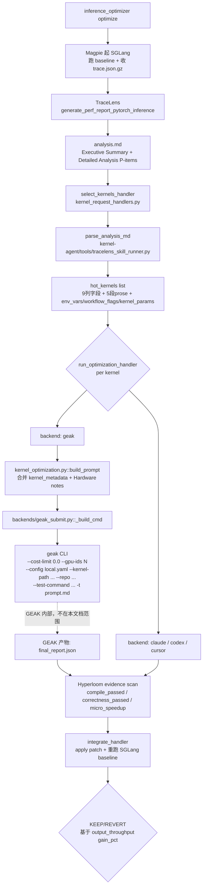

# TraceLens ↔ Hyperloom ↔ GEAK 接口契约与实现现状（中文版）

> 状态：基于 `design/TraceLens_Report_Interfacing.docx` 与 `feature/xiaofei/tracelens-finishing-touches` 分支（2026-05-15）。
> 目的：把 docx 的接口契约、Hyperloom 当前实现、TraceLens/GEAK 在流程中的位置一次对齐，**避免在这种集成问题上反复提 issue，时间成本太高**。
> 读者：TraceLens 团队、GEAK 团队、Hyperloom 维护者。
>
> **并行工作说明**：unitTestAgent 与 GEAK 之间的"最佳实践传参"（#175 系列 — 完整 kernel metadata 注入、参数压缩、test harness 传递）目前由 **@An, Zihao** 在并行处理；本文档不重复覆盖那一条工作流，仅在 §3.4 引用契约共同部分。

---

## 1. 总结：docx 同步情况

**一句话结论**：`TraceLens_Report_Interfacing.docx` 中所有给 Hyperloom 单方消费的 binding contract（共 6 条）当前**全部满足**；docx §3（Kernel Fusion）是 **schema gap**——docx schema 和 TraceLens 数据都在，但 GEAK 端缺 fusion 输入接口、Hyperloom 端缺 parser，落地瓶颈在 GEAK 端而非 Hyperloom 端（详见 §3.7）；docx 中 System-Level Optimizations **没有 binding schema**，不属 gap（详见 §3.8）。

### 1.1 docx 8 项需求 vs Hyperloom 实现

| # | docx 要求 | Hyperloom 实现位置 | 状态 |
|---|---|---|---|
| 1 | `analysis.md` 是唯一数据源，不允许 fallback 到 `priority_data.json` / `category_data/*.json` / `kernel_summary.csv` / raw-trace | `kernel-agent/tools/tracelens_analysis.py:1882-1987`（明确 raise 而非 fallback）+ `tracelens_skill_runner.py:351-353` | ✅ |
| 2 | 9 列 Compute Insights schema：`Operation / Args / Kernel Path / Time (ms) / %E2E / Count / FLOPS/Byte / Efficiency / Bound` | `tracelens_skill_runner.py:354-364` 9-token 严格校验 + `:742-755` header 必须精确匹配 | ✅ |
| 3 | 每个 P-item 5 个 labeled section：`Identification / Data / Reasoning for Slowdown / Resolution / Impact estimate` | `tracelens_skill_runner.py:390-394` + `_extract_pitem_prose()` 全量提取 | ✅ |
| 4 | 给 GEAK 的 prompt 必须额外注入 `Workflow flags / Environment variables / Kernel-specific parameters (KV_DTYPE / BLOCK_SIZE / HEAD_SIZE)` | `kernel_optimization.py:755-827 build_kernel_metadata()` + prompt.md JSON block | ✅ |
| 5 | GEAK budget filter：**Higher P-item 优先，块内 Lower Efficiency 优先** | `tracelens_skill_runner.py:679-693 _efficiency_sort_key`（注释直接引 docx §3）+ `:786` stable sort | ✅ |
| 6 | Idle %（10–20% 阈值）sanity check，超过时不走 fallback path | `tracelens_analysis.py:36-37 HIGH_IDLE_PCT_THRESHOLD_DEFAULT=20.0` + `:1896-1912` idle gate | ✅ |
| 7 | Fusion 4 列：`Kernel / Type / Duration / Perf model`（面向 "kernel fusion modules"） | Hyperloom 未消费 + GEAK 未提供 fusion 输入接口 | ⚠️ **schema gap** — docx schema 与 TraceLens 数据都已就绪，但落地瓶颈在 GEAK 端而非 Hyperloom 端，详见 §3.7 |
| 8 | System-Level Optimizations（GPU idle / async launches / communication / graph capture） | GPU idle 已被 #6 idle gate 消费；其余 3 项未消费 | ⚠️ **非 binding contract** — docx 未给 schema，仅在 §1 概览以 "Exploratory ... if observed" 出现，详见 §3.8 |

### 1.2 关键修复历史（近 3 个 commit）

| Commit | 摘要 | 解决的根因 |
|---|---|---|
| `3dd1ab9` | `fix(tracelens)`: stop raw-trace fallback from silently undoing idle-gate suppression | idle gate 抑制结果被 raw-trace fallback 路径吞掉 |
| `2044407` | `fix(install)`: pip-install all 5 GEAK v3.1.0 MCP tools, not just `rag-mcp` | `profiler_mcp` 等 4 个 MCP 包未装 → GEAK preprocess Step 5/7 直接 `ModuleNotFoundError` |
| `aaadeb8` | `fix(geak)`: default `--geak-cost-limit` to `0.0` to match GEAK `geak.yaml` contract | GEAK sub-agent 路径不读 `geak.yaml`，fallback 到 dataclass `cost_limit=3.0` 把 sub-agent 全砍死 |

### 1.3 相关历史 issue（详见 §4 附录）

**已 closed 的"集成/接口"类 issue（按角色分组，不止前述 8 个）**：

- TraceLens 报告聚合 / 输出一致性：**#125 · #144 · #194 · #203 · #204 · #205 · #209**
- TraceLens Agent 早期接口 / 部署：**#43 · #61 · #74 · #75 · #76 · #77 · #78 · #79 · #80 · #126 · #127 · #148**
- GEAK 调用契约 / prompt 内容：**#175 · #183 · #188 · #189**
- GEAK 资源 / 预算 / 调度：**#34 · #56 · #131 · #181 · #182 · #184 · #186**
- 端到端流程 / Hyperloom 侧接入：**#89 · #93 · #120 · #124 · #143**

**仍 open**：

| Issue | 性质 | 真实瓶颈 / 处理建议 |
|---|---|---|
| **#195** Fusion | **schema gap**（docx schema 在 → TraceLens 数据在 → 但 GEAK 没有 fusion 输入接口、Hyperloom 没有 fusion backend） | 需 GEAK 主导设计 fusion 输入 API；之后 Hyperloom 加 parser 推送。详见 §3.7 |
| **#211** FlyDSL | **集成扩展请求**（docx 之外的新 backend） | 需要 TraceLens 加 FlyDSL 分类 + Hyperloom 加 FlyDSL metadata + GEAK 用 `flydsl_optimization.md` skill。详见 §4.1 |

> 区分原则：**集成 bug** = 现有契约下 TraceLens / GEAK / Hyperloom 三方信息流断了或错了；**schema gap / 集成扩展请求** = 新增 backend / 新增 schema / 新增能力。本文档只对"集成 bug"做契约同步，后两类另走 roadmap。

> **Hyperloom 在 fusion 落地上的能力边界**（针对 #195）：Hyperloom 可以加 parser 把 docx §3 的 fusion section 抽出来，但**没法承接"融合多 kernel 成一个"这个动作**——那是 GEAK / 编译器侧的能力。所以 fusion 落地的瓶颈在 GEAK 端而非 Hyperloom 端，请不要把后续 fusion 相关诉求作为 Hyperloom 的 bug 提到本仓库；如果 GEAK 团队决定增加 fusion 输入 API，Hyperloom 这边的 parser 工作可以同步开工。

---

## 2. Hyperloom 当前运行流程

本节聚焦"信息从 TraceLens 到 GEAK"这一条线，**到 GEAK 入参为止**。GEAK 内部如何 preprocess / spawn sub-agent / 选 patch 不在本文档范围（由 GEAK 团队维护）。

### 2.1 端到端流程图（到 GEAK 调用为止）



### 2.2 TraceLens 在流程中只出现一次

**在 select_kernels 阶段调用一次**：拿 baseline trace 产 `analysis.md`，喂给 `select_kernels_handler`。

- 触发位置：`inference_optimizer/orchestrator/kernel_request_handlers.py::select_kernels_handler`
- 调用工具：`kernel-agent/tools/tracelens_analysis.py`（封装 `TraceLens_generate_perf_report_pytorch_inference` CLI）
- 输出：`<workspace>/kernel-agent/runs/<session>/select_kernels/analysis_output/analysis.md`
- 消费：`tracelens_skill_runner.parse_analysis_md(md_path, top_k=10)` 解析出 `hot_kernels[]`，每个含 9 列原始字段 + 5 个 P-item prose 字段 + `env_vars` / `workflow_flags` / `kernel_params`

### 2.3 GEAK 在流程中的位置

GEAK 是 `run_optimization_handler` 调用的多个 backend 之一。当前 backend ladder（commit `2044407` 之后）为：

```
geak → claude → codex → cursor
```

GEAK 排第一位是 docx §3 "Filter for GEAK based on budget" 的契约延伸——同等候选下让最有专门优化能力的 GEAK 先用预算。Claude / Codex / Cursor 作为 fallback，当 GEAK 失败 / 拒绝 / 超时才接力。

**Hyperloom 给 GEAK 的入参**（Hyperloom 侧完整边界）：

```
kernel-agent/tools/kernel_optimization.py
  └── build_prompt()                   # 拼 prompt.md (内容见 §3.3 / §3.4)
  └── backends/geak_submit.py::submit()
       └── _build_cmd()                # 拼 geak CLI 命令行
            geak -t prompt.md --yolo --output <patch_output_dir>
                 --gpu-ids N
                 --config /workspace/hyperloom/runtime/geak-config/local.yaml
                 --kernel-path <abs path to .cu/.triton>
                 --repo <abs path to repo root>
                 --test-command "<python harness>"
                 --cost-limit 0.0      # ← commit aaadeb8 强制传 0 (= unlimited)
```

参数到此为止。GEAK 拿到这些参数之后内部如何工作（preprocess / sub-agent spawn / SelectPatchAgent / benchmark loop），由 GEAK 团队维护，本文档不展开。

---

## 3. docx 逐条需求 vs 当前实现

每节按 **docx 原文 → Hyperloom 实现 → 关键代码 →（如有）测试覆盖 / 对应 issue** 的格式。

### 3.1 需求 1：`analysis.md` 是单一数据源，不允许 fallback

**docx 原文**（§2 Recommended Interfacing Approach）：

> The TraceLens report (analysis.md) should be considered the single source of truth for all kernel details (no intermediates generated by the agent).
>
> Any fallback paths in Hyperloom using the agent intermediates such as sub-agent reports and TraceLens CSVs may be inadvertently triggered by situations involving incorrect profiling (report not populated since most of the trace involves idle time). Sanity checks must be present to verify trace post-collection to ensure typical idle time (<10-20% as a rough threshold).

**Hyperloom 实现**：

- 全面移除 `priority_data.json` / `category_data/*.json` / `kernel_summary.csv` / raw-trace 这 4 条 fallback 解析路径
- TraceLens skill runner 失败时**显式 raise**，不再静默 fallback 到 sidecar
- idle gate（见 §3.6）触发时直接 suppress 候选 + 写 `trace_health_warnings[]`，**不再走 raw-trace 兜底**（commit `3dd1ab9` 修了这个 bug）

**关键代码**：

```python
# kernel-agent/tools/tracelens_analysis.py:1982-1990
warnings.append(
    "TraceLens analysis.md was not produced; refusing to "
    "fall back to priority_data/category_data/CSV candidate "
    "parsers because analysis.md is the single source of truth."
)

# kernel-agent/tools/tracelens_analysis.py:2034-2037
warnings.append(
    "No hot-kernel candidates produced by any TraceLens "
    "analysis.md path. Refusing intermediate/CSV/raw-trace "
    "fallbacks because analysis.md is the single source of truth."
)
```

```python
# kernel-agent/tools/tracelens_skill_runner.py:351-353
# This parser is the only place in Hyperloom that reads TraceLens candidate
# data; intermediate files (``priority_data.json``, ``category_data/*.json``)
# are intentionally ignored.
```

**测试覆盖**：`kernel-agent/tools/test_tracelens_csv.py`（验证 CSV fallback 已被关闭）+ `kernel-agent/tests/test_kernel_agent.py::KernelAgentToolTests::test_tracelens_high_idle_suppresses_candidates`

**对应 issue**：#125 · #183 · #203 · #204 全部由此契约关闭。

---

### 3.2 需求 2：9 列 Compute Insights 表 schema

**docx 原文**（§2 H3 9-Column Operations Table Schema）：

> The Data section contains a single Markdown table with nine mandatory columns (extra columns allowed only at the end):
>
> Operation / Args / Kernel Path / Time (ms) / %E2E / Count / FLOPS/Byte / Efficiency / Bound

**Hyperloom 实现**：精确 9 token 校验，header 必须完全匹配；**只允许子串重命名容错**，不允许列序变化或缺列。

```python
# kernel-agent/tools/tracelens_skill_runner.py:354-364
_DATA_TABLE_HEADER_TOKENS = (
    "operation",
    "args",
    "kernel path",
    "time (ms)",
    "%e2e",
    "count",
    "flops/byte",
    "efficiency",
    "bound",
)
```

校验逻辑（`:742-755`）：

1. 把 header row 全部转小写，与 `_DATA_TABLE_HEADER_TOKENS` 逐位对比
2. 不匹配则尝试"子串包含"（容错列名换字，如 `Time` → `Time (ms)`）
3. 仍不匹配则**直接 skip 整个 P-item block**——宁可少一个候选也不要静默错位映射

**为何严格**：错位映射会把 `Efficiency` 解释成 `FLOPS/Byte`，下游 budget filter（§3.5）排序就完全错；docx 设计原则就是 "silent wrong-mapping would be worse than a missed candidate"。

---

### 3.3 需求 3：每个 P-item 5 个 labeled section

**docx 原文**（§2 H2 Detailed Analysis: Compute Kernel Insights）：

> Each P-item under "### Compute Kernel Insights" provides a full deep-dive with exactly five labeled sections. This section is meant to be consumed by the interface to kernel optimization modules.
>
> * Identification: What was flagged and why
> * Data: Exactly one 9-column ops table
> * Reasoning for Slowdown: Root cause analysis
> * Resolution: Concrete optimization steps
> * Impact estimate: Low/High impact_score bounds

**Hyperloom 实现**：5 个 LABEL 常量 + `_extract_pitem_prose()` 全量提取，下游 GEAK prompt 把 Reasoning / Resolution 作为"假设性提示"而非"指令"传给 GEAK（让 GEAK 自由验证或推翻）。

```python
# kernel-agent/tools/tracelens_skill_runner.py:390-394
_IDENTIFICATION_LABEL = "**Identification:**"
_DATA_LABEL = "**Data:**"
_REASONING_LABEL = "**Reasoning for Slowdown:**"
_RESOLUTION_LABEL = "**Resolution:**"
_IMPACT_LABEL = "**Impact estimate:**"
```

提取返回结构（`_extract_pitem_prose()`）：

```python
{
  "identification":         str,
  "reasoning_for_slowdown": str,
  "resolution":             str,
  "impact_low_ms":          float,
  "impact_low_e2e_pct":     float,
  "impact_high_ms":         float,
  "impact_high_e2e_pct":    float,
}
```

**Impact estimate 解析**：用正则匹配 `Low end ...: X ms savings (Y% E2E)` / `High end ...: X ms savings (Y% E2E)` 两行，给 §3.5 budget filter 用作排序的次要 key。

---

### 3.4 需求 4：GEAK prompt 必须注入 Workflow flags / Env vars / Kernel params

**docx 原文**（§2 Recommended Interfacing Approach）：

> The relevant data for GEAK can be operation, args, kernel path as was already aligned between the GEAK and TraceLens team in [REQ] Info from Tracelens-Agent to GEAK ... (Issue #216 · AMD-AGI/TraceLens-internal)
>
> * Operation / Args / Kernel Path / E2E% / Reasoning for Slowdown / Resolution / Priority Item / Category
> * **Data from Hyperloom**:
>   * Workflow flags
>   * Environment variables
>   * Kernel-specific parameters, such as:
>     * KV_DTYPE
>     * BLOCK_SIZE
>     * HEAD_SIZE

**Hyperloom 实现**：`build_kernel_metadata()` 把 TraceLens 提供的 8 个 GEAK 字段 + Hyperloom 提供的 4 个 workload 字段合并成一个 JSON block 嵌进 prompt.md。

```python
# kernel-agent/tools/kernel_optimization.py:755-827 (节选)
def build_kernel_metadata(candidate: dict[str, Any], args: argparse.Namespace) -> dict[str, Any]:
    parsed_sglang_args = _parse_sglang_args(args.extra_sglang_args)
    raw_params = candidate.get("kernel_params") if isinstance(candidate.get("kernel_params"), dict) else {}
    kernel_params = dict(raw_params)
    if parsed_sglang_args.get("kv_cache_dtype"):
        kernel_params.setdefault("KV_DTYPE", parsed_sglang_args["kv_cache_dtype"])
    if parsed_sglang_args.get("page_size"):
        kernel_params.setdefault("BLOCK_SIZE", parsed_sglang_args["page_size"])
    elif parsed_sglang_args.get("block_size"):
        kernel_params.setdefault("BLOCK_SIZE", parsed_sglang_args["block_size"])
    for key in ("KV_DTYPE", "BLOCK_SIZE", "HEAD_SIZE"):
        kernel_params.setdefault(key, candidate.get(key))
    return {
        "kernel_name":      ...,
        "kernel_path":      ...,
        "kernel_type":      ...,
        "category":         ...,
        "backend":          "sglang",
        "env_vars":         candidate.get("env_vars") or {},
        "workflow_flags":   candidate.get("workflow_flags") or [],
        "kernel_params":    kernel_params,
        "input_dtypes":     candidate.get("input_dtypes") or [],
        "input_shapes":     candidate.get("input_shapes") or [],
        ...
    }
```

**实际产出 prompt.md 中的 JSON block**（节选自 2026-05-15 k007 RMSNorm-quant 真实运行）：

```json
{
  "backend": "sglang",
  "env_vars": {
    "CONC": "64", "ISL": "1024", "MAX_MODEL_LEN": "6144",
    "NUM_PROMPTS": "320", "NUM_WARMUPS": "8", "OSL": "1024",
    "RANDOM_RANGE_RATIO": "1",
    "ROCR_VISIBLE_DEVICES": "0,1,2,3,4,5,6,7",
    "TP": "8"
  },
  "kernel_name": "_ZN5aiter24add_rmsnorm_quant_kernel...",
  "kernel_params": { "KV_DTYPE": "fp8_e4m3", ... },
  ...
}
```

**`--target-platform` 字段额外补充**：commit `935f242`（PR #201 by shuoshuo）把 `--target-platform mi300x|mi325x|mi355x` 从 `inference_optimizer/cli.py::_autodetect_gpu_type` 一路透传到 `kernel_optimization.py::build_prompt`，prompt 里 Hardware notes 不再硬编码 MI300X（关闭 issue #189）。

---

### 3.5 需求 5：GEAK budget filter（Higher P-item, Lower Efficiency）

**docx 原文**（§2 Recommended Interfacing Approach → Possible Approach (Hyperloom v3)）：

> * Filter for GEAK based on budget (Higher P-item, Lower Efficiency)

**Hyperloom 实现**：两层 stable sort——

1. **块间**：P-item 顺序由 TraceLens 自己保证（rank=1 在前 → rank=N 在后）
2. **块内**：用 `_efficiency_sort_key` 升序（低 efficiency 在前），缺失 efficiency 的 row 降到末尾

```python
# kernel-agent/tools/tracelens_skill_runner.py:679-720 (节选)
def _efficiency_sort_key(candidate: dict[str, Any]) -> float:
    """Per-row sort key for the ``Lower Efficiency`` budget filter.

    ``TraceLens_Report_Interfacing.docx`` §2 Recommended Interfacing
    Approach → Possible Approach (Hyperloom v3):

      > Filter for GEAK based on budget (Higher P-item, Lower Efficiency)

    P-item rank is the outer order, so this key only orders rows *within*
    one P-item. Rows where TraceLens did not report an efficiency value
    (``_row_to_candidate`` defaulted ``efficiency_percent`` to ``0.0``)
    are demoted to last so they don't outrank rows TraceLens actually
    measured. Python's sort is stable, so true-zero / equal-efficiency
    rows preserve TraceLens's original ``Data:`` row order.
    """
    eff = candidate.get("efficiency_percent")
    ...

def parse_analysis_md(md_path: Path, top_k: int = 10) -> list[dict[str, Any]]:
    """...
    1. **Higher P-item first** — rank=1 rows before rank=2 rows, etc.
    2. **Lower Efficiency first** within the same P-item, so rows with
       more optimization headroom survive the ``top_k`` budget cap.
    """
    ...
    for rank, title, body in blocks:
        ...
        pitem_candidates.sort(key=_efficiency_sort_key)
        for cand in pitem_candidates:
            candidates.append(cand)
            if len(candidates) >= top_k:
                return candidates
```

**默认 budget**：`top_k=10`（caller 可覆盖）。结合 §3.4 的 GEAK 优先 backend，意味着 P1 中 efficiency 最低的 10 个 kernel 会最先拿到 GEAK 配额。

**未来扩展（docx §2 Possible Approach (Future)）**：docx 提到"per-row impact_score 排序"作为未来可选，目前 Hyperloom 还是按 docx 的 v3 approach（块内 efficiency 升序），如果未来 TraceLens 在每行加 `impact_score` 列我们可以平滑切到 impact_score 主排序。

---

### 3.6 需求 6：Idle % sanity check（10–20% 阈值）

**docx 原文**（§2，最后一组 bullet）：

> Any fallback paths in Hyperloom using the agent intermediates such as sub-agent reports and TraceLens CSVs may be inadvertently triggered by situations involving incorrect profiling (report not populated since most of the trace involves idle time). Sanity checks must be present to verify trace post-collection to ensure typical idle time (<10-20% as a rough threshold).

**Hyperloom 实现**：

- 阈值默认 **20%**（docx 给的是 `<10-20%`，取上界更保守，避免误杀正常 small-batch 工作负载）
- 可通过 `HYPERLOOM_TRACELENS_IDLE_PCT_THRESHOLD` 环境变量调（数字单位是百分比）
- 数据源：直接从 `analysis.md` 的 Executive Summary 抓 `Idle %` 行（`extract_idle_pct_from_analysis_md()`），**不依赖**任何 sidecar
- 触发后：suppress 该轮候选（hot_kernels 返回空）+ 写 `trace_health_warnings[]` JSON 结构供上层日志/告警

```python
# kernel-agent/tools/tracelens_analysis.py:36-37
HIGH_IDLE_PCT_THRESHOLD_DEFAULT = 20.0
HIGH_IDLE_PCT_THRESHOLD_ENV = "HYPERLOOM_TRACELENS_IDLE_PCT_THRESHOLD"
```

```python
# kernel-agent/tools/tracelens_analysis.py:1896-1912 (节选)
idle_pct_value = extract_idle_pct_from_analysis_md(report_path)
idle_pct_threshold = _resolve_idle_pct_threshold()
high_idle_detected = (
    idle_pct_value is not None
    and idle_pct_value > idle_pct_threshold
)
if high_idle_detected:
    trace_health_warnings.append(
        _build_high_idle_warning(
            idle_pct=idle_pct_value,
            threshold_pct=idle_pct_threshold,
            report_path=report_path,
        )
    )
    # ⬇ idle gate suppresses candidates; do NOT fall through to raw-trace
    return suppressed_result
```

**关键 bug 修复**（commit `3dd1ab9`）：之前 idle gate 抑制后，raw-trace fallback 路径**会再次重新构造 candidates 把抑制结果吞掉**——意味着 idle %=90% 的烂 trace 仍然会产生 candidates 喂给 GEAK，浪费预算还可能优化错。修复后把 idle gate 的 `return` 提前到 raw-trace fallback 之前，彻底阻断这条 fallback。

**测试覆盖**：`test_kernel_agent.py::test_tracelens_high_idle_suppresses_candidates`（fixture: `tests/fixtures/tracelens_v03_llama70b_analysis.md`，idle=92.4% → 期望 candidates=[]）

---

### 3.7 需求 7：Kernel Fusion 4 列 schema

**docx 原文**（§3 H2 Detailed Analysis: Kernel Fusion Insights）：

> Each P-item under "### Kernel Fusion Insights" uses only three labeled sections (no Reasoning for Slowdown / Resolution). **This section is meant to be consumed by the interface to kernel fusion modules.**
>
> * Identification: Module name, kernel composition, instance count
> * Data: 4-column table (Kernel / Type / Duration / Perf model)
> * Impact estimate: Low/high bounds + coverage, fusion pattern, confidence
>
> Disclaimer: This is still an experimental feature. **Serving frameworks like vLLM/SGLang may not contain any opportunities**, though training workloads may offer more gains.

**当前状态**：

- ✅ **docx schema 在**——4 列 fusion 表格定义清晰
- ✅ **TraceLens 数据在**——`analysis.md` 的 `### Kernel Fusion Insights` 段实际产出 fusion 候选（issue #195 评论里 @tsrikris 截图确认）
- ❌ **Hyperloom 未消费 fusion section**
- ❌ **GEAK 未提供 fusion 输入接口**

**为什么这条契约还没落地**：docx §3 原文写 "meant to be consumed by **the interface to kernel fusion modules**"，并不是给 GEAK 用。GEAK 当前是**单 kernel 重写工具**（输入一个 .cu/.triton 文件 → 输出一个 patched 文件），**没有"接收多 kernel 输入 + 输出融合方案"的能力**。所以这条契约的落地需要两端同时动作：

1. **GEAK 端**：新增 fusion 输入 API（多 kernel + 依赖关系 → 一个融合 patch / 计算图改写）。这是 GEAK 架构层面的新能力，需要 GEAK 团队主导设计。
2. **Hyperloom 端**：等 GEAK 有了 fusion 输入接口后，在 `tracelens_skill_runner.py` 加一个 fusion parser 把 docx §3 的 4 列 schema 提取出来并按新接口推送。

**TraceLens disclaimer 的实际意义**：docx 自己已经说明 "Serving frameworks like vLLM/SGLang may not contain any opportunities, though training workloads may offer more gains"。`tsrikris` 在 #195 评论里也确认 "I've not typically seen many cases in vLLM/SGLang trace but more often possible in Huggingface type traces"。Hyperloom 是 inference-only（SGLang 路径），即使三方都把接口做完，inference workload 上的实际收益预期有限。

**对应 issue #195**：建议保持 OPEN，挂在 GEAK 仓库 / Hyperloom 仓库的 `roadmap` label 下；优先级取决于：(1) GEAK 团队是否决定增加 fusion 输入能力；(2) 实际 inference workload 上 TraceLens 产出 fusion 候选的数量与质量。

---

### 3.8 需求 8：System-Level Optimizations（非 binding contract）

**docx 提及位置**：仅在 §1 Report Section Overview 以**一行 bullet** 出现，没有 §2/§3 那样的 H2/H3 deep-dive contract：

> System-Level Optimizations: Exploratory system-level findings (GPU idle time, async launches, communication, graph capture) **if observed**.

**Hyperloom 当前状态**：

- **GPU idle time**：✅ 已消费——`extract_idle_pct_from_analysis_md` + idle gate（§3.6）。Hyperloom 用 idle % 做 trace 健康检查，是 docx 列出的 4 项里最关键的一项。
- **async launches**：❌ 未消费——docx 未规定如何 interface
- **communication**：⚠️ 部分相关——`kernel_optimization.py` 对 communication kernel 有 `num_gpus_recommended=2` 的特殊路径，但**不是从 System-Level Optimizations section 取数据**，而是从 §3.4 的 `category` 字段判断
- **graph capture**：❌ 未消费——docx 未规定如何 interface

**为什么这不是 gap**：

1. docx **没有给出 schema 或 binding contract**——既没有"必须 N 列表格"，也没有"必须 M 个 labeled section"，只是一个概念性概览。
2. docx 把这章定位成 **"Exploratory ... if observed"**——探索性、不保证存在，与 §2/§3 的"This section is meant to be consumed by ..."形成对比。
3. Hyperloom 已经把其中**唯一明确可用的信号（GPU idle %）消费了**。其余 async launches / graph capture 即使 TraceLens 输出了，也缺少明确的 Hyperloom 消费动作（没有对应的 backend 或 decision rule）。

**未来扩展前提**：如果 TraceLens 团队认为 async / graph capture 应被 Hyperloom 消费，需要先在 docx 里**补一个 binding schema**（参照 §2 9 列或 §3 4 列的形式），Hyperloom 再实现对应 parser。

---

## 4. 附录

### 4.1 已 closed 集成 issue 全清单（按角色分组）

> 此表只为方便 TraceLens / GEAK / Hyperloom 三方对账。本文档生效后，**如果再有 issue 落入这些类别，应该先检索本文档对应的 §3.x，再决定是否新开 issue**。

**TraceLens 报告聚合 / 输出一致性**：

| Issue | 标题 | 对应契约 |
|---|---|---|
| #125 | TraceLens Agent Output Parsing | §3.1 拒绝绕过 analysis.md |
| #144 | Improper Categorization of Kernels limiting GEAK | §3.4 category 字段 |
| #194 | Differences in profiling between TraceLens and Hyperloom | §3.1 + §3.2 统一从 analysis.md 解析 9 列 |
| #203 | standalone_analysis.md drops per-kernel rows | §3.1 上游修复后直接读 analysis.md |
| #204 | surface TraceLens prose + source-function aggregation | §3.3 5-section prose + §3.4 workload metadata |
| #205 | 6 robustness gaps in TraceLens server patcher | TraceLens 部署侧（非契约） |
| #209 | TraceLens reports: triple-duplicate markdown | TraceLens 上游修复（非契约） |

**TraceLens Agent 早期接口 / 部署**（v0.2–v0.3 时期，多数已被 v0.4 流程取代）：

| Issue | 标题 |
|---|---|
| #43 / #61 / #74 / #75 / #76 / #77 / #78 / #79 / #80 | TraceLens Agent 输入/输出/权限/版本/上传系列 |
| #126 / #127 / #148 | profiler 配置 / 分片调用 / TraceLens-internal 集成分支 |

**GEAK 调用契约 / prompt 内容**：

| Issue | 标题 | 对应契约 |
|---|---|---|
| #175 | Provide Complete Kernel Metadata for GEAK Invocation | §3.4（由 @An, Zihao 主导） |
| #183 | TraceLens output not directly consumable by GEAK | §3.1 + §3.4 |
| #188 | `--exit-immediately` is not passed when invoking GEAK CLI | `geak_submit.py::_build_cmd` |
| #189 | task.md hardcodes MI300X/gfx942 | §3.4 `--target-platform` 透传 |

**GEAK 资源 / 预算 / 调度**：

| Issue | 标题 | 对应处理 |
|---|---|---|
| #34 | Process stuck to baselining + GEAK tasks | 调度修复 |
| #56 / #131 | 资源不足 / 无 GPU 节点 | 调度修复 |
| #181 | GEAK Ray GPU isolation broken in LOCAL mode | `geak_submit.py` Ray runtime_env |
| #182 | Dockerfile defaults block MI355X + intellikit 冲突 | install.sh |
| #184 | `model_class: litellm` 默认路由 claude-* 到 Anthropic | install.sh ensure_auth_proxy |
| #186 | GEAK kernel-opt 2h budget 被 Ray queue wait 吃掉 | per-attempt budget + commit `aaadeb8`（cost-limit 0） |

**端到端流程 / Hyperloom 侧接入**：

| Issue | 标题 |
|---|---|
| #89 | Inference-optimization skill skips moe kernels |
| #93 | Session breakdown |
| #120 | Hyperloom UI worked on optimization without TraceLens profiling |
| #124 | Invocation of TraceLens Agent in E2E Mode |
| #143 | OOB: Add Cursor as a backend option |

### 4.2 关键代码索引（一站式查阅）

| 角色 | 文件 | 关键函数 / 常量 |
|---|---|---|
| TraceLens CLI 封装 | `kernel-agent/tools/tracelens_analysis.py` | `HIGH_IDLE_PCT_THRESHOLD_DEFAULT`、`_resolve_idle_pct_threshold()`、`_build_high_idle_warning()` |
| `analysis.md` 解析器 | `kernel-agent/tools/tracelens_skill_runner.py` | `_DATA_TABLE_HEADER_TOKENS`、5 个 `_*_LABEL`、`_extract_pitem_prose()`、`_efficiency_sort_key()`、`parse_analysis_md()` |
| GEAK 调用入口 | `kernel-agent/tools/kernel_optimization.py` | `build_kernel_metadata()`、`build_prompt()`、`--geak-cost-limit`、`--target-platform` |
| GEAK CLI 封装 | `kernel-agent/tools/backends/geak_submit.py` | `_build_cmd()`、`run_via_cli()`、`run_via_ray()`、`submit()` |
| GEAK 安装 | `kernel-agent/scripts/install.sh` | `ensure_geak()`（装 5 个 mcp_tools） |
| Hyperloom 端到端入口 | `inference_optimizer/orchestrator/kernel_request_handlers.py` | `select_kernels_handler()`、`run_optimization_handler()`、`integrate_handler()` |

---

**文档结束**。如发现描述与代码现状不一致，请提交 PR 或 issue 注明 commit SHA。

