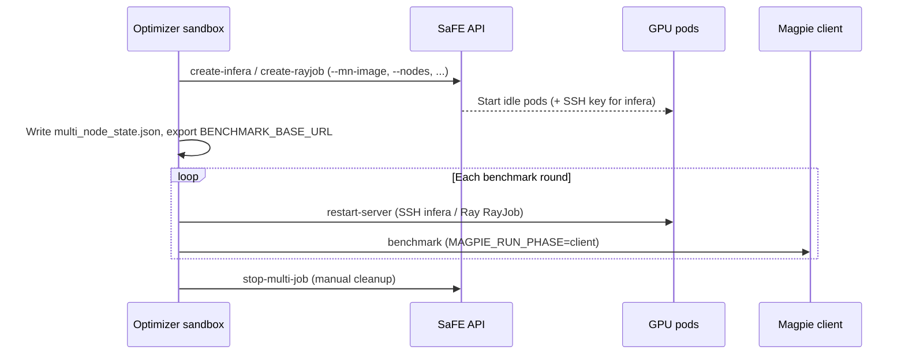

# Hyperloom Remote Demo — Multi-Node Inference Optimization

Welcome! This tutorial is a hands-on walkthrough for running **Hyperloom**
in **Remote Mode** with `--nodes >= 2`: the optimizer benchmarks against a
long-lived remote inference server, restarts it each tuning round, and attempts
to improve SGLang throughput.

Remote multi-node supports **two integration paths** (see § below). **This
demo focuses on Path A (SaFE-managed)** — the typical Primus SaFE sandbox
flow where Hyperloom creates GPU workloads via the SaFE API. Path B (external /
env-provided addresses) is summarized here; full env semantics live in
`src/hyperloom/inference_optimizer/multi_node/SKILL.md` § External mode.

It serves two audiences:

- **For you (the reader):** explains *what* happens when Hyperloom provisions
  pods via SaFE (or attaches to a pre-provisioned cluster) and how
  `--mn-backend infera` vs `rayjob` differ.
- **For an AI agent:** concrete, ordered, copy-paste-able steps — including
  exact `optimize` flags and environment blocks for your cluster.

By the end you will have a multi-node optimization session under
`$USER_DATA_PATH/<model>/<UTC_timestamp>/`, with launcher logs and persisted
`state.json` for monitoring and `--resume`.

---

## Before you start

### What is Primus-SaFE?

**[Primus-SaFE](https://github.com/AMD-AGI/Primus-SaFE)** is AMD's open-source training and inference management platform.

### Two ways to connect a remote cluster

When `--nodes >= 2`, Hyperloom must know **where to benchmark** and **how to
restart** the remote server each round. You can supply that in one of two ways:

| | **Path A — SaFE-managed** (this demo) | **Path B — External (env-provided)** |
|---|--------------------------------------|--------------------------------------|
| **When to use** | Optimizer runs inside a **SaFE sandbox** with API creds | Cluster already running; **no SaFE API** (bare-metal, custom K8s, other orchestrator) |
| **Trigger** | `SAFE_API_URL` **and** `SAFE_API_KEY` both set | SaFE creds **absent**; `HYPERLOOM_MN_EXT_SERVICE_URL` set |
| **Provision** | Hyperloom calls SaFE **create-infera** / **create-rayjob** before Coordinator starts | **Skipped** — operator pre-provisioned pods |
| **Benchmark URL** | SaFE workload frontend → `BENCHMARK_BASE_URL` | `HYPERLOOM_MN_EXT_SERVICE_URL` → `BENCHMARK_BASE_URL` |
| **Per-round restart** | Infera: SSH (SaFE injects optimizer pubkey at create); RayJob: Ray Dashboard | Infera: `HYPERLOOM_MN_EXT_SSH_KEY` + `*_IPS`; RayJob: `HYPERLOOM_MN_EXT_HEAD_IP` |
| **Cleanup** | `stop-multi-job` → SaFE stop/delete | Manual — no SaFE workload id |

> **Priority:** when **both** SaFE creds and `HYPERLOOM_MN_EXT_*` are present,
> **SaFE wins** — external vars are ignored (normal managed flow).

The steps below (Prerequisites → Step 7) assume **Path A (SaFE-managed)** unless
the operator explicitly configures Path B. **Full Path B env reference:** § Path B
below.

### Remote vs local (and Path A vs Path B)

| Aspect | Local (`hyperloom-local-demo.md`) | Path A — SaFE-managed | Path B — External |
|--------|-----------------------------------|----------------------|-------------------|
| **When** | Single-node dev / bare-metal | Optimizer runs in a **SaFE sandbox** with `SAFE_API_URL` + `SAFE_API_KEY` | Multi-node cluster **already running**; SaFE API unavailable |
| **GPUs** | Same host as the optimizer | **SaFE-created pods** (`InferaDeployment` or `RayJob`) | **Operator-managed pods** (any orchestrator) |
| **Provision** | N/A (`--nodes 1`) | SaFE **create-infera** / **create-rayjob** before Coordinator starts | **None** — you supply addresses and (for restarts) SSH or Ray head |
| **Benchmark target** | Magpie launches sglang **locally** | Magpie **client** → `BENCHMARK_BASE_URL` (from SaFE workload) | Magpie **client** → `HYPERLOOM_MN_EXT_SERVICE_URL` |
| **Per-round restart** | Local process recycle | `--mn-backend infera`: **SSH** into idle pods; `rayjob`: **Ray Dashboard** | infera: `HYPERLOOM_MN_EXT_SSH_KEY` + `*_IPS`; rayjob: `HYPERLOOM_MN_EXT_HEAD_IP` (or benchmark-only without head) |
| **`USER_DATA_PATH`** | You choose a writable dir | **Platform-injected** — do **not** change it | Writable dir on sandbox or host (operator choice) |
| **`NFS_SHARED_ROOT`** | Optional — local paths suffice | **Mandatory** — same absolute path on sandbox **and** every GPU pod | **Mandatory** when model/tool paths must be visible on all ranks |
| **Credentials** | N/A | `SAFE_API_*`, `SAFE_WORKSPACE` (platform-injected) | Unset `SAFE_API_*`; set `HYPERLOOM_MN_EXT_*` instead |
| **Cleanup** | Stop local server | `stop-multi-job` → SaFE stop/delete workload | **Manual** — no SaFE workload id to release |
| **Steps in this doc** | Use the local demo | **Prerequisites → Step 7** below | § Two ways (Path B example) + same `optimize` flags; **skip** Path A SaFE checks |

### Prerequisites (Path A — SaFE-managed)

1. **SaFE sandbox** with Hyperloom installed (`install.sh` already run under
   `$USER_DATA_PATH/runtime/`).
2. **SaFE API credentials** injected by the platform (do not pass on CLI):

   | Env var | Purpose |
   |---------|---------|
   | `SAFE_API_URL` | SaFE API base URL |
   | `SAFE_API_KEY` | SaFE API bearer token |
   | `SAFE_WORKSPACE` | Workspace id for workload create |
   | `WORKLOAD_ID` | Optional owner id (cascade cleanup) |
   | `DISPLAY_NAME` | Optional human label for the workload |

3. **Writable workspace:** session data lands under
   `$USER_DATA_PATH/<Model_Name>_<Time_stamp>/` (platform sets
   `$USER_DATA_PATH`; the optimizer creates `<model_basename>/<UTC_ts>/`
   inside it).
4. **`NFS_SHARED_ROOT`** — cluster-wide shared mount (NFS or equivalent) at the
   **same absolute path** on the optimizer sandbox **and** every SaFE GPU pod.
   Remote multi-node **cannot run** without it (model weights, InferenceX /
   Magpie / TraceLens, profiler traces).

### NFS shared filesystem (mandatory)

| Consumer | Why |
|----------|-----|
| Optimizer sandbox | `USER_DATA_PATH`, session artifacts, torch profiler traces |
| SaFE GPU pods | `--model` path, shared tool checkouts |

The operator exports one root as `NFS_SHARED_ROOT`. Example layout (replace
`<nfs>` with the mount point):

```text
<nfs>/models/Qwen3-30B-A3B/     # --model
<nfs>/InferenceX/               # INFERENCEX_PATH
<nfs>/Magpie/                   # MAGPIE_PATH
<nfs>/TraceLens/                # TRACELENS_ROOT (open-source TraceLens)
<nfs>/TraceLens-internal/       # TRACELENS_INTERNAL_ROOT (optional extension)
```

> **Agent:** if `NFS_SHARED_ROOT` is unset or paths are not on a shared mount,
> **stop** — local-only paths break multi-node restart, profiling, and Magpie
> client benchmarks.

Before launch, verify from the sandbox:

```bash
test -n "$NFS_SHARED_ROOT" && test -d "$NFS_SHARED_ROOT" && echo "NFS_SHARED_ROOT OK: $NFS_SHARED_ROOT" \
  || echo "ERROR: NFS_SHARED_ROOT missing — cannot run remote multi-node"
```

### Skill entry point

Resolve paths from the platform `.env` before launching:

```text
Use the skill at ${HYPERLOOM_SKILL_PATH} to optimize inference performance.
```

If `HYPERLOOM_SKILL_PATH` is unset, fall back to the checkout-relative path:

```text
<hyperloom-repo>/src/hyperloom/inference_optimizer/SKILL.md
```

For this workload's pinned flags/env, also read:

```text
<hyperloom-repo>/examples/hyperloom-remote-mn-qwen3-30b/SKILL.md
```

> **Agent:** never hard-code a personal or site-specific checkout path. Always
> resolve from `HYPERLOOM_ROOT`, `HYPERLOOM_SKILL_PATH`, `NFS_SHARED_ROOT`, or
> paths the operator provides in the prompt.

---

## Path B — External mode environment variables (no SaFE)

Use this section when the multi-node cluster is **already running** and there is
**no SaFE API**. Hyperloom skips `create-infera` / `create-rayjob`, builds
`multi_node_state.json` from environment variables, sets
`BENCHMARK_BASE_URL` from `HYPERLOOM_MN_EXT_SERVICE_URL`, and runs Magpie in
**client** mode.

### Activation

| Condition | Required state |
|-----------|----------------|
| SaFE creds **absent** | `SAFE_API_URL` and `SAFE_API_KEY` must **both** be unset or empty |
| External trigger | `HYPERLOOM_MN_EXT_SERVICE_URL` set to an `http://` or `https://` URL |
| Conflict rule | If SaFE creds **and** `HYPERLOOM_MN_EXT_*` are both present, **SaFE wins** — external vars are ignored |

```bash
unset SAFE_API_URL SAFE_API_KEY
```

### `HYPERLOOM_MN_EXT_*` — cluster addresses (operator exports)

These are the **only** variables that describe the pre-provisioned cluster. Export
them **before** `inference_optimizer optimize`.

| Variable | Backend | Required | Description |
|----------|---------|----------|-------------|
| `HYPERLOOM_MN_EXT_SERVICE_URL` | both | **yes** | OpenAI-compatible **benchmark frontend** (infera frontend typically `:8000`). Copied to `BENCHMARK_BASE_URL` for Magpie client runs. Must start with `http://` or `https://`. |
| `HYPERLOOM_MN_EXT_PREFILL_IPS` | infera | infera† | Comma-separated **prefill** pod IPs (PD disaggregated). Used for SSH restart targeting and GPU telemetry. |
| `HYPERLOOM_MN_EXT_DECODE_IPS` | infera | infera† | Comma-separated **decode** pod IPs (PD disaggregated). |
| `HYPERLOOM_MN_EXT_WORKER_IPS` | infera | infera† | Comma-separated **worker** pod IPs (aggregated multi-node). |
| `HYPERLOOM_MN_EXT_SSH_KEY` | infera | infera† | Filesystem path to the **private** SSH key that can log into the GPU pods. The matching public key must already be in each pod's `authorized_keys` (no SaFE to inject one). |
| `HYPERLOOM_MN_EXT_SSH_PORT` | infera | no | SSH **base** port on worker/prefill pods (default **2233**). Decode pods use base + role offset (+10). Must match what `mn-sshd-init.sh` binds in your image. |
| `HYPERLOOM_MN_EXT_SSH_KNOWN_HOSTS` | infera | no | Path to an `ssh` known_hosts file. If unset, host-key checking is relaxed. |
| `HYPERLOOM_MN_EXT_HEAD_IP` | rayjob | rayjob‡ | Ray **head** pod IP. Dashboard submit uses `:8265`; GCS address is derived as `<head>:6379`. |
| `HYPERLOOM_MN_EXT_RAY_DASHBOARD_TOKEN` | rayjob | no | Bearer token when the Ray Dashboard requires authentication. |

† **infera external:** `HYPERLOOM_MN_EXT_SSH_KEY` **and** at least one of
`PREFILL_IPS` / `DECODE_IPS` / `WORKER_IPS` are required. Otherwise `optimize`
**fails fast** (`sys.exit(2)`) — no silent benchmark-only fallback.

‡ **rayjob external:** without `HYPERLOOM_MN_EXT_HEAD_IP`, the run is
**benchmark-only** (per-round `restart-server` no-ops). SSH vars are not used
for rayjob.

**IP list tips:**

- Use comma separation only (no spaces required): `10.0.1.1,10.0.1.2`
- PD disaggregated: set prefill + decode IPs; node counts can be inferred from
  list lengths if `PD_PREFILL_NODES` / `PD_DECODE_NODES` are unset
- Aggregated infera: set `WORKER_IPS` (one IP per worker pod)

### Companion variables (usually from `optimize` CLI)

`optimize` re-exports these from flags; you normally **do not** set them by hand
unless driving subcommands outside `optimize`. Listed here because external state
synthesis reads them when building `multi_node_state.json`.

| Variable | Set by | Default / notes |
|----------|--------|-----------------|
| `INFERENCE_OPTIMIZER_NODES` | `--nodes` | Node count (must be `>= 2` for multi-node) |
| `INFERENCE_OPTIMIZER_GPUS_PER_NODE` | `--gpus-per-node` | Default `8` |
| `INFERENCE_OPTIMIZER_MN_BACKEND` | `--mn-backend` | `infera` or `rayjob`; CLI flag wins over env |
| `PD_MODE` | `--pd-mode` | `disaggregated` or `colocated` / `aggregated` |
| `PD_PREFILL_NODES` | `--pd-prefill-nodes` | Inferred from `HYPERLOOM_MN_EXT_PREFILL_IPS` length if unset |
| `PD_DECODE_NODES` | `--pd-decode-nodes` | Inferred from `HYPERLOOM_MN_EXT_DECODE_IPS` length if unset |
| `PD_PREFILL_TP` / `PD_DECODE_TP` | `--pd-prefill-tp` / `--pd-decode-tp` | Role tensor parallel |
| `PD_PREFILL_EP` / `PD_DECODE_EP` | `--pd-prefill-ep` / `--pd-decode-ep` | Role expert parallel |
| `PD_TRANSFER_BACKEND` | `--pd-transfer-backend` | e.g. `mooncake` for PD KV transfer |
| `SAFE_WORKSPACE` | platform (optional) | Passthrough label stored in synthetic state only |

### What you still pass on the CLI

External mode does **not** replace normal `optimize` flags. Still pass model,
topology, backend, and tuning flags (see §5 / workload SKILL). `--mn-image` is
**not** used for provision (cluster already exists) but may still matter for
documentation or subcommands.

Shared **sandbox** env (`INFERENCEX_PATH`, `TRACELENS_ROOT`, `MAGPIE_PATH`,
`NFS_SHARED_ROOT`, etc.) is unchanged — see § NFS and workload SKILL blocks.

### Examples

**infera + PD disaggregated** (benchmark + SSH restart):

```bash
unset SAFE_API_URL SAFE_API_KEY

export HYPERLOOM_MN_EXT_SERVICE_URL=http://<frontend-host>:8000
export HYPERLOOM_MN_EXT_PREFILL_IPS=<prefill-ip>
export HYPERLOOM_MN_EXT_DECODE_IPS=<decode-ip>
export HYPERLOOM_MN_EXT_SSH_KEY=/path/to/id_ed25519
# optional: export HYPERLOOM_MN_EXT_SSH_PORT=2233

inference_optimizer optimize \
  --model ${NFS_SHARED_ROOT}/models/Qwen3-30B-A3B \
  --nodes 2 --mn-backend infera \
  --pd-mode disaggregated \
  --pd-prefill-nodes 1 --pd-decode-nodes 1 \
  --tp 8 --ep 8 \
  --pd-transfer-backend mooncake \
  ...
```

**infera aggregated** (worker IPs only):

```bash
unset SAFE_API_URL SAFE_API_KEY
export HYPERLOOM_MN_EXT_SERVICE_URL=http://<frontend-host>:8000
export HYPERLOOM_MN_EXT_WORKER_IPS=<ip1>,<ip2>
export HYPERLOOM_MN_EXT_SSH_KEY=/path/to/id_ed25519

inference_optimizer optimize --model <path> --nodes 2 --mn-backend infera --tp 8 --ep 8 ...
```

**rayjob** (benchmark + Ray restart):

```bash
unset SAFE_API_URL SAFE_API_KEY
export HYPERLOOM_MN_EXT_SERVICE_URL=http://<ray-serve-or-head-url>:<port>
export HYPERLOOM_MN_EXT_HEAD_IP=<ray-head-ip>
# optional: export HYPERLOOM_MN_EXT_RAY_DASHBOARD_TOKEN=<token>

inference_optimizer optimize --model <path> --nodes 2 --mn-backend rayjob --tp 8 --ep 8 ...
```

**rayjob benchmark-only** (no per-round restart — omit head IP):

```bash
unset SAFE_API_URL SAFE_API_KEY
export HYPERLOOM_MN_EXT_SERVICE_URL=http://<serving-url>:<port>

inference_optimizer optimize --model <path> --nodes 2 --mn-backend rayjob ...
```

### Runtime behavior

| Topic | Behavior |
|-------|----------|
| State file | Synthetic `multi_node_state.json` written at session start; `external: true` |
| Stale SaFE state | `HYPERLOOM_MN_EXT_*` **overrides** on-disk non-external state when SaFE is absent |
| Magpie | `MAGPIE_RUN_PHASE=client` set automatically |
| Cleanup | No SaFE workload id — cluster teardown is **manual** |
| Kernel / GEAK on infera | SSH paths must work; same as SaFE infera when `HYPERLOOM_MN_EXT_SSH_KEY` + IPs are set |

> **Agent:** for Path B, verify `SAFE_API_*` are unset, `HYPERLOOM_MN_EXT_SERVICE_URL`
> is reachable, and infera has SSH key + IPs before launching. Use the same
> workload flags/env from `examples/hyperloom-remote-mn-qwen3-30b/SKILL.md`; skip
> Path A SaFE checklist items.

### Pre-launch checklist (agent)

Path A (SaFE) — skip rows marked **(A only)** when the operator configured Path B:

- [ ] Integration path: Path A (`SAFE_API_*` present) or Path B (`HYPERLOOM_MN_EXT_SERVICE_URL`, no SaFE creds)
- [ ] `NFS_SHARED_ROOT` set; same mount path on sandbox **and** GPU pods
- [ ] `SAFE_API_URL` and `SAFE_API_KEY` present **(A only)**
- [ ] `SAFE_WORKSPACE` set **(A only)**
- [ ] `USER_DATA_PATH` writable; `${NFS_SHARED_ROOT}/models/...` exists
- [ ] `<INFERA_SSHD_IMAGE>` / `<RAYJOB_IMAGE>` supplied by operator
- [ ] `--mn-image` set when `--mn-backend infera` (sshd-capable image — §3)
- [ ] `install.sh` already run under `$USER_DATA_PATH/runtime/` **(A only)**
- [ ] `ulimit -Sn 65536` before launch

---

## Step 1 — Environment check (sandbox)

Run from the **optimizer sandbox** (not from inside GPU pods).

```bash
echo "hostname: $(hostname)"
echo "USER_DATA_PATH=${USER_DATA_PATH:-<unset>}"
test -n "$USER_DATA_PATH" && test -w "$USER_DATA_PATH" && echo "USER_DATA_PATH: writable OK" || echo "USER_DATA_PATH: MISSING or not writable"
test -n "$SAFE_API_URL" && test -n "$SAFE_API_KEY" && echo "SaFE creds: present" || echo "SaFE creds: MISSING"
test -n "$SAFE_WORKSPACE" && echo "SAFE_WORKSPACE=$SAFE_WORKSPACE" || echo "SAFE_WORKSPACE: unset (create may fail)"
```

> **Agent:** if `USER_DATA_PATH` is unset or not writable, **stop** and ask the
> operator to fix platform injection. **Never** export a different
> `USER_DATA_PATH` for this run.

Confirm tool mirrors and model path exist (under `NFS_SHARED_ROOT`):

```bash
ls -d "${INFERENCEX_PATH:-${NFS_SHARED_ROOT}/InferenceX}" \
      "${MAGPIE_PATH:-${NFS_SHARED_ROOT}/Magpie}" \
      "${TRACELENS_ROOT:-${NFS_SHARED_ROOT}/TraceLens}" 2>/dev/null
ls "${MODEL_PATH:-${NFS_SHARED_ROOT}/models/Qwen3-30B-A3B}/config.json" 2>/dev/null && echo "model OK"
# Optional internal TraceLens extension:
test -z "${TRACELENS_INTERNAL_ROOT}" || ls -d "${TRACELENS_INTERNAL_ROOT:-${NFS_SHARED_ROOT}/TraceLens-internal}" 2>/dev/null
```

---

## Step 2 — Choose multi-node backend

When `--nodes >= 2`, `optimize` provisions a SaFE workload **before** the
Coordinator starts. Pick **one** backend:

| | **Infera** (`--mn-backend infera`) | **RayJob** (`--mn-backend rayjob`, default) |
|---|--------------------------------------|---------------------------------------------|
| SaFE kind | `InferaDeployment` | `RayJob` |
| Control plane | **SSH** into idle GPU pods | **Ray Dashboard** + `ray job submit` |
| Benchmark URL | Infera frontend **:8000** | RayJob head service URL |
| Per-round server restart | SSH fan-out `launch_infera_node.py` | `restart-server` via Ray |
| PD disaggregation | Supported (prefill/decode roles) | Supported |
| Image requirement | **Must include sshd** (see §3) | Standard RayJob / PyTorch image |
| Pod env forwarding | Prefix-whitelisted + `--extra-env` at create; tuning via `restart-server` | `--rayjob-extra-env K=V` at create |

Single-node runs (`--nodes 1`) ignore `--mn-backend` and behave like the
local demo.

---

## Step 3 — `--mn-backend infera` image input

When `--mn-backend infera`, pass `--mn-image <INFERA_SSHD_IMAGE>`. The image
**must** support the idle-pod SSH control plane used by `create-infera`:

| Requirement | Why |
|-------------|-----|
| `openssh-server` (+ client) | Optimizer SSHes from sandbox → pod each round |
| `/usr/local/bin/mn-idle.sh` | Pod entrypoint: install authorized key, start sshd, block |
| `/usr/local/bin/mn-sshd-init.sh` | Binds sshd to `$MN_SSH_PORT` (default base **2222**, not 22) |
| infera + sglang engine deps | `restart-server` launches `infera.engine.sglang` on each rank |

Pods start **idle** (no sglang at create time). SaFE injects the optimizer's
**SSH public key** at create (`MN_SSH_AUTHORIZED_KEY`); the private key is
stored in `multi_node_state.json` (`ssh_key_path`). Under PD disaggregation,
decode pods use a **role port offset** so co-located roles do not collide.

> **Agent:** a plain sglang image **without** sshd / `mn-idle.sh` will fail
> SSH restarts (connection refused or permission denied). Ask the operator for
> `<INFERA_SSHD_IMAGE>` — do not substitute a non-sshd image.

For PD disaggregation, prefer **`--pd-transfer-backend mooncake`** (`nixl` can
return HTTP 200 with zero output tokens).

---

## Step 4 — Required `optimize` inputs (multi-node)

Only pass what the CLI and SaFE provisioner need. Credentials and workspace
come from the platform.

### Always required (`--nodes >= 2`)

| Input | CLI flag / env | Notes |
|-------|----------------|-------|
| Node count | `--nodes N` | Must be `>= 2` for multi-node |
| Backend | `--mn-backend infera \| rayjob` | Default `rayjob` if omitted |
| Container image | `--mn-image <ref>` | Or `INFERENCE_OPTIMIZER_MN_IMAGE` |
| GPUs per pod | `--gpus-per-node N` | Default 8; must satisfy `nodes * gpn >= tp` |
| Model | `--model <path>` | `${NFS_SHARED_ROOT}/models/...` or HF id |
| Tensor parallel | `--tp N` | Required; default 1 is wrong for MoE |
| Framework | `--framework sglang` | |

### Strongly recommended

| Input | CLI flag | Notes |
|-------|----------|-------|
| CPUs per pod | `--cpus-per-node` | Default 96 |
| Memory per pod | `--mem-per-node` | Default 1024 (GiB) |
| Expert parallel | `--ep N` | MoE: often `ep == tp` |
| Goal / budget | `--target-gain`, `--max-hours` | |

### Infera PD disaggregation only

| Input | CLI flag |
|-------|----------|
| PD mode | `--pd-mode disaggregated` |
| Role node counts | `--pd-prefill-nodes`, `--pd-decode-nodes` (sum must equal `--nodes`) |
| Role TP | `--pd-prefill-tp`, `--pd-decode-tp` |
| Role EP | `--pd-prefill-ep`, `--pd-decode-ep` |
| KV transfer | `--pd-transfer-backend mooncake` |
| Role server args | `--pd-prefill-extra-args`, `--pd-decode-extra-args` |

### RayJob only

| Input | CLI flag |
|-------|----------|
| Shared server args | `--server-args "..."` |
| Pod env at create | `--rayjob-extra-env K=V` (repeatable) — operator-provided pod vars only |

**Do not** `--rayjob-extra-env` sandbox-only vars (`INFERENCEX_PATH`,
`TRACELENS_ROOT`, `KERNEL_OPT_*`, `TP`, `PD_*`, etc.). See
`multi_node/SKILL.md` “DO NOT `--rayjob-extra-env` these”.

---

## Step 5 — Agent launch prompts

Copy the block that matches your backend. Keep flags and env **verbatim**
unless the operator changes the workload.

### 5a — Infera + PD disaggregation (SaFE create-infera)

```text
Use the skill at ${HYPERLOOM_SKILL_PATH} to optimize inference performance.
(Workload pins: examples/hyperloom-remote-mn-qwen3-30b/SKILL.md)

FLAGS  (keep as --flags):
--model ${NFS_SHARED_ROOT}/models/Qwen3-30B-A3B \
--target-gain 30 \
--max-hours 4 \
--mn-backend infera \
--framework=sglang \
--nodes 2 \
--gpus-per-node 8 \
--cpus-per-node 90 \
--mem-per-node 1024 \
--tp 8 --ep 8 \
--mn-image <INFERA_SSHD_IMAGE> \
--pd-mode disaggregated \
--pd-prefill-nodes 1 --pd-decode-nodes 1 \
--pd-prefill-tp 8 --pd-decode-tp 8 \
--pd-prefill-ep 8 --pd-decode-ep 8 \
--pd-transfer-backend mooncake \
--pd-prefill-extra-args "--attention-backend aiter --mem-fraction-static 0.78 --disable-radix-cache --ep-dispatch-algorithm fake --load-balance-method round_robin --watchdog-timeout 3600 --deepep-mode normal --enable-dp-attention --moe-dense-tp-size 1 --enable-dp-lm-head --chunked-prefill-size 8192 --trust-remote-code" \
--pd-decode-extra-args "--attention-backend aiter --mem-fraction-static 0.82 --enable-dp-attention --deepep-mode normal --ep-dispatch-algorithm fake --load-balance-method round_robin --watchdog-timeout 3600 --moe-dense-tp-size 1 --enable-dp-lm-head --chunked-prefill-size 8192 --max-running-requests 1024 --trust-remote-code" \
--no-framework-agent

Environment (keep as env):
GPU_TYPE=mi325x
PRECISION=bf16
ISL=1024
OSL=1024
CONC=128
RANDOM_RANGE_RATIO=0.8
KERNEL_AGENT_BUILD_GEAK_RAG_INDEX=0
SGLANG_DISAGGREGATION_BOOTSTRAP_TIMEOUT=1200
SGLANG_DISAGGREGATION_WAITING_TIMEOUT=1200
SGLANG_USE_AITER=1
SGLANG_AITER_MLA_PERSIST=1
INFERENCEX_PATH=${NFS_SHARED_ROOT}/InferenceX
TRACELENS_ROOT=${NFS_SHARED_ROOT}/TraceLens
TRACELENS_INTERNAL_ROOT=${NFS_SHARED_ROOT}/TraceLens-internal
MAGPIE_PATH=${NFS_SHARED_ROOT}/Magpie
NODE_TLS_REJECT_UNAUTHORIZED=0

Requirements:
1. Save files to a writable folder; session_dir: $USER_DATA_PATH/{Model_Name}_{Time_stamp} will be writable.
2. Report the session ID, log path, PID, and initial health check result.
3. Then monitor the process every 300s, until work is done.
4. To recover an unexpected crash, ONLY DO `optimize --resume` (same session dir). Never start a new `optimize`. If state.json stop_reason is final: stop and exit.
5. Do NOT modify USER_DATA_PATH.
```

**When `--mn-backend infera`:**

- Set `--mn-image <INFERA_SSHD_IMAGE>` (see §3).
- Forward operator-provided pod env at **create-infera** via `create-infera --extra-env`
  — not via `--rayjob-extra-env`.
- Optional MoE cold-start budget (large models):
  `export HYPERLOOM_MN_POLL_TIMEOUT_S=1800 HYPERLOOM_MN_HEALTH_WAIT_S=1800`

### 5b — RayJob aggregated (SaFE create-rayjob)

```text
Use the skill at ${HYPERLOOM_SKILL_PATH} to optimize inference performance.
(Workload pins: examples/hyperloom-remote-mn-qwen3-30b/SKILL.md)

FLAGS  (keep as --flags):
--model ${NFS_SHARED_ROOT}/models/Qwen3-30B-A3B \
--target-gain 30 \
--max-hours 4 \
--mn-backend rayjob \
--framework=sglang \
--nodes 2 \
--gpus-per-node 8 \
--cpus-per-node 90 \
--mem-per-node 1024 \
--tp 8 --ep 8 \
--no-framework-agent \
--mn-image <RAYJOB_IMAGE> \
--server-args "--attention-backend aiter --mem-fraction-static 0.8 --enable-dp-attention --deepep-mode normal --ep-dispatch-algorithm fake --load-balance-method round_robin --watchdog-timeout 3600 --moe-dense-tp-size 1 --enable-dp-lm-head --chunked-prefill-size 8192 --max-running-requests 1024 --trust-remote-code"

Environment (keep as env):
GPU_TYPE=mi325x
PRECISION=bf16
ISL=1024
OSL=1024
CONC=128
RANDOM_RANGE_RATIO=0.8
KERNEL_AGENT_BUILD_GEAK_RAG_INDEX=0
SGLANG_USE_AITER=1
SGLANG_AITER_MLA_PERSIST=1
INFERENCEX_PATH=${NFS_SHARED_ROOT}/InferenceX
TRACELENS_ROOT=${NFS_SHARED_ROOT}/TraceLens
TRACELENS_INTERNAL_ROOT=${NFS_SHARED_ROOT}/TraceLens-internal
MAGPIE_PATH=${NFS_SHARED_ROOT}/Magpie
NODE_TLS_REJECT_UNAUTHORIZED=0

Requirements:
1. Save files to a writable folder; session_dir: $USER_DATA_PATH/{Model_Name}_{Time_stamp} will be writable.
2. Report the session ID, log path, PID, and initial health check result.
3. Then monitor the process every 300s, until work is done.
4. To recover an unexpected crash, ONLY DO `optimize --resume` (same session dir). Never start a new `optimize`. If state.json stop_reason is final: stop and exit.
5. Do NOT modify USER_DATA_PATH.
```

**RayJob-specific agent checks:**

- `optimize` runs `create-rayjob` + one-time `init-env` automatically when
  `--nodes >= 2`.
- `--server-args` applies to every `restart-server` round (aggregated path).
- Release GPUs when finished:
  `python3 -m hyperloom.inference_optimizer.multi_node stop-multi-job [--delete]`

---

## Step 6 — Launch pattern (sandbox shell)

Example launcher skeleton — map values from §5, do not hard-code paths:

```bash
set -e
set -a; . "${USER_DATA_PATH}/runtime/.env" 2>/dev/null || true; set +a
. "${KERNEL_AGENT_ENV:-${USER_DATA_PATH}/runtime/kernel-agent.env.sh}"

# Sandbox-only exports from the prompt Environment block
export GPU_TYPE=mi325x PRECISION=bf16 ISL=1024 OSL=1024 CONC=128
export INFERENCEX_PATH="${INFERENCEX_PATH:-${NFS_SHARED_ROOT}/InferenceX}"
export TRACELENS_ROOT="${TRACELENS_ROOT:-${NFS_SHARED_ROOT}/TraceLens}"
export TRACELENS_INTERNAL_ROOT="${TRACELENS_INTERNAL_ROOT:-${NFS_SHARED_ROOT}/TraceLens-internal}"
export MAGPIE_PATH="${MAGPIE_PATH:-${NFS_SHARED_ROOT}/Magpie}"
export SGLANG_USE_AITER=1 SGLANG_AITER_MLA_PERSIST=1
export NODE_TLS_REJECT_UNAUTHORIZED=0

ulimit -Sn 65536
RUN_DIR="${USER_DATA_PATH}/optimizer_runs"; mkdir -p "$RUN_DIR"
TAG="Qwen3-30B-A3B-$(date +%Y%m%d_%H%M%S)"

setsid nohup inference_optimizer --verbose optimize \
  --model "${MODEL_PATH:-${NFS_SHARED_ROOT}/models/Qwen3-30B-A3B}" \
  --framework sglang --gpu-type mi325x \
  --target-gain 30 --max-hours 4 \
  --nodes 2 --mn-backend infera \
  --gpus-per-node 8 --cpus-per-node 90 --mem-per-node 1024 \
  --tp 8 --ep 8 \
  --mn-image <INFERA_SSHD_IMAGE> \
  --pd-mode disaggregated \
  --pd-prefill-nodes 1 --pd-decode-nodes 1 \
  --pd-prefill-tp 8 --pd-decode-tp 8 \
  --pd-prefill-ep 8 --pd-decode-ep 8 \
  --pd-transfer-backend mooncake \
  --pd-prefill-extra-args "..." \
  --pd-decode-extra-args "..." \
  --no-framework-agent \
  --launch-info-file "$RUN_DIR/launch_$TAG.json" \
  > "$RUN_DIR/run_$TAG.log" 2>&1 < /dev/null &
```

Parse the machine-readable launch line from the log:

```bash
grep '^HYPERLOOM_LAUNCH ' "$RUN_DIR/run_$TAG.log" | tail -1
# Or JSON: jq .pid,.session_dir "$RUN_DIR/launch_$TAG.json"
```

---

## Step 7 — Monitor, resume, and stop

### Report after launch (required)

1. **Session ID** — `manifest.json` → `session_id`
2. **Session dir** — from `HYPERLOOM_LAUNCH session_dir=...` or launch JSON
3. **PID** — optimizer process id from launch JSON
4. **Log path** — `$RUN_DIR/run_<tag>.log`
5. **Initial health** — multi-node provision succeeded (no `sys.exit(2)` in
   log); first baseline task queued in `state.json`

### Monitor every 300s

```bash
SESSION_DIR="<from launch json>"
python3 - <<'PY'
import json, pathlib, time
p = pathlib.Path("$SESSION_DIR/state.json")
s = json.loads(p.read_text())
print("phase:", s.get("phase"), "stop_reason:", s.get("stop_reason"),
      "cumul_gain%:", s.get("cumulative_gain"), "crash_count:", s.get("crash_count"))
PY
```

| Signal | Action |
|--------|--------|
| `stop_reason` empty, phase advancing | Keep monitoring |
| `crash_count` increased, non-terminal `stop_reason` | `optimize --resume` **same session** |
| `stop_reason` ∈ `target_reached`, `global_converged`, `time_exhausted`, `max_ticks` | Done — read `reports/final.md` |
| `stop_reason` = `target_reached` without `--force-resume` | **Do not** resume (terminal) |

### Resume (crash recovery only)

```bash
export INFERENCE_OPTIMIZER_CURRENT_SESSION_DIR="<exact session_dir>"
inference_optimizer optimize --resume --resume-from "$INFERENCE_OPTIMIZER_CURRENT_SESSION_DIR" \
  >> "$RUN_DIR/run_<tag>.log" 2>&1
```

> **Agent:** never start a **new** `optimize` for the same job after a crash.
> Never change `USER_DATA_PATH`. Never `--resume` past a terminal `stop_reason`
> unless the operator explicitly passes `--force-resume`.

### Release cluster

```bash
python3 -m hyperloom.inference_optimizer.multi_node stop-multi-job --delete --clear-state
```

---

## What happens under the hood (SaFE)



State file: `$INFERENCE_OPTIMIZER_CURRENT_SESSION_DIR/runtime/multi_node_state.json`
(legacy fallback: `/tmp/multi_node_state.json`).

---

## Further reading

- **Pinned workload skill (copy-paste flags/env):**
  `examples/hyperloom-remote-mn-qwen3-30b/SKILL.md`
- **Primus-SaFE** (Path A control plane):
  [github.com/AMD-AGI/Primus-SaFE](https://github.com/AMD-AGI/Primus-SaFE)
- Multi-node CLI, SSH semantics, **external mode (Path B)**:
  `src/hyperloom/inference_optimizer/multi_node/SKILL.md`
- **Path B env reference (no SaFE):** § Path B in this document
- Launcher & resume rules:
  `src/hyperloom/inference_optimizer/SKILL.md`
- Optimization loop:
  `docs/conceptual/optimization-loop.md`
- Local single-node counterpart:
  `examples/hyperloom-local-demo.md`
