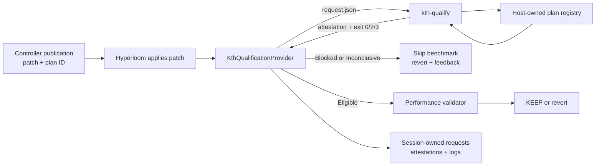

# KTH qualification gate demo

This CPU-only fixture demo exercises the production subprocess contract and
Hyperloom integration without claiming GPU performance:

```bash
PYTHONPATH=src python examples/kth_qualification_gate/run_demo.py \
  --kth-root ../kernel-trust-harness
```

The command creates and preserves a temporary Git repository, Controller
publication bundles, digest-bound KTH requests and attestations, subprocess
logs, integration results, `timeline.json`, and `terminal_timeline.txt`. Pass
`--out EMPTY_DIRECTORY` for a stable artifact location.


Expected story:

1. Both candidates arrive as micro-validated with fixture tolerance evidence.
2. KTH blocks one-sided rounding drift with `NUMERICAL_POLICY`.
3. Hyperloom does not call the performance validator and reverts that patch.
4. The correction restores round-to-nearest-even under the same host plan.
5. KTH returns `Eligible for performance evaluation`; only then does the
   fixture performance validator run, and Hyperloom records `KEEP`.

The demo requires the KTH `integration/hyperloom-provider` branch. Its fixture
plan is disabled by default and is enabled only inside this demo process.

## Architecture



Trust boundary: a publication may select only a plan ID. Commands, imports,
reference implementations, candidate adapters, and kernel-path overrides are
not accepted in the request.
