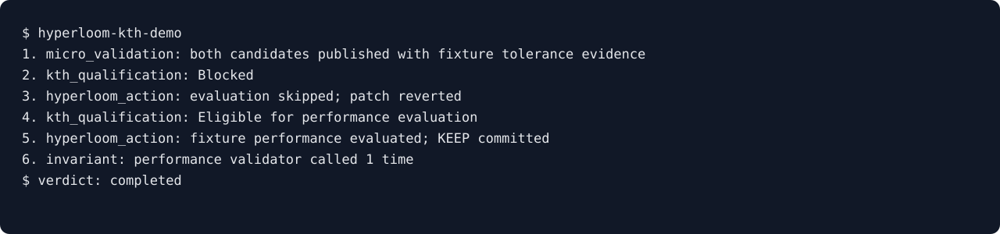
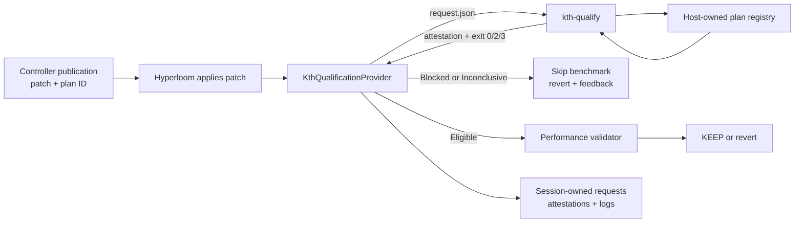

# KTH qualification gate demo

This CPU-only fixture demo exercises the production subprocess contract and
Hyperloom integration without claiming GPU performance:

```bash
PYTHONUNBUFFERED=1 PYTHONPATH=src python examples/kth_qualification_gate/run_demo.py \
  --kth-root ../kernel-trust-harness
```

Live gfx942 path (tw051 or another allocated MI300X node). Uses the host-owned
fused-add residual plan (`host/gfx942-rmsnorm-fused-add-v1`) and does **not**
rerun AITER #4888:

```bash
PYTHONUNBUFFERED=1 PYTHONPATH=src python examples/kth_qualification_gate/run_demo.py \
  --kth-root ../kernel-trust-harness \
  --gpu --host tw051 --out /tmp/hyperloom-kth-gpu
```

`tw042` and `tw045` hold banked KTH GPU evidence. Passing `--host tw042` (or
`tw045`) prints a warning and continues. The run still does not rerun AITER
#4888 and still writes only to `--out` and `artifacts/demo_gpu_live/`.

The live run prints a briefing, then a spoken explanation at each apply /
qualify / revert / KEEP: the request Hyperloom is allowed to send, the patch
bytes, the wait while KTH runs, and the decoded attestation (REF / policy /
composition numbers). A watcher does not need prior KTH context. Pass
`--out /some/empty/dir` for a stable artifact location.



Expected story (the terminal will say this in more words):

1. Both candidates arrive as micro-validated with fixture tolerance evidence.
2. KTH blocks one-sided rounding drift (CPU: `NUMERICAL_POLICY`; GPU: often
   `REF` plus a COMPOSITION table where one-step allclose would still accept).
3. Hyperloom does not call the performance validator and reverts that patch.
4. The correction restores round-to-nearest-even under the same host plan.
5. KTH returns `Eligible for performance evaluation`; only then does the
   performance validator run, and Hyperloom records `KEEP`.

The demo requires the KTH `integration/hyperloom-provider` branch. CPU fixture
plans are disabled by default and are enabled only inside the CPU demo
process. The gfx942 plan is a host-owned registry entry and requires a visible
MI300X plus the pinned `vllm/vllm-openai-rocm:v0.27.1` image.

## Architecture



Trust boundary: a publication may select only a plan ID. Commands, imports,
reference implementations, candidate adapters, and kernel-path overrides are
not accepted in the request.
