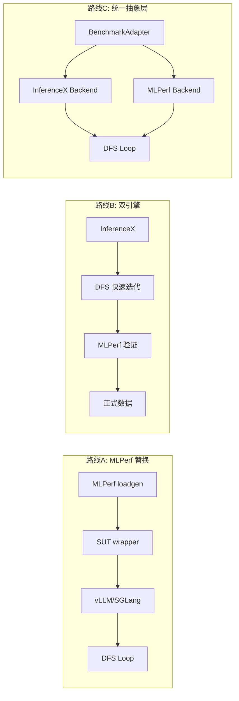
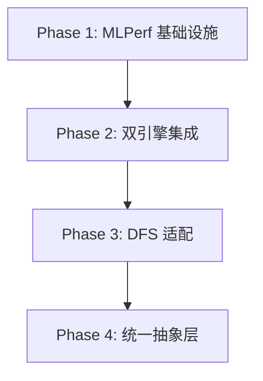

# Hyperloom x MLPerf Inference 集成方案

## 现状分析

**Hyperloom 当前的基准测试栈：**
- 使用 InferenceX 的 `benchmark_serving.py`（异步 HTTP 客户端 + 随机 token 负载）
- 指标：`tok/s/GPU`, `TTFT`, `TPOT`, `ITL`
- 准确率：GSM8K via `lm-evaluation-harness`
- 后端：vLLM / SGLang（OpenAI 兼容 API）

**MLPerf Inference 的核心组件：**
- **LoadGen**：C++ 库（带 Python 绑定），负责负载生成、延迟追踪、指标计算
- **SUT (System Under Test)**：用户实现的推理后端 wrapper
- **QSL (QuerySampleLibrary)**：MLPerf 标准数据集的加载器
- **场景**：Server（Poisson 到达 + TTFT/TPOT SLO）、Offline（纯吞吐）
- **合规性**：accuracy checker + compliance tests + 提交目录结构

**关键模型重叠** -- Hyperloom 已测试的模型中，以下直接对应 MLPerf v6.0 benchmark：
- **DeepSeek-R1** -- MLPerf v6.0 新增
- **GPT-OSS-120B** -- MLPerf v6.0 新增
- Llama2-70B -- MLPerf 最多提交的 LLM benchmark

---

## 三条技术路线

### 路线 A：MLPerf loadgen 作为主测量引擎（"纯 MLPerf"）

将 DFS 优化循环的度量层从 InferenceX 的 `benchmark_serving.py` 替换为 MLPerf loadgen。

**实现方式：**
- 编译安装 `mlcommons/inference` 中的 loadgen（`pip install mlcommons-loadgen` 或从源码 build）
- 实现 **SUT class**：接收 loadgen 的 QuerySample，转发到 vLLM/SGLang 的 OpenAI 兼容端点，返回 token 序列
- 实现 **QSL class**：加载 MLPerf 标准数据集（OpenORCA for Llama2-70B, CNN DailyMail for GPT-J）
- 解析 `mlperf_log_summary.txt` 获取 Server scenario 的 `Scheduled samples per second` 和 Offline 的 `Samples per second`
- 运行 MLPerf accuracy checker 替代 GSM8K eval

**DFS 适配：**
- 主指标改为 MLPerf Server QPS（或 Offline throughput）/ GPU 数量
- 准确率约束改为 MLPerf 标准（99% 或 99.9% of reference accuracy）
- `run_baseline.sh` 改为调用 loadgen 的 performance run + accuracy run

**优点：** 数据直接可比、可提交、最权威
**缺点：** 迭代速度慢（loadgen 有预热 + 最短运行时间要求）、数据集固定、灵活性低

---

### 路线 B：双引擎 -- InferenceX 快速迭代 + MLPerf 验证（推荐）

保留 InferenceX 作为 DFS 循环的快速探索工具，增加 MLPerf 作为里程碑验证步骤。

**实现方式：**
- DFS 循环内部仍用 InferenceX 的 `benchmark_serving.py`（快速、灵活、已集成）
- 新增 `actions/mlperf-validate.md`：在以下时机触发 MLPerf 运行：
  - Baseline 阶段：同时跑 InferenceX 和 MLPerf，建立指标对应关系
  - 每次累积增益 > 5% 时
  - SWEEP 阶段后（最终配置确认）
- 新增 `scripts/run_mlperf.sh`：封装 loadgen 的 Server + Offline 场景运行
- 新增 `scripts/run_mlperf_accuracy.sh`：封装 accuracy checker
- 优化报告中同时呈现 InferenceX 和 MLPerf 指标

**DFS 适配：**
- 主循环指标仍为 InferenceX 的 `tok/s/GPU`（迭代速度快）
- MLPerf 数据作为"第二意见"记录到 state 中
- 报告阶段对比两套指标的一致性

**优点：** 兼顾迭代速度和标准化数据；MLPerf 跑分只在关键节点执行，不拖慢 DFS
**缺点：** 两套数据可能有小幅偏差（需要标定）

---

### 路线 C：统一基准抽象层（长期架构）

在 skill 层面引入 benchmark adapter 接口，让 DFS 引擎对底层测量工具无感。

**实现方式：**
- 定义 `BenchmarkAdapter` 接口（Python）：
  - `run_throughput(model, tp, conc, ...) -> {tput_per_gpu, ttft, tpot, ...}`
  - `run_accuracy(model, port, ...) -> {score, pass}`
  - `get_metric_name() -> str`
- 实现 `InferenceXAdapter` 和 `MLPerfAdapter`
- Skill 的 `SKILL.md` 和 actions 中通过 `$BENCHMARK_BACKEND` env 选择引擎
- DFS scoring 函数对齐到统一的 metric 名称

**优点：** 最干净的架构；未来可以加入更多引擎（如 vLLM benchmark suite、TensorRT-LLM 的 bench）
**缺点：** 工程量最大；需要仔细对齐两套引擎的语义差异

---

## 推荐路径：路线 B 先行，逐步演进到 C

---

## 具体实施步骤

### Phase 1: MLPerf 基础设施搭建

**1.1 loadgen 安装与编译**
- 在 MI355X 节点上编译 `mlcommons/inference` loadgen（ROCm 环境下的 Python wheel）
- 验证 `import mlperf_loadgen` 可用

**1.2 SUT 实现 -- 新文件 `inference_optimization/mlperf/sut_vllm.py`**
- 包装 vLLM/SGLang 的 OpenAI 兼容端点为 MLPerf SUT
- 核心接口：`issue_queries(query_samples)` -> 异步发请求 -> `mlperf_loadgen.QuerySamplesComplete()`
- 支持 Server 和 Offline 两种场景
- 参考：`mlcommons/inference/language/llama2-70b/` 的 reference implementation

**1.3 QSL 实现 -- 新文件 `inference_optimization/mlperf/qsl.py`**
- 加载 MLPerf 标准数据集：OpenORCA (Llama2-70B), CNN DailyMail (GPT-J)
- 实现 `LoadSamplesToRam` / `UnloadSamplesFromRam`

**1.4 Accuracy checker 集成**
- 运行 MLPerf reference accuracy script
- 解析输出，对比 reference accuracy（99% / 99.9% threshold）

### Phase 2: 集成到 Hyperloom Skill 体系

**2.1 新增 MLPerf action 文件**
- `.cursor/skills/inference-optimization/actions/mlperf-validate.md`
- 定义何时触发 MLPerf 验证、如何解析结果、如何更新 DFS state

**2.2 新增脚本**
- `scripts/run_mlperf.sh` -- 封装 loadgen 性能运行（Server + Offline）
- `scripts/run_mlperf_accuracy.sh` -- 封装 accuracy checker
- `scripts/setup_mlperf.sh` -- 环境安装（loadgen + datasets + models）

**2.3 结果解析**
- 解析 `mlperf_log_summary.txt` 中的关键指标
- 映射到 Hyperloom state schema：`mlperf_server_qps`, `mlperf_offline_tput`, `mlperf_accuracy`

### Phase 3: DFS 优化循环适配

**3.1 评分函数扩展**
- 在 [SKILL.md](.cursor/skills/inference-optimization/SKILL.md) 的 heuristic 中可选加入 MLPerf 指标权重
- `score = (expected_gain / cost) * (1 - accuracy_risk) * mlperf_correlation_factor`

**3.2 准确率 gate 对齐**
- MLPerf 要求 99% of reference accuracy（比 Hyperloom 当前的 GSM8K 绝对值阈值更严格）
- 需要在 accuracy gate 中支持 MLPerf 的相对精度标准

**3.3 报告模板更新**
- [report.md](.cursor/skills/inference-optimization/actions/report.md) 增加 MLPerf 数据段
- 包含：Server QPS/GPU, Offline tput/GPU, accuracy vs reference, 场景合规性

### Phase 4（长期）: 统一抽象层

- 提取 `BenchmarkAdapter` 接口
- 重构 `run_baseline.sh` / `run_sweep.sh` 支持 `--backend mlperf|inferencex`
- KB 知识库标签中区分两套引擎的经验

---

## 关键技术挑战

| 挑战 | 说明 | 解决思路 |
|------|------|----------|
| loadgen 迭代速度 | MLPerf Server 场景需要 10 分钟级别运行 | 路线 B 中仅在关键节点触发，日常用 InferenceX |
| 指标对齐 | InferenceX 的 `tok/s` vs MLPerf 的 `queries/s` | Phase 1 中建立标定关系 |
| 数据集差异 | InferenceX 用 random tokens，MLPerf 用真实数据集 | SUT 层处理 tokenization，QSL 管理数据集 |
| ROCm 上编译 loadgen | loadgen 的 C++ 部分在 ROCm 环境下的兼容性 | 使用 `pip install mlcommons-loadgen` 或 Docker |
| SLO 约束差异 | MLPerf Server: TTFT 2000ms / TPOT 200ms | 在 DFS scoring 中加入 SLO 合规性检查 |
| 模型选择 | 不是所有 Hyperloom 测试的模型都有 MLPerf benchmark | 优先选 DeepSeek-R1、GPT-OSS-120B（v6.0 新增，与现有工作重叠） |

---

## 推荐起步模型

优先级从高到低：
1. **DeepSeek-R1** -- Hyperloom 已有优化经验 + MLPerf v6.0 新增 benchmark
2. **GPT-OSS-120B** -- InferenceX 已有配置 + MLPerf v6.0 新增
3. **Llama2-70B** -- MLPerf 最成熟的 LLM benchmark，参考实现最完善
