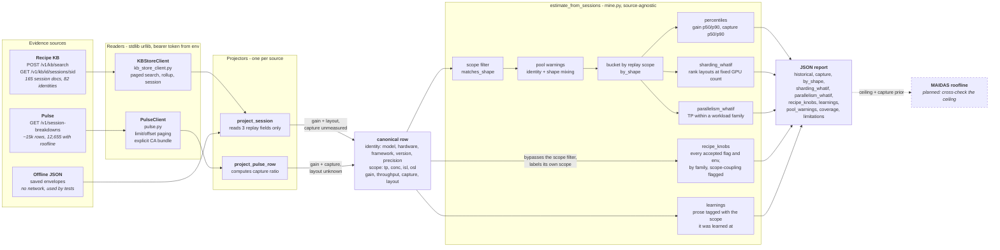
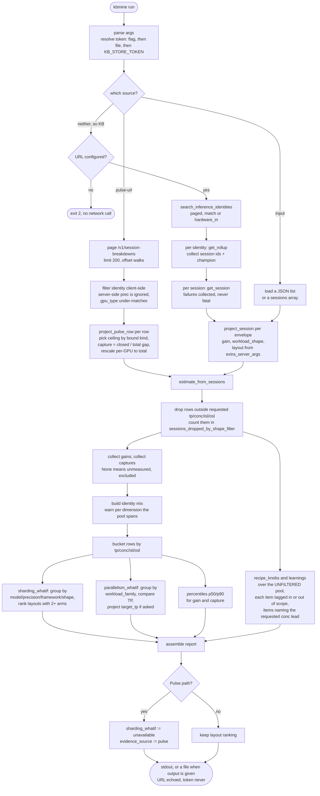
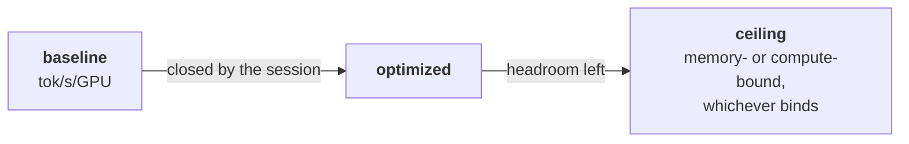

<!--
SPDX-FileCopyrightText: 2026 Advanced Micro Devices, Inc.
SPDX-License-Identifier: MIT
-->
# Architecture

The tool answers one question — *is this target worth a session?* — from
evidence that prior sessions already produced. No GPU is touched at any point.

## Design in one idea

Two services hold complementary halves of the answer, and neither is
sufficient:

* The **Recipe KB** is scoped to *replay material*: configuration, patches and
  the minimum metadata needed to re-apply them. It is the only place an
  accepted parallelism layout can be read from, and it carries no roofline
  anywhere in its 401 distinct key paths.
* **Pulse** is the fleet index of `session_breakdown.json`, holding *execution
  evidence*: roofline ceilings, both throughput arms, token spend and elapsed
  time. It carries no accepted server args, so no layout can be read from it.

So a source is a **projector**, not a fork in the aggregation. Each projector
flattens one source's document into the same canonical row, and everything
downstream — scoping, pooling, warnings, ranking — runs once, source-agnostic.
Adding an evidence source means writing one function, not a second estimator.

## Architecture

The asymmetry in the two projector edges is the whole boundary. On the KB path
`capture` is reported as **unmeasured**, never as zero, because an absent
ceiling is not a closed gap — treating it as zero is precisely what dragged the
earlier forecast toward nothing. On the Pulse path the layout is labelled
`layout_unknown` rather than `framework-default`, because calling an unknown
layout "default" would invent an evidence arm that no session published.

## Run flow

The three entry points are `--input` for an offline pool, `--pulse-url` for
fleet evidence, and the default Recipe KB path when neither is given.

Note that `recipe_knobs` and `learnings` hang off `S1` rather than the buckets:
they read the pool *before* the shape filter. Everything statistical stays
strictly in-scope, while the recipe and the prose cross the boundary carrying a
label, because a target at an unseen scope has no in-scope evidence by
definition and an empty report is the least useful true answer available.

Two properties worth noting in that flow. A missing store URL exits `2`
*before* any network call, so a misconfiguration is never a partial fetch. And
per-identity fetch failures accumulate into `fetch_errors` instead of aborting
the run, because one unreadable rollup out of eighty should still yield a
prior — the report says how much it stood on via `coverage` and
`sessions_scored`.

## The capture ratio

Gain says how far a session moved. Capture says how much of the *available*
distance it covered, which is the part that transfers to a target that has not
run:

$$\text{capture} = \frac{\text{optimized} - \text{baseline}}{\text{ceiling} - \text{baseline}}$$

A no-run forecast then reads
`baseline + p50_capture x (ceiling - baseline)`, which is why the ceiling has
to come from the same session as the two arms. The ceiling is selected by the
session's own `roofline_bound_kind`; when that label is absent the lower of the
two ceilings is used, since the lower one is what actually binds.

Capture is `None` — not `0` — whenever the snapshot or the ceiling is missing,
and a test pins that. Three of 5,008 sampled rows exceeded 100%, meaning the
analytic ceiling was too low; Pulse flags those with
`roofline_ceiling_exceeded` and excluding them is a known to-do.

## Why the scoping is not optional

Pooling every session a search returns makes the median meaningless, so rows
are grouped along two different axes depending on the question:

| grouping | holds fixed | answers |
| --- | --- | --- |
| `shape_key` | tp, conc, isl, osl | what gain to expect at this scope |
| `replay_scope_key` | model, precision, framework, **and** the full shape | which layout wins inside a fixed GPU count |
| `workload_family` | model, precision, conc, isl, osl — TP left free | how throughput scales with TP |

The last two differ by exactly one dimension, and that difference is the
point. Layouts must be compared at a *fixed* GPU count, since `tp=1 dp=2` on
two GPUs versus `tp=2` on two GPUs is a real choice while the same labels on
eight GPUs is a different experiment. TP scaling needs the opposite: GPU count
must vary while everything else holds, or the comparison is confounded — ISL
changes arithmetic intensity and model size dictates the TP that fits at all,
so a 0.6B at TP1 against a 70B at TP8 reads as catastrophic scaling when
nothing scaled.

Live data keeps making the case: on 103 MI355X sessions a 23.4% pooled median
hid per-family medians ranging from 6.2% to 311%, and a 6,000-row Pulse pull
gave a p50 gain of 41.9% for mi300x/sglang/fp8/tp1 against 11.6% for
mi355x/vllm/bf16/tp1. `pool_warnings` names every dimension a pool spans so a
reader cannot mistake one for the other.
